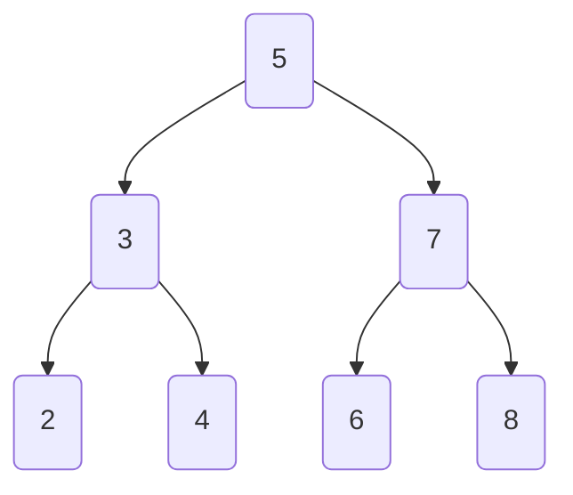
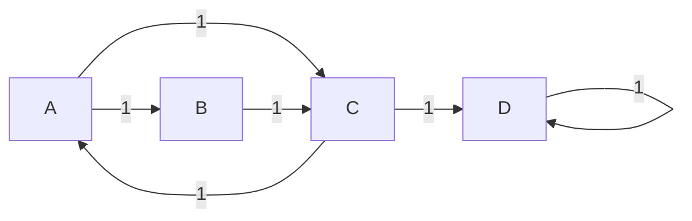

> [!abstract] Overview
> 1) **Data Structures** — operations, **advantages & disadvantages**, examples (C++ + a bit of Python).
> 2) **Algorithms** — searching, sorting, graph algorithms, DP, and patterns; each with pros/cons and example C++ implementations.

---

## Table of Contents
- Part I — Data Structures
  - Arrays
  - Linked Lists
  - Stack / Queue / Deque
  - Hash Tables
  - Heaps
  - Trees (BST)
  - Tries
  - Graph Representations
  - Disjoint Set Union

- Part II — Algorithms
  - Searching
  - Sorting
  - Graph Traversals
  - Shortest Path (Dijkstra)
  - MST (Kruskal)
  - Dynamic Programming
  - Patterns (Greedy, Sliding Window, Two Pointers)

---

## Part I — Data Structures

### 1) Arrays (Dynamic Arrays)

> [!info] Definition
> Contiguous memory; dynamic arrays support amortized **O(1)** append.

**Complexity**

| Operation | Time |
|---|---:|
| Random access `a[i]` | `O(1)` |
| Append (amortized) | `O(1)` |
| Insert/Delete middle | `O(n)` |
| Linear search | `O(n)` |
| Binary search (sorted) | `O(log n)` |

> [!tip] Advantages
> - `O(1)` random access; cache friendly  
> - Simple & widely supported

> [!warning] Disadvantages
> - Middle insert/delete is `O(n)`  
> - Requires contiguous memory

**C++ Example (vector basics)**
```cpp
#include <bits/stdc++.h>
using namespace std;

int main() {
    vector<int> v = {3,1,4};
    v.push_back(1);           // amortized O(1)
    int x = v[2];             // O(1)
    v.insert(v.begin()+1, 42);// O(n)
    v.erase(v.begin()+2);     // O(n)
    for (int e: v) cout << e << " ";
    return 0;
}

```

### 2) Linked Lists (Singly)

> [!info] Definition
> Nodes with `val` and `next` pointer; not contiguous.

**Complexity**

| Operation             |   Time |
| --------------------- | -----: |
| Insert/Delete at head | `O(1)` |
| Search by value       | `O(n)` |
| Access by index       | `O(n)` |

> [!tip] Advantages
>
> * `O(1)` head insert/delete
> * Flexible growth; no contiguous memory required

> [!fail] Disadvantages
>
> * No random access (`O(n)` indexing)
> * Pointer overhead, cache-unfriendly

**C++ Example (insert/find/delete)**

```cpp
#include <bits/stdc++.h>
using namespace std;

struct Node {
    int val;
    Node* next;
    Node(int v): val(v), next(nullptr) {}
};

struct SinglyList {
    Node* head = nullptr;

    void push_front(int v) {                // O(1)
        Node* n = new Node(v);
        n->next = head;
        head = n;
    }

    Node* find(int t) {                     // O(n)
        Node* cur = head;
        while (cur && cur->val != t) cur = cur->next;
        return cur;
    }

    void delete_value(int t) {              // O(n)
        Node dummy(0); dummy.next = head;
        Node* prev = &dummy; Node* cur = head;
        while (cur) {
            if (cur->val == t) { prev->next = cur->next; delete cur; break; }
            prev = cur; cur = cur->next;
        }
        head = dummy.next;
    }

    void print() {
        for (Node* c=head; c; c=c->next) cout << c->val << " ";
        cout << "\n";
    }
};

int main() {
    SinglyList L;
    for (int x : {3,1,4,1,5}) L.push_front(x);
    L.print();
    cout << (L.find(4) ? "found 4\n" : "no 4\n");
    L.delete_value(1);
    L.print();
    return 0;
}
```

---

### 3) Stack / Queue / Deque

* **Stack (LIFO):** `push`, `pop`, `top`
* **Queue (FIFO):** `push`, `pop`, `front`
* **Deque:** push/pop at **both** ends

**Typical complexity:** O(1) amortized per op.

> [!note] Use cases
>
> * Stack: recursion/undo, DFS
> * Queue: BFS
> * Deque: sliding windows / two-ended processing

**C++ Example**

```cpp
#include <bits/stdc++.h>
using namespace std;

int main() {
    stack<int> st; st.push(10); st.push(20); cout << st.top() << "\n"; st.pop();

    queue<int> q; q.push(1); q.push(2); cout << q.front() << "\n"; q.pop();

    deque<int> dq; dq.push_front(5); dq.push_back(7); dq.pop_front(); dq.pop_back();

    return 0;
}
```

---

### 4) Hash Tables (Maps/Sets)

> [!info] Definition
> Buckets indexed by hash(key). Average **O(1)** ops; worst-case **O(n)**.

**Complexity (avg/worst)**

| Operation         |    Avg |  Worst |
| ----------------- | -----: | -----: |
| Insert/Find/Erase | `O(1)` | `O(n)` |

> [!tip] Advantages
>
> * Very fast average lookups/updates
> * Simple API (maps/sets)

> [!warning] Disadvantages
>
> * No key order
> * Worst-case degradation if poor hashing

**C++ Example (unordered\_map / unordered\_set)**

```cpp
#include <bits/stdc++.h>
using namespace std;

int main() {
    unordered_map<string,int> mp;
    mp["a"] = 1; mp["b"] = 2;
    cout << (mp.count("a") ? mp["a"] : 0) << "\n";

    unordered_set<int> s = {1,2,3};
    s.insert(4);
    cout << (s.count(3) ? "in\n" : "out\n");
    return 0;
}
```

---

### 5) Heaps (Priority Queue)

**Min/Max-heap**: `top` in `O(1)`, push/pop in `O(log n)`, build in `O(n)`.

> [!example] Uses
> Dijkstra’s, scheduling, kth smallest/largest, stream processing.

**C++ Example**

```cpp
#include <bits/stdc++.h>
using namespace std;

int main() {
    // max-heap
    priority_queue<int> pq;
    for (int x : {5,1,8,3}) pq.push(x);
    cout << pq.top() << "\n"; // 8
    pq.pop();

    // min-heap
    priority_queue<int, vector<int>, greater<int>> minpq;
    for (int x : {5,1,8,3}) minpq.push(x);
    cout << minpq.top() << "\n"; // 1
    return 0;
}
```

---

### 6) Trees (BST)

> [!info] Definition
> Binary tree with invariant: **Left < Root < Right**.

**Complexity**

| Operation            |        Avg |  Worst |
| -------------------- | ---------: | -----: |
| Search/Insert/Delete | `O(log n)` | `O(n)` |

> [!tip] Advantages
>
> * Ordered keys, in-order traversal is sorted
> * Natural for range queries

> [!fail] Disadvantages
>
> * Can degrade to a list if unbalanced (use AVL/RB for guarantees)

**C++ Example (BST insert/search/inorder)**

```cpp
#include <bits/stdc++.h>
using namespace std;

struct Node {
    int key; Node* l; Node* r;
    Node(int k): key(k), l(nullptr), r(nullptr) {}
};

Node* insert(Node* root, int k){
    if(!root) return new Node(k);
    if(k < root->key) root->l = insert(root->l, k);
    else if(k > root->key) root->r = insert(root->r, k);
    return root;
}

bool search(Node* root, int k){
    if(!root) return false;
    if(root->key == k) return true;
    return k < root->key ? search(root->l,k) : search(root->r,k);
}

void inorder(Node* root){
    if(!root) return;
    inorder(root->l); cout << root->key << " "; inorder(root->r);
}

int main(){
    Node* root=nullptr;
    for (int x : {5,3,7,2,4,6,8}) root = insert(root, x);
    inorder(root); cout << "\n";
    cout << (search(root,4) ? "found\n" : "nope\n");
    return 0;
}
```

**Mermaid (BST shape)**



---

### 7) Tries (Prefix Trees)

* Insert/Find by characters: `O(L)` where `L` is string length
* Great for autocomplete/prefix queries; memory cost is higher

**C++ Example (basic lowercase trie)**

```cpp
#include <bits/stdc++.h>
using namespace std;

struct Trie {
    bool end = false;
    array<Trie*,26> next{};
    Trie(){ next.fill(nullptr); }
    void insert(const string& s){
        Trie* node = this;
        for(char c: s){
            int i=c-'a';
            if(!node->next[i]) node->next[i]=new Trie();
            node=node->next[i];
        }
        node->end=true;
    }
    bool startsWith(const string& p){
        Trie* node=this;
        for(char c: p){
            int i=c-'a';
            if(!node->next[i]) return false;
            node=node->next[i];
        }
        return true;
    }
};

int main(){
    Trie tr; tr.insert("algo"); tr.insert("algae");
    cout << (tr.startsWith("alg") ? "yes\n" : "no\n");
    cout << (tr.startsWith("alt") ? "yes\n" : "no\n");
    return 0;
}
```

---

### 8) Graph Representations

**Adjacency List (sparse) vs. Adjacency Matrix (dense)**

| Representation |    Space | Iterate neighbors | Edge check `u→v` |
| -------------- | -------: | ----------------: | ---------------: |
| Adj List       | `O(V+E)` |       `O(deg(u))` |      `O(deg(u))` |
| Adj Matrix     |  `O(V²)` |            `O(V)` |           `O(1)` |

**C++ Examples**

```cpp
// Adjacency list
int n = 5;
vector<vector<int>> g(n);
auto add_edge = [&](int u,int v){ g[u].push_back(v); g[v].push_back(u); };

// Adjacency matrix
vector<vector<int>> mat(n, vector<int>(n, 0));
auto add_edge_m = [&](int u,int v){ mat[u][v]=mat[v][u]=1; };
```

---

### 9) Disjoint Set Union (Union-Find)

> [!info] Definition
> Track connectivity with **path compression** + **union by rank/size**.

* Amortized \~`O(1)` per op (inverse Ackermann α(n))

**C++ Example**

```cpp
#include <bits/stdc++.h>
using namespace std;

struct DSU {
    vector<int> p, r;
    DSU(int n): p(n), r(n,0) { iota(p.begin(), p.end(), 0); }
    int find(int x){ return p[x]==x ? x : p[x]=find(p[x]); }
    bool unite(int a,int b){
        a=find(a); b=find(b); if(a==b) return false;
        if(r[a]<r[b]) swap(a,b);
        p[b]=a; if(r[a]==r[b]) r[a]++;
        return true;
    }
};

int main(){
    DSU d(5);
    d.unite(0,1); d.unite(1,2);
    cout << (d.find(0)==d.find(2) ? "connected\n" : "not\n");
    return 0;
}
```

---

## Part II — Algorithms

### 1) Searching

**Linear Search** — `O(n)`; works on any container
**Binary Search** — `O(log n)`; needs **sorted** array

**C++ Example**

```cpp
#include <bits/stdc++.h>
using namespace std;

int linear_search(const vector<int>& a, int t){
    for (int i=0;i<(int)a.size();++i) if(a[i]==t) return i;
    return -1;
}

int binary_search_idx(const vector<int>& a, int t){
    int lo=0, hi=(int)a.size()-1;
    while (lo<=hi){
        int mid=(lo+hi)/2;
        if (a[mid]==t) return mid;
        if (a[mid]<t) lo=mid+1; else hi=mid-1;
    }
    return -1;
}

int main(){
    vector<int> a = {5,1,8,3,2,9};
    sort(a.begin(), a.end());
    cout << linear_search(a,8) << "\n";
    cout << binary_search_idx(a,8) << "\n";
    return 0;
}
```

---

### 2) Sorting

> [!table] Trade-offs
>
> | Algorithm      |       Avg |     Worst | Stable | Notes                             |
> | -------------- | --------: | --------: | :----: | --------------------------------- |
> | Insertion      |      `n²` |      `n²` |    ✅   | good for small/near-sorted        |
> | Merge          | `n log n` | `n log n` |    ✅   | predictable; extra memory         |
> | Quick          | `n log n` |      `n²` |    ❌   | fast in practice; randomize pivot |
> | Heap           | `n log n` | `n log n` |    ❌   | in-place; good worst-case         |
> | Counting/Radix |     `n+k` |     `n+k` |    ✅   | integers with limited ranges      |

**C++: Insertion Sort**

```cpp
void insertion_sort(vector<int>& a){
    for (int i=1;i<(int)a.size();++i){
        int x=a[i], j=i-1;
        while (j>=0 && a[j]>x){ a[j+1]=a[j]; --j; }
        a[j+1]=x;
    }
}
```

**C++: Merge Sort**

```cpp
void merge_vec(vector<int>& a, int l, int m, int r){
    vector<int> L(a.begin()+l, a.begin()+m+1);
    vector<int> R(a.begin()+m+1, a.begin()+r+1);
    int i=0,j=0,k=l;
    while(i<(int)L.size() && j<(int)R.size())
        a[k++] = (L[i]<=R[j]) ? L[i++] : R[j++];
    while(i<(int)L.size()) a[k++]=L[i++];
    while(j<(int)R.size()) a[k++]=R[j++];
}
void merge_sort(vector<int>& a, int l, int r){
    if(l>=r) return;
    int m=(l+r)/2;
    merge_sort(a,l,m);
    merge_sort(a,m+1,r);
    merge_vec(a,l,m,r);
}
```

**C++: Quick Sort (randomized pivot recommended)**

```cpp
int partition_vec(vector<int>& a, int l, int r){
    int p=a[r], i=l;
    for(int j=l;j<r;++j) if(a[j]<=p) swap(a[i++], a[j]);
    swap(a[i], a[r]); return i;
}
void quick_sort(vector<int>& a, int l, int r){
    if(l>=r) return;
    int p = l + rand() % (r-l+1);
    swap(a[p], a[r]);
    int m = partition_vec(a, l, r);
    quick_sort(a, l, m-1);
    quick_sort(a, m+1, r);
}
```

**C++: Heap Sort (via priority\_queue)**

```cpp
vector<int> heap_sort(vector<int> a){
    priority_queue<int> pq(a.begin(), a.end()); // max-heap
    vector<int> out; out.reserve(a.size());
    while(!pq.empty()){ out.push_back(pq.top()); pq.pop(); }
    reverse(out.begin(), out.end());
    return out;
}
```

---

### 3) Graph Traversals (BFS/DFS)

* **BFS:** `O(V+E)`; shortest path in #edges (unweighted)
* **DFS:** `O(V+E)`; components, topological sort, cycle detection

**C++ Example (BFS & DFS on adjacency list)**

```cpp
#include <bits/stdc++.h>
using namespace std;

vector<int> bfs(const vector<vector<int>>& g, int s){
    vector<int> order; vector<int> vis(g.size());
    queue<int> q; vis[s]=1; q.push(s);
    while(!q.empty()){
        int u=q.front(); q.pop(); order.push_back(u);
        for(int v: g[u]) if(!vis[v]) vis[v]=1, q.push(v);
    }
    return order;
}

void dfs_rec(const vector<vector<int>>& g, int u, vector<int>& vis, vector<int>& ord){
    vis[u]=1; ord.push_back(u);
    for(int v: g[u]) if(!vis[v]) dfs_rec(g,v,vis,ord);
}
vector<int> dfs(const vector<vector<int>>& g, int s){
    vector<int> vis(g.size()), ord;
    dfs_rec(g,s,vis,ord); return ord;
}

int main(){
    vector<vector<int>> g = {{1,2},{2},{0,3},{3}};
    auto b = bfs(g,2); auto d = dfs(g,2);
    for(int x: b) cout << x << " "; cout << "\n";
    for(int x: d) cout << x << " "; cout << "\n";
    return 0;
}
```

**Mermaid (sample graph)**



---

### 4) Shortest Path (Dijkstra — non‑negative weights)

* Heap-based greedy expansion
* `O((V+E) log V)` with adjacency lists + heap
* **Does not** handle negative edges (use Bellman-Ford/Johnson)

**C++ Example (undirected)**

```cpp
#include <bits/stdc++.h>
using namespace std;

vector<long long> dijkstra(int n, const vector<vector<pair<int,int>>>& g, int s){
    const long long INF = LLONG_MAX/4;
    vector<long long> dist(n, INF);
    priority_queue<pair<long long,int>, vector<pair<long long,int>>, greater<pair<long long,int>>> pq;
    dist[s]=0; pq.push({0,s});
    while(!pq.empty()){
        auto [d,u]=pq.top(); pq.pop();
        if(d!=dist[u]) continue;
        for(auto [v,w]: g[u]){
            long long nd=d+w;
            if(nd<dist[v]) dist[v]=nd, pq.push({nd,v});
        }
    }
    return dist;
}

int main(){
    int n=5;
    vector<vector<pair<int,int>>> g(n);
    auto add=[&](int u,int v,int w){ g[u].push_back({v,w}); g[v].push_back({u,w}); };
    add(0,1,2); add(1,2,3); add(0,3,1); add(3,4,4); add(2,4,1);
    auto dist = dijkstra(n,g,0);
    for (auto d: dist) cout << d << " "; cout << "\n";
    return 0;
}
```

---

### 5) Minimum Spanning Tree (Kruskal)

* Sort edges by weight; add if they connect different components (DSU)
* `O(E log E)`

**C++ Example**

```cpp
#include <bits/stdc++.h>
using namespace std;

struct DSU{
    vector<int> p,r;
    DSU(int n):p(n),r(n,0){ iota(p.begin(),p.end(),0); }
    int find(int x){ return p[x]==x?x:p[x]=find(p[x]); }
    bool unite(int a,int b){
        a=find(a); b=find(b); if(a==b) return false;
        if(r[a]<r[b]) swap(a,b);
        p[b]=a; if(r[a]==r[b]) r[a]++;
        return true;
    }
};

pair<long long, vector<tuple<int,int,int>>> mst_kruskal(int n, vector<tuple<int,int,int>> edges){
    sort(edges.begin(), edges.end()); // by weight
    DSU d(n); long long total=0;
    vector<tuple<int,int,int>> used;
    for (auto [w,u,v] : edges){
        if (d.unite(u,v)){ total += w; used.push_back({u,v,w}); }
    }
    return {total, used};
}

int main(){
    vector<tuple<int,int,int>> edges = {
        {1,0,1},{4,0,2},{3,1,2},{2,1,3},{5,2,3}
    };
    auto [cost, chosen] = mst_kruskal(4, edges);
    cout << "MST cost = " << cost << "\n";
    for (auto [u,v,w] : chosen) cout << u << "-" << v << " ("<<w<<")\n";
    return 0;
}
```

---

### 6) Dynamic Programming (0/1 Knapsack)

* State: `dp[i][cap]` best value using first `i` items within capacity `cap`
* Time `O(nW)`; Space `O(nW)` or `O(W)` optimized

**C++ Example**

```cpp
#include <bits/stdc++.h>
using namespace std;

int knapsack_01(int W, const vector<int>& wt, const vector<int>& val){
    int n=wt.size();
    vector<vector<int>> dp(n+1, vector<int>(W+1, 0));
    for(int i=1;i<=n;i++){
        for(int cap=0;cap<=W;cap++){
            dp[i][cap] = dp[i-1][cap];
            if(wt[i-1]<=cap)
                dp[i][cap] = max(dp[i][cap], dp[i-1][cap-wt[i-1]] + val[i-1]);
        }
    }
    return dp[n][W];
}

int main(){
    vector<int> wt={2,3,4,5}, val={3,4,5,8};
    cout << knapsack_01(5, wt, val) << "\n"; // 7? no, optimal is 8 (3+5)
    return 0;
}
```

---

### 7) Patterns (Greedy, Sliding Window, Two Pointers)

> [!tip] Greedy
> Pick locally optimal choice; prove correctness (greedy-choice + optimal substructure).

> [!tip] Sliding Window
> Maintain window state for contiguous subarrays; typically `O(n)`.

> [!tip] Two Pointers
> Use on sorted/structured data to achieve `O(n)` scanning.

**C++ Example (Two-Pointers: Two-Sum in Sorted Array)**

```cpp
#include <bits/stdc++.h>
using namespace std;

pair<int,int> two_sum_sorted(const vector<int>& a, int target){
    int i=0, j=(int)a.size()-1;
    while (i<j){
        int s=a[i]+a[j];
        if (s==target) return {i,j};
        if (s<target) i++; else j--;
    }
    return {-1,-1};
}

int main(){
    vector<int> a={1,2,3,4,6,8,11};
    auto ans = two_sum_sorted(a, 10); // 2+8
    cout << ans.first << " " << ans.second << "\n";
    return 0;
}
```

**C++ Example (Sliding Window: Longest substring without repeating)**

```cpp
#include <bits/stdc++.h>
using namespace std;

int longest_unique_substring(const string& s){
    vector<int> last(256, -1);
    int best=0, start=0;
    for (int i=0;i<(int)s.size();++i){
        unsigned char c = s[i];
        if (last[c] >= start) start = last[c] + 1;
        last[c] = i;
        best = max(best, i - start + 1);
    }
    return best;
}

int main(){
    cout << longest_unique_substring("abcbcbb") << "\n"; // 3
    return 0;
}
```

---

