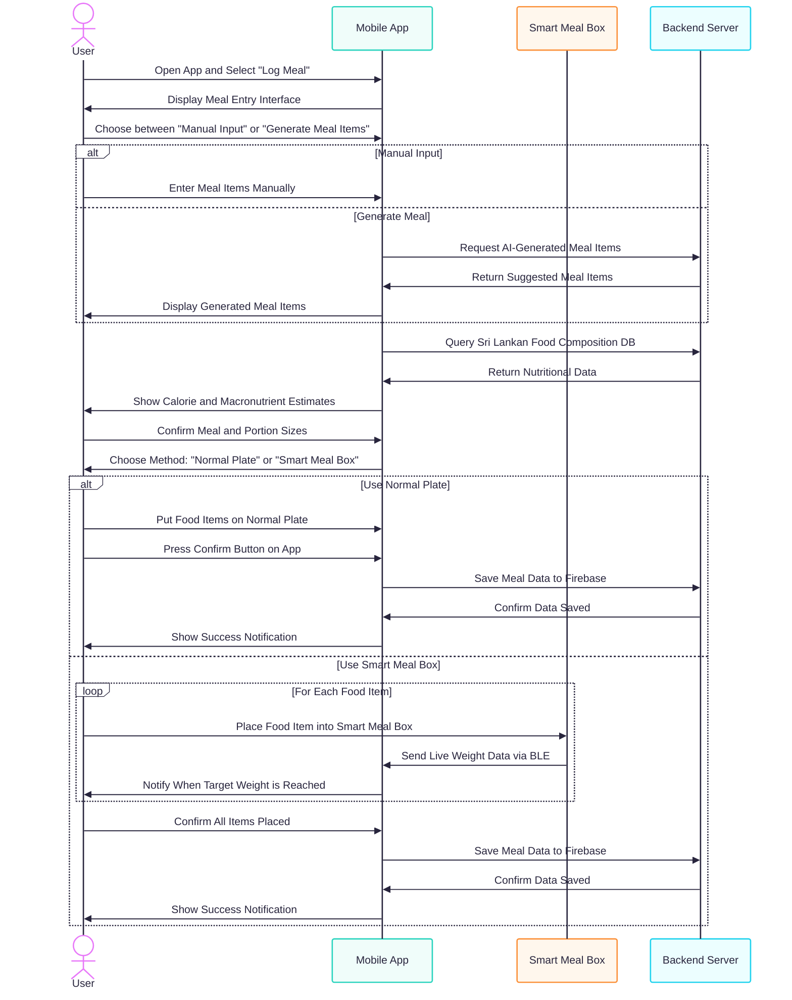
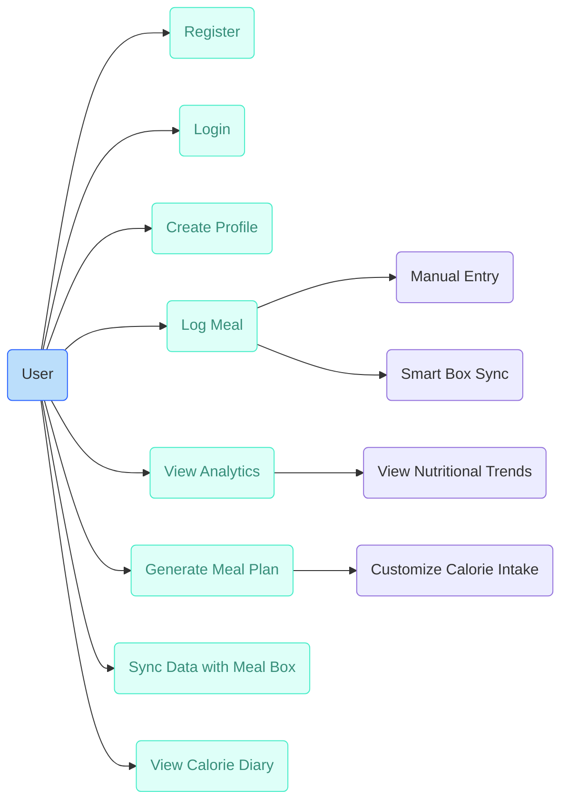
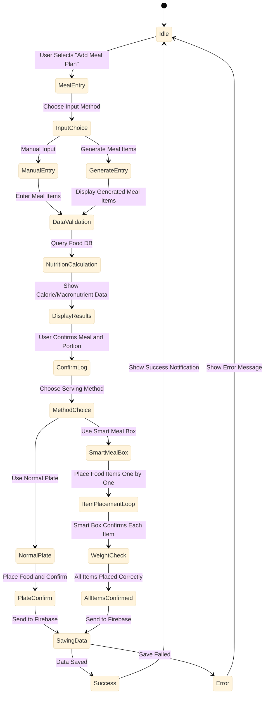
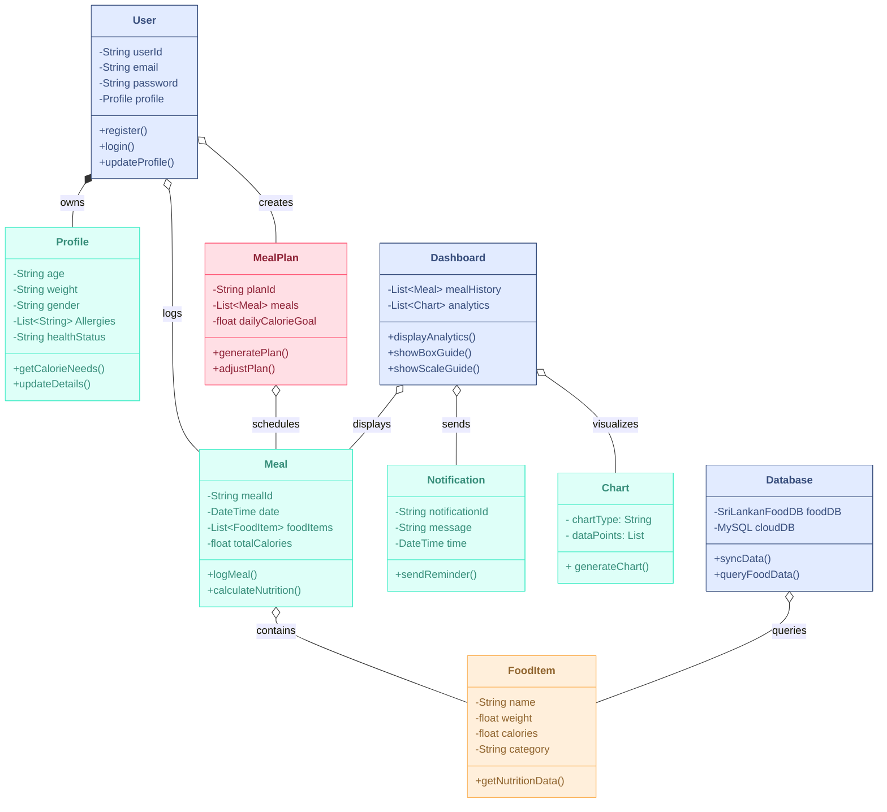

## Sequence Diagram

```mermaid
---
config:
  theme: redux-color
---
sequenceDiagram
  actor U as User
  participant A as Mobile App
  participant B as Smart Meal Box
  participant S as Backend Server

  U ->> A: Open App and Select "Log Meal"
  A ->> U: Display Meal Entry Interface
  U ->> A: Choose between "Manual Input" or "Generate Meal Items"
  alt Manual Input
    U ->> A: Enter Meal Items Manually
  else Generate Meal
    A ->> S: Request AI-Generated Meal Items
    S ->> A: Return Suggested Meal Items
    A ->> U: Display Generated Meal Items
  end
  A ->> S: Query Sri Lankan Food Composition DB
  S ->> A: Return Nutritional Data
  A ->> U: Show Calorie and Macronutrient Estimates
  U ->> A: Confirm Meal and Portion Sizes

  A ->> U: Choose Method: "Normal Plate" or "Smart Meal Box"

  alt Use Normal Plate
    U ->> A: Put Food Items on Normal Plate
    U ->> A: Press Confirm Button on App
    A ->> S: Save Meal Data to Firebase
    S ->> A: Confirm Data Saved
    A ->> U: Show Success Notification
  else Use Smart Meal Box
    loop For Each Food Item
      U ->> B: Place Food Item into Smart Meal Box
      B ->> A: Send Live Weight Data via BLE
      A ->> U: Notify When Target Weight is Reached
    end
    U ->> A: Confirm All Items Placed
    A ->> S: Save Meal Data to Firebase
    S ->> A: Confirm Data Saved
    A ->> U: Show Success Notification
  end

```

## Use Case Diagram

```mermaid
---
config:
  theme: default
---
flowchart LR
    A["User"] --> B["Register"] & C["Login"] & D["Create Profile"] & E["Log Meal"] & F["View Analytics"] & G["Generate Meal Plan"] & I["Sync Data with Meal Box"] & P["View Calorie Diary"]
    E --> L["Manual Entry"] & M["Smart Box Sync"]
    G --> N["Customize Calorie Intake"]
    F --> O["View Nutritional Trends"]
    A@{ shape: rounded}
    B@{ shape: rounded}
    C@{ shape: rounded}
    D@{ shape: rounded}
    E@{ shape: rounded}
    F@{ shape: rounded}
    G@{ shape: rounded}
    I@{ shape: rounded}
    P@{ shape: rounded}
    L@{ shape: rounded}
    M@{ shape: rounded}
    N@{ shape: rounded}
    O@{ shape: rounded}
     B:::Aqua
     C:::Aqua
     D:::Aqua
     E:::Aqua
     F:::Aqua
     G:::Aqua
     I:::Aqua
     P:::Aqua
    classDef Aqua stroke-width:1px, stroke-dasharray:none, stroke:#46EDC8, fill:#DEFFF8, color:#378E7A
    style A stroke:#2962FF,fill:#BBDEFB

```

## State Diagram

```mermaid
---
config:
  theme: base
  layout: dagre
---
stateDiagram
  direction TB
  [*] --> Idle
  Idle --> MealEntry:User Selects "Add Meal Plan"
  MealEntry --> InputChoice:Choose Input Method
  InputChoice --> ManualEntry:Manual Input
  InputChoice --> GenerateEntry:Generate Meal Items
  ManualEntry --> DataValidation:Enter Meal Items
  GenerateEntry --> DataValidation:Display Generated Meal Items
  DataValidation --> NutritionCalculation:Query Food DB
  NutritionCalculation --> DisplayResults:Show Calorie/Macronutrient Data
  DisplayResults --> ConfirmLog:User Confirms Meal and Portion
  ConfirmLog --> MethodChoice:Choose Serving Method
  MethodChoice --> NormalPlate:Use Normal Plate
  MethodChoice --> SmartMealBox:Use Smart Meal Box
  NormalPlate --> PlateConfirm:Place Food and Confirm
  PlateConfirm --> SavingData:Send to Firebase
  SmartMealBox --> ItemPlacementLoop:Place Food Items One by One
  ItemPlacementLoop --> WeightCheck:Smart Box Confirms Each Item
  WeightCheck --> AllItemsConfirmed:All Items Placed Correctly
  AllItemsConfirmed --> SavingData:Send to Firebase
  SavingData --> Success:Data Saved
  SavingData --> Error:Save Failed
  Success --> Idle:Show Success Notification
  Error --> Idle:Show Error Message

```

## Class Diagram

```mermaid
---
config:
  theme: default
---
classDiagram
direction TB
    class User {
	    -String userId
	    -String email
	    -String password
	    -Profile profile
	    +register()
	    +login()
	    +updateProfile()
    }
    class Profile {
	    -String age
	    -String weight
	    -String gender
	    -List~String~ Allergies
	    -String healthStatus
	    +getCalorieNeeds()
	    +updateDetails()
    }
    class Meal {
	    -String mealId
	    -DateTime date
	    -List~FoodItem~ foodItems
	    -float totalCalories
	    +logMeal()
	    +calculateNutrition()
    }
    class MealPlan {
	    -String planId
	    -List~Meal~ meals
	    -float dailyCalorieGoal
	    +generatePlan()
	    +adjustPlan()
    }
    class FoodItem {
	    -String name
	    -float weight
	    -float calories
	    -String category
	    +getNutritionData()
    }
    class Dashboard {
	    -List~Meal~ mealHistory
	    -List~Chart~ analytics
	    +displayAnalytics()
	    +showBoxGuide()
	    +showScaleGuide()
    }
    class Notification {
	    -String notificationId
	    -String message
	    -DateTime time
	    +sendReminder()
    }
    class Chart {
	    - chartType: String
	    - dataPoints: List
	    + generateChart()
    }
    class Database {
	    -SriLankanFoodDB foodDB
	    -MySQL cloudDB
	    +syncData()
	    +queryFoodData()
    }

    User *-- Profile : owns
    User o-- Meal : logs
    User o-- MealPlan : creates
    Meal o-- FoodItem : contains
    MealPlan o-- Meal : schedules
    Dashboard o-- Meal : displays
    Dashboard o-- Notification : sends
    Dashboard o-- Chart : visualizes
    Database o-- FoodItem : queries

	class User:::Sky
	class Profile:::Aqua
	class Meal:::Aqua
	class MealPlan:::Rose
	class FoodItem:::Peach
	class Dashboard:::Sky
	class Notification:::Aqua
	class Chart:::Aqua
	class Database:::Sky

	classDef Aqua :, stroke-width:1px, stroke-dasharray:none, stroke:#46EDC8, fill:#DEFFF8, color:#378E7A
	classDef Sky :, stroke-width:1px, stroke-dasharray:none, stroke:#374D7C, fill:#E2EBFF, color:#374D7C
	classDef Peach :, stroke-width:1px, stroke-dasharray:none, stroke:#FBB35A, fill:#FFEFDB, color:#8F632D
	classDef Rose :,stroke-width:1px, stroke-dasharray:none, stroke:#FF5978, fill:#FFDFE5, color:#8E2236

```
![[Pasted image 20250427144213.png]]