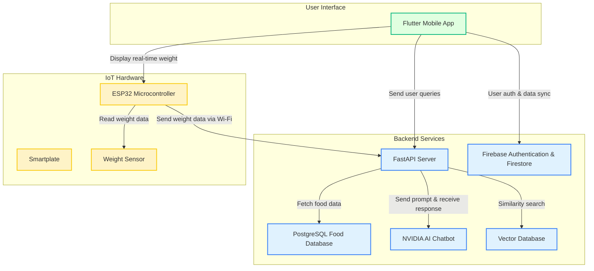

### **NutriMithu – AI-Powered Nutrition & Smartplate App for Sri Lankan Lifestyles**

**Overview:**

**NutriMithu** is a smart, culturally-aware nutrition app tailored for the dietary habits of Sri Lankan users. Combining AI guidance, local food tracking, and hardware integration, the app promotes healthy eating through personalized plans and real-time food monitoring. It bridges the gap between everyday meals and nutritional awareness, using modern technology to empower healthier lifestyles.

**Key Features:**

- **Localized Food Intelligence:**  A curated set of Sri Lankan meals with localized calorie and nutrient estimates are stored in a **PostgreSQL database** and served via a **Python FastAPI backend**.

-  **AI Nutrition Assistant:** Integrated with NVIDIA’s **Palmyra Med-70B** model to provide intelligent, conversational responses on diet and health.

-  **Personalized Meal Planning:** Automatically adjusts daily nutrition plans based on user profile, preferences, and health conditions.

-  **Smart-plate Integration:** Connected to a **weight sensor-equipped plate** powered by an **ESP32 microcontroller**, allowing real-time measurement of food quantity to enhance calorie tracking.

- **Secure Cloud Backend:** Built with Firebase Authentication and Firestore for real-time data storage and user management.

-  **Modern Flutter UI:** Smooth multi-step onboarding, reusable UI components, and responsive design for an engaging user experience.

