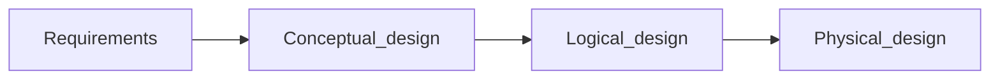

## Design Process
### Design Phases

>[!abstract]- Design phases
>>[!info]- Initial phase
>>Characterize fully the data needs of the prospective database users.
>
>>[!info]- Second phase
>>Choosing a data model
>>- Applying the concepts of the chosen data model
>>- Translating these requirements into a conceptual schema of the database
>>- A fully developed conceptual schema indicates the functional requirements of the enterprise (kinds of operations that will be performed on the data)
>
>>[!info]- Final phase
>>Moving from abstract data model to the implementation of the database
>>- Logical design (Deciding the database schema)
>>- Physical design (Deciding the physical layout of the database)

>[!warning]- Major pitfalls to avoid in designing a database schema
>>[!error]- Redundancy
>
>>[!error]- Incompleteness

>[!abstract]- Design Approaches
>>[!info]- Entity relationship Model
>>- Models that enterprise as a collection of `entities` and `relationships`
>>- Represented diagrammatically by an *entity-relationship diagram*
>
>>[!info]- Normalization
>>Formalize what designs are bad and test for them

### ER Model
