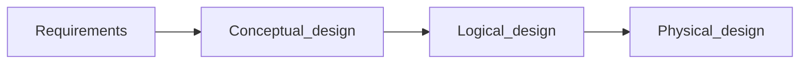

---
tags:
  - DatabaseSystems
  - DB
  - ERD
Reviewed: 
Created: 2024-08-14T22:51:00
About: Based on CS3043-Lecture 02 Database design using E-R models
---
Related : #DatabaseSystems #DB/02 #ERD

---
<br>

# Content


# 1. Design Process

<br>

### Design Phases



<br>

>[!abstract]- Design phases
>>[!info]- Initial phase
>>Characterize fully the data needs of the prospective database users.
>
>>[!info]- Second phase
>>Choosing a data model
>>- Applying the concepts of the chosen data model
>>- Translating these requirements into a conceptual schema of the database
>>- A fully developed conceptual schema indicates the functional requirements of the enterprise (kinds of operations that will be performed on the data)
>
>>[!info]- Final phase
>>Moving from abstract data model to the implementation of the database
>>- Logical design (Deciding the database schema)
>>- Physical design (Deciding the physical layout of the database)

>[!warning]- Major pitfalls to avoid in designing a database schema
>>[!error]- Redundancy
>
>>[!error]- Incompleteness

>[!abstract]- Design Approaches
>>[!info]- Entity relationship Model
>>- Models that enterprise as a collection of `entities` and `relationships`
>>- Represented diagrammatically by an *entity-relationship diagram*
>
>>[!info]- Normalization
>>Formalize what designs are bad and test for them

<br>

# 2. ER Model
>[!FAQ]- Why was the ER data model developed
>To facilitate database design by allowing specification of an `enterprise schema` that represents the overall logical structure of the database

>[!abstract]- Basic concepts used in ER-data model
>- entity sets
>- relationship sets
>- attributes

>[!tip] The ER model also has an associated diagrammatic representation, the `ER diagram` which can express the overall logical structure of a database graphically

<br>

### Entity Sets
>[!FAQ]- What is an `entity`
>An object that exists and is distinguishable from other objects

>[!FAQ]- what is an `Entity Set`
>A set of entities of the same type that share the same properties

>[!note]- Attributes
>An entity is represented by a set of **attributes** (descriptive properties possessed by all members of an entity set).
>A subset of the attributes form a **`primary key`** 🔑 of the entity set. (uniquely identifying each member of the set)

<br>

>[!tip]- How to represent **entity sets** graphically
>- Rectangles represents entity sets
>- Attributes are listed inside the entity rectangle
>- Underline indicates **primary key 🗝 ** attribute
>
>![[Pasted image 20240704100409.png]]

<br>

### Relationship Sets
>[!info] A **relationship** is an association among several entities.

>[!info]- A **relationship set** is a mathematical relation among 2 or more entities each taken from entity sets
> { $(\ e_1 ,\ e_2,\ ... \ e_n\ ) |\ e_1 \ \in \ E_1,\ e_2 \ \in \ E_2,\ ...\ e_n\  \in \ E_n$ }

<br>

### Attributes

Attributes are properties of entities or relationships. They can be:
- Simple or composite
- Single-valued or multi-valued
- Derived
> [!image]- Relationship sets with attributes
> ![[Pasted image 20240914231059.png]]

<br>
<br>

# 3. ER Diagram Notation

ER diagrams use specific symbols to represent different elements:

| Element | Symbol |
|---------|--------|
| Entity Set | Rectangle |
| Relationship Set | Diamond |
| Attribute | Oval |
| Primary Key | Underlined Attribute |
| Weak Entity Set | Double Rectangle |
| Identifying Relationship | Double Diamond |

# 4. Mapping Cardinalities

Mapping cardinalities express the number of entities to which another entity can be associated via a relationship set.

Types:
- One-to-one (1:1)
- One-to-many (1:N)
- Many-to-one (N:1)
- Many-to-many (M:N)

Example:
```
instructor ---(1)---- advisor ----(N)--- student
```

# 5. Participation Constraints

- **Total Participation**: Every entity in the entity set participates in at least one relationship in the relationship set.
- **Partial Participation**: Some entities may not participate in any relationship in the relationship set.

# 6. Weak Entity Sets

A weak entity set is one whose existence depends on another entity, called its identifying entity.

Example:
```
section (weak entity) depends on course (identifying entity)
```

# 7. Specialization and Generalization

- **Specialization**: Top-down design process; designating subgroupings within an entity set.
- **Generalization**: Bottom-up design process; combining entity sets with shared features into a higher-level entity set.

Example:
```
Person
  |
  |-- Employee
  |     |-- Instructor
  |     |-- Secretary
  |
  |-- Student
        |-- Graduate
        |-- Undergraduate
```

# 8. Aggregation

Aggregation allows treating a relationship set as an entity set for purposes of participating in other relationship sets.

Example:
```
(proj_guide(student, project, instructor)) --- eval_for --- evaluation
```

# 9. Reduction to Relational Schemas

The ER model can be converted to relational schemas:
- Each entity set and relationship set becomes a relation schema
- Attributes become attributes of the relation schemas

Example:
```sql
CREATE TABLE instructor (
    ID INT PRIMARY KEY,
    name VARCHAR(50),
    salary DECIMAL(10, 2)
);

CREATE TABLE advisor (
    student_id INT,
    instructor_id INT,
    PRIMARY KEY (student_id, instructor_id),
    FOREIGN KEY (student_id) REFERENCES student(ID),
    FOREIGN KEY (instructor_id) REFERENCES instructor(ID)
);
```

# 10. Design Issues and Best Practices

- Choose between entities and attributes based on the complexity and importance of the concept.
- Decide whether a concept should be an entity set or a relationship set.
- Use ternary relationships judiciously; sometimes binary relationships are more appropriate.
- Consider using weak entity sets for dependent entities.
- Utilize specialization/generalization for better modularity.
- Apply aggregation to represent complex relationships.

# 11. Alternative Notations

While this note focuses on the classic ER notation, other notations exist:
- Chen notation
- IE Crow's Foot notation
- UML Class Diagrams

Each notation has its strengths and is used in different contexts or by different tools.

****

<br>

Up Next : [[Introduction to SQL]]
