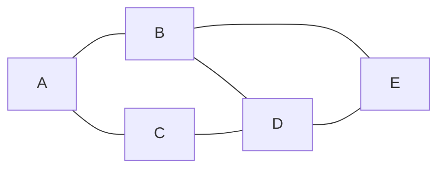

---
tags:
  - AI
  - SearchAlgorithms
Reviewed: true
Created: 2024-09-09T10:03:00
About: Note generated using GPT on depth-first Search algorithm
---
Depth-First Search (DFS) is another fundamental uninformed search algorithm. Unlike BFS, which explores the graph level by level, DFS dives deep into the graph, visiting nodes by following a path until it reaches a dead end, then backtracking to explore other unvisited nodes.

### Key Characteristics of DFS:

1. **Recursive or Stack-Based**: DFS can be implemented recursively or using an explicit stack. It follows a **last-in, first-out** (LIFO) order.
2. **Exploration**: DFS explores a path until it can't go any further (i.e., it reaches a leaf or a dead-end), then it backtracks to explore other possible paths.
3. **Not Optimal**: DFS does not guarantee finding the shortest path in an unweighted graph, and it may explore deeper parts of the graph first before finding the goal.
4. **Uninformed**: Like BFS, DFS has no prior knowledge of the goal's location.

### How DFS Works:

1. DFS starts at a given node and explores along each path as far as possible before backtracking to explore other paths.
2. It uses either a **stack** (explicit or recursive call stack) to keep track of nodes that need further exploration.
3. DFS continues until all nodes are visited or the goal node is found.




```python
def depth_first_search(graph, start, goal, visited=None, path=None):
    if visited is None:
        visited = set()  # Keeps track of visited nodes
    if path is None:
        path = []  # To store the current path

    visited.add(start)  # Mark the current node as visited
    path.append(start)  # Add the node to the current path

    if start == goal:
        return path  # Return the path when the goal is found

    # Explore neighbors recursively
    for neighbor in graph.get(start, []):
        if neighbor not in visited:
            result = depth_first_search(graph, neighbor, goal, visited, path)
            if result:  # If the goal is found, return the path
                return result

    path.pop()  # Backtrack
    return None  # Return None if no path is found

# Example graph as an adjacency list
graph = {
    'A': ['B', 'C'],
    'B': ['D', 'E'],
    'C': ['D'],
    'D': ['E'],
}

# Example run: Start from A and find the path to E
result = depth_first_search(graph, 'A', 'E')

if result:
    print(f"Path: {result}")
else:
    print("Path not found")

```


> [!code]- DFS code
> 
> > [!code]- Python
> > ```python
> > def dfs(graph, start, visited=None):
> >     if visited is None:
> >         visited = set()
> >     
> >     visited.add(start)
> >     print(start)  # Visit the node
> > 
> >     for neighbor in graph[start]:
> >         if neighbor not in visited:
> >             dfs(graph, neighbor, visited)
> >     
> >     return visited
> > 
> > # Example graph represented as an adjacency list
> > graph = {
> >     'A': ['B', 'C'],
> >     'B': ['A', 'D', 'E'],
> >     'C': ['A', 'F'],
> >     'D': ['B'],
> >     'E': ['B', 'F'],
> >     'F': ['C', 'E']
> > }
> > 
> > # Start DFS from node 'A'
> > dfs(graph, 'A')
> > 
> 
> > [!code]- Java
> > ```java
> > import java.util.* ;
> > 
> > public class DFSRecursive {
> >    private Map<String, List<String>> graph = new HashMap<> ();
>  >   public void addEdge(String node, String neighbor) {
>  >        graph.computeIfAbsent(node, k -> new ArrayList<>()).add(neighbor);
>  >       graph.computeIfAbsent(neighbor, k -> new ArrayList<>()).add(node); 
>  >    }
>  >
>  >    public void dfs(String start) {
>  >        Set<String> visited = new HashSet<>();
>  >        dfsHelper(start, visited);
>  >    }
>  >
>  >    private void dfsHelper(String node, Set<String> visited) {
>  >        visited.add(node);
>  >        System.out.println(node);
>  >
>  >        for (String neighbor : graph.get(node)) {
>  >            if (!visited.contains(neighbor)) {
>  >                dfsHelper(neighbor, visited);
>  >            }
>  >        }
>  >    }
>  >
>  >    public static void main(String[] args) {
>  >        DFSRecursive dfs = new DFSRecursive();
>  >        dfs.addEdge("A", "B");
>  >        dfs.addEdge("A", "C");
>  >        dfs.addEdge("B", "D");
>  >        dfs.addEdge("B", "E");
>  >        dfs.addEdge("C", "F");
>  >        dfs.addEdge("E", "F");
>  >
>  >        dfs.dfs("A");
>  >    }
>  > }
>  > ```
>  


