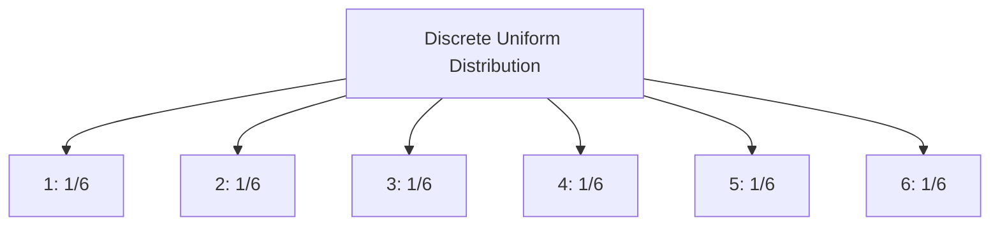
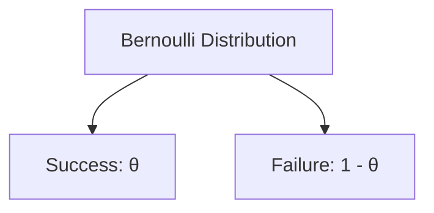
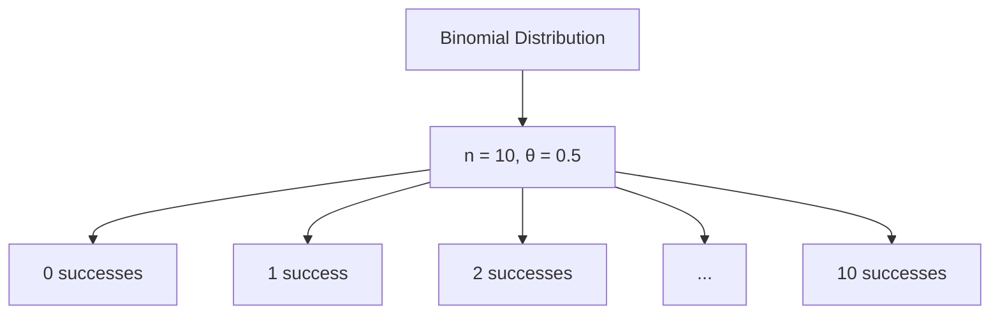

# Discrete Distributions in Applied Statistics

Discrete distributions are probability distributions for variables that can only take on specific, separate values. Here, we'll explore some important discrete distributions with examples and visualizations.

## 1. Uniform Distribution

In a discrete uniform distribution, all outcomes have an equal probability of occurring.

**Example:** Rolling a fair six-sided die. Each number has an equal 1/6 probability of being rolled.

**Probability Mass Function (PMF):**
```
P(X = x) = 1/n, for x = 1, 2, ..., n
```

Where n is the number of possible outcomes.

**Visualization:**



## 2. Bernoulli Distribution

The Bernoulli distribution describes an experiment with only two possible outcomes, typically called "success" and "failure."

**Example:** Flipping a coin (Heads = success, Tails = failure)

**Probability Mass Function (PMF):**
```
f(x) = θ^x * (1 - θ)^(1-x), where x = 0 or 1
```

Where θ is the probability of success.

**Visualization:**



## 3. Binomial Distribution

The binomial distribution is an extension of the Bernoulli distribution for n independent trials.

**Example:** Number of heads in 10 coin flips.

**Probability Mass Function (PMF):**
```
f(x) = C(n,x) * θ^x * (1 - θ)^(n-x), where x = 0, 1, ..., n
```

Where:
- n is the number of trials
- x is the number of successes
- θ is the probability of success on each trial
- C(n,x) is the binomial coefficient

**Mean:** μ = nθ
**Variance:** σ² = nθ(1-θ)

**Visualization:**



## 4. Poisson Distribution

The Poisson distribution models the number of events occurring in a fixed interval.

**Example:** Number of customers arriving at a store in one hour.

**Probability Mass Function (PMF):**
```
f(x; λ) = (e^(-λ) * λ^x) / x!, where x = 0, 1, 2, ...
```

Where λ is the average number of events in the interval.

**Mean and Variance:** Both equal to λ

> [!image]- Visualization:
> 
> ```mermaid
> graph LR
>     A[Poisson Distribution] --> B[λ = 3]
>     B --> C[0 events: 0.0498]
>     B --> D[1 event: 0.1494]
>     B --> E[2 events: 0.2240]
>     B --> F[3 events: 0.2240]
>     B --> G[4 events: 0.1680]
>     B --> H[...]
> ```

## 5. Negative Binomial Distribution

The negative binomial distribution models the number of trials needed to achieve a specified number of successes.

**Example:** Number of coin flips needed to get 3 heads.

**Probability Mass Function (PMF):**
```
b*(x; r, P) = C(x-1, r-1) * P^r * (1-P)^(x-r)
```

Where:
- x is the number of trials
- r is the number of successes
- P is the probability of success on each trial

**Mean:** μ = r/P
**Variance:** σ² = rQ/P²

Where Q = 1-P

## 6. Geometric Distribution

The geometric distribution is a special case of the negative binomial distribution where we're interested in the number of trials until the first success.

**Example:** Number of coin flips until getting the first head.

**Probability Mass Function (PMF):**
```
g(x; p) = p * q^(x-1)
```

Where:
- p is the probability of success
- q = 1-p
- x is the number of trials

**Mean:** μ = 1/p
**Variance:** σ² = q/p²

## 7. Hypergeometric Distribution

The hypergeometric distribution is used when sampling without replacement from a finite population.

**Example:** Drawing 5 cards from a standard 52-card deck and counting the number of hearts.

**Probability Mass Function (PMF):**
```
h(x; N, n, k) = [C(k,x) * C(N-k, n-x)] / C(N,n)
```

Where:
- N is the population size
- k is the number of success states in the population
- n is the number of draws
- x is the number of observed successes

**Mean:** μ = nk/N
**Variance:** σ² = nk(N-k)(N-n) / [N²(N-1)]

These discrete distributions form the foundation for many statistical analyses and modeling techniques in applied statistics. Understanding their properties and when to use each one is crucial for effective data analysis and decision-making.
