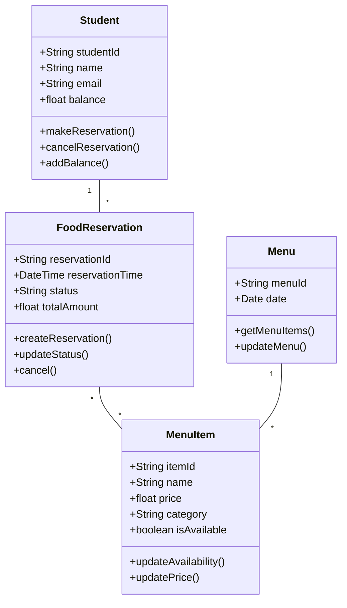
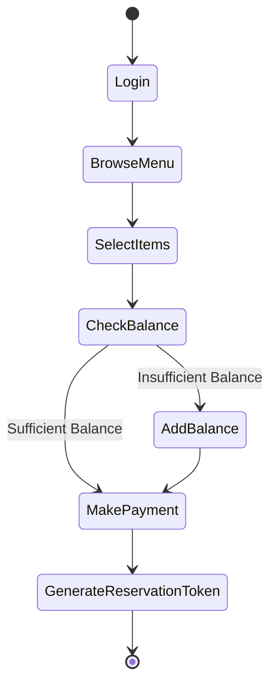
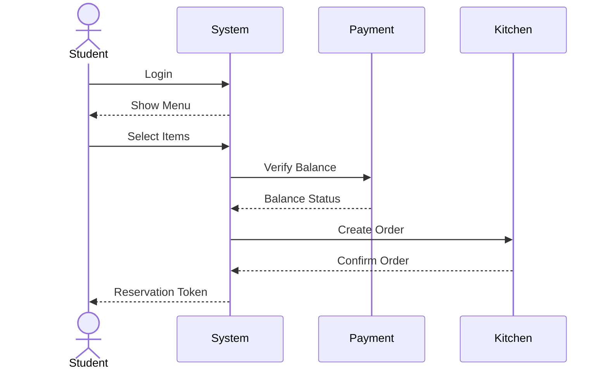
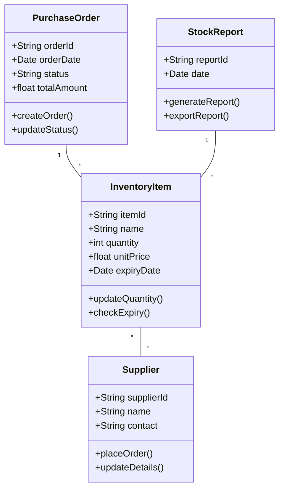
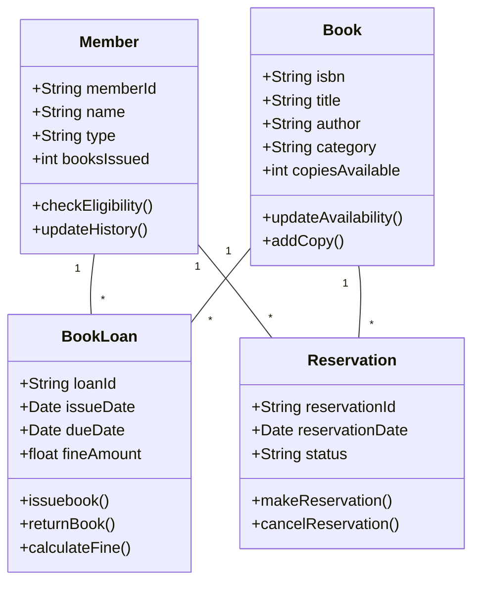
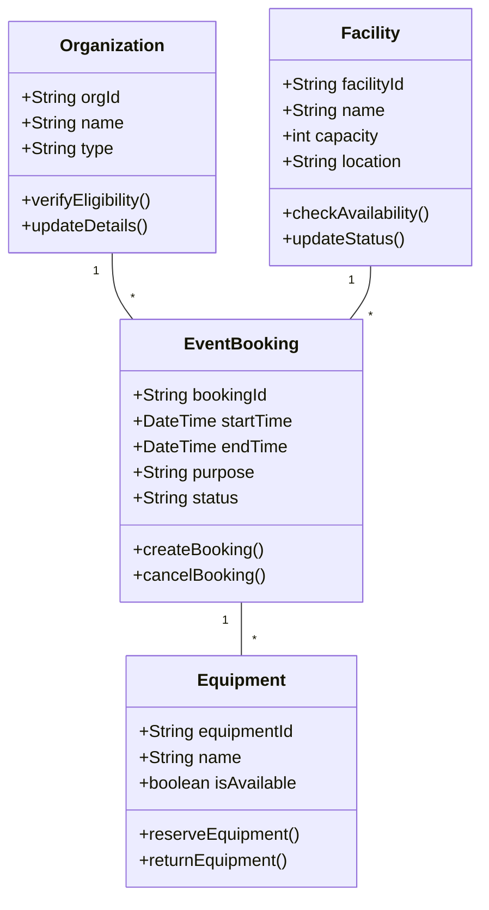
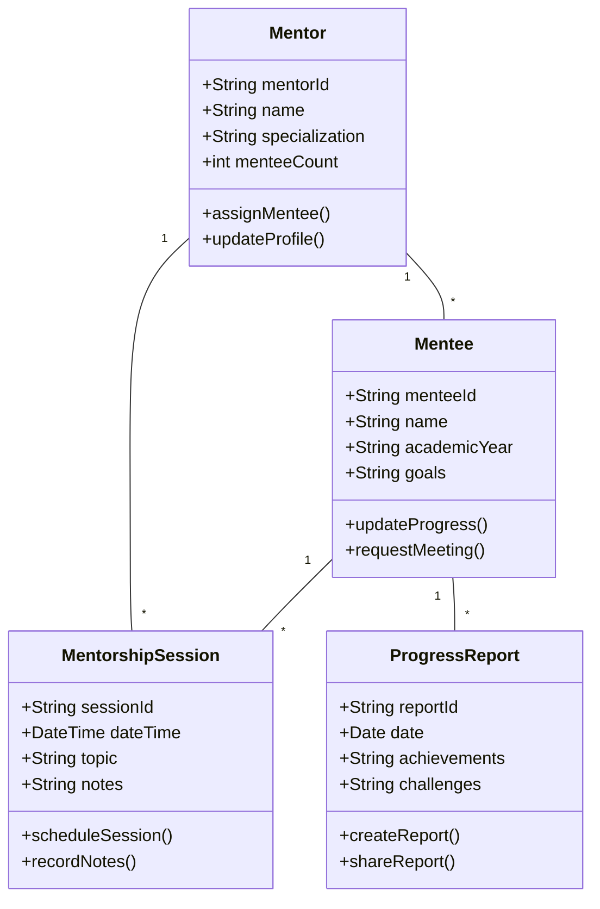
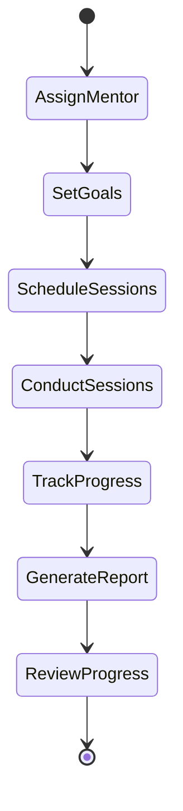

## Status
Reviewed : `INPUT[toggle:Reviewed]`

Progress :  
```meta-bind
INPUT[progressBar:Completion]
```



```mermaid
%% 1. UNIVERSITY CANTEEN FOOD RESERVATION SYSTEM

classDiagram
    class Student {
        +String studentId
        +String name
        +String email
        +float balance
        +makeReservation()
        +cancelReservation()
        +addBalance()
    }
    
    class FoodReservation {
        +String reservationId
        +DateTime reservationTime
        +String status
        +float totalAmount
        +createReservation()
        +updateStatus()
        +cancel()
    }
    
    class MenuItem {
        +String itemId
        +String name
        +float price
        +String category
        +boolean isAvailable
        +updateAvailability()
        +updatePrice()
    }
    
    class Menu {
        +String menuId
        +Date date
        +getMenuItems()
        +updateMenu()
    }
    
    Student "1" -- "*" FoodReservation
    FoodReservation "*" -- "*" MenuItem
    Menu "1" -- "*" MenuItem


```



```mermaid
%% Activity Diagram for Food Reservation
stateDiagram-v2
	[*] --> Login
    Login --> BrowseMenu
    BrowseMenu --> SelectItems
    SelectItems --> CheckBalance
    CheckBalance --> MakePayment: Sufficient Balance
    CheckBalance --> AddBalance: Insufficient Balance
    AddBalance --> MakePayment
    MakePayment --> GenerateReservationToken
    GenerateReservationToken --> [*]
```


```mermaid
%% Sequence Diagram for Food Reservation
sequenceDiagram
    actor Student
    participant System
    participant Payment
    participant Kitchen
    
    Student->>System: Login
    System-->>Student: Show Menu
    Student->>System: Select Items
    System->>Payment: Verify Balance
    Payment-->>System: Balance Status
    System->>Kitchen: Create Order
    Kitchen-->>System: Confirm Order
    System-->>Student: Reservation Token
```


```mermaid
%% 2. CANTEEN INVENTORY MANAGEMENT SYSTEM

classDiagram
    class InventoryItem {
        +String itemId
        +String name
        +int quantity
        +float unitPrice
        +Date expiryDate
        +updateQuantity()
        +checkExpiry()
    }
    
    class Supplier {
        +String supplierId
        +String name
        +String contact
        +placeOrder()
        +updateDetails()
    }
    
    class PurchaseOrder {
        +String orderId
        +Date orderDate
        +String status
        +float totalAmount
        +createOrder()
        +updateStatus()
    }
    
    class StockReport {
        +String reportId
        +Date date
        +generateReport()
        +exportReport()
    }
    
    InventoryItem "*" -- "*" Supplier
    PurchaseOrder "1" -- "*" InventoryItem
    StockReport "1" -- "*" InventoryItem

```


```mermaid
%% 3. LIBRARY BOOK LENDING SYSTEM

classDiagram
    class Book {
        +String isbn
        +String title
        +String author
        +String category
        +int copiesAvailable
        +updateAvailability()
        +addCopy()
    }
    
    class Member {
        +String memberId
        +String name
        +String type
        +int booksIssued
        +checkEligibility()
        +updateHistory()
    }
    
    class BookLoan {
        +String loanId
        +Date issueDate
        +Date dueDate
        +float fineAmount
        +issuebook()
        +returnBook()
        +calculateFine()
    }
    
    class Reservation {
        +String reservationId
        +Date reservationDate
        +String status
        +makeReservation()
        +cancelReservation()
    }
    
    Member "1" -- "*" BookLoan
    Book "1" -- "*" BookLoan
    Member "1" -- "*" Reservation
    Book "1" -- "*" Reservation

```


```mermaid
%% 4. INFRASTRUCTURE RESERVATION SYSTEM

classDiagram
    class Facility {
        +String facilityId
        +String name
        +int capacity
        +String location
        +checkAvailability()
        +updateStatus()
    }
    
    class EventBooking {
        +String bookingId
        +DateTime startTime
        +DateTime endTime
        +String purpose
        +String status
        +createBooking()
        +cancelBooking()
    }
    
    class Organization {
        +String orgId
        +String name
        +String type
        +verifyEligibility()
        +updateDetails()
    }
    
    class Equipment {
        +String equipmentId
        +String name
        +boolean isAvailable
        +reserveEquipment()
        +returnEquipment()
    }
    
    Organization "1" -- "*" EventBooking
    Facility "1" -- "*" EventBooking
    EventBooking "1" -- "*" Equipment

```


```mermaid
%% 5. CSE MENTORING PROGRAM MANAGEMENT

classDiagram
    class Mentor {
        +String mentorId
        +String name
        +String specialization
        +int menteeCount
        +assignMentee()
        +updateProfile()
    }
    
    class Mentee {
        +String menteeId
        +String name
        +String academicYear
        +String goals
        +updateProgress()
        +requestMeeting()
    }
    
    class MentorshipSession {
        +String sessionId
        +DateTime dateTime
        +String topic
        +String notes
        +scheduleSession()
        +recordNotes()
    }
    
    class ProgressReport {
        +String reportId
        +Date date
        +String achievements
        +String challenges
        +createReport()
        +shareReport()
    }
    
    Mentor "1" -- "*" Mentee
    Mentor "1" -- "*" MentorshipSession
    Mentee "1" -- "*" MentorshipSession
    Mentee "1" -- "*" ProgressReport
```


```mermaid
%% Use Case Diagram for Mentoring System
stateDiagram-v2
    [*] --> AssignMentor
    AssignMentor --> SetGoals
    SetGoals --> ScheduleSessions
    ScheduleSessions --> ConductSessions
    ConductSessions --> TrackProgress
    TrackProgress --> GenerateReport
    GenerateReport --> ReviewProgress
    ReviewProgress --> [*]
```

