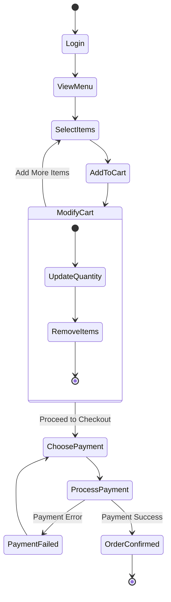
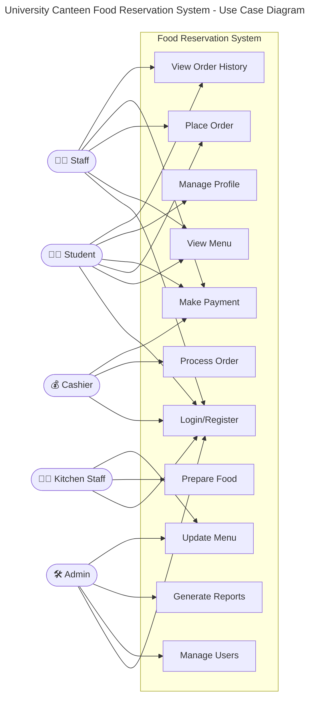
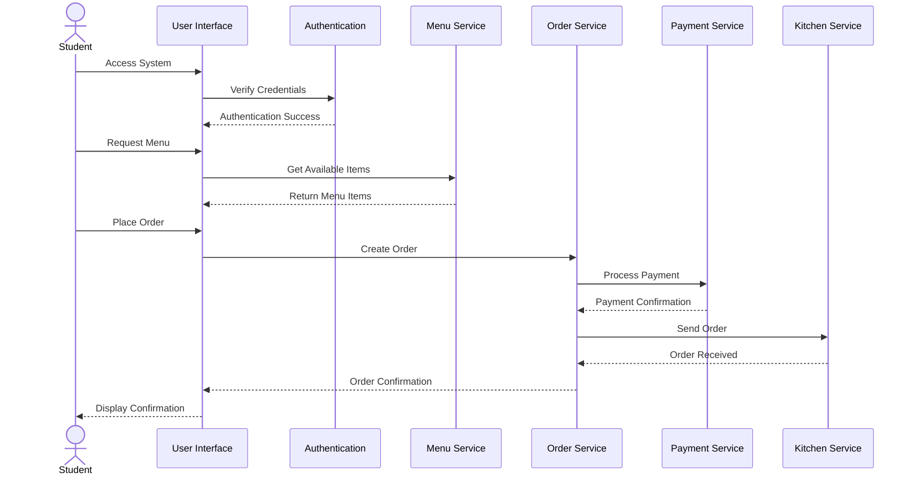
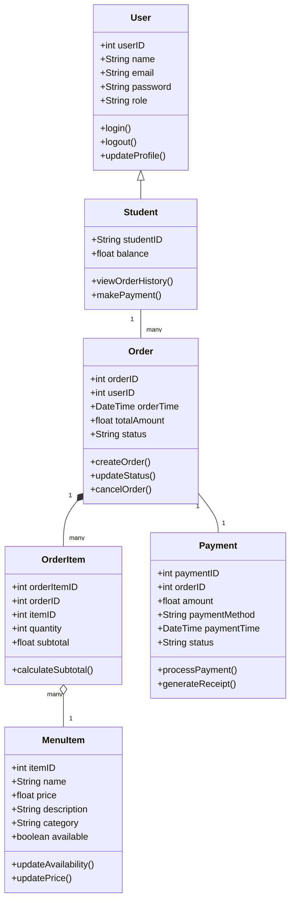
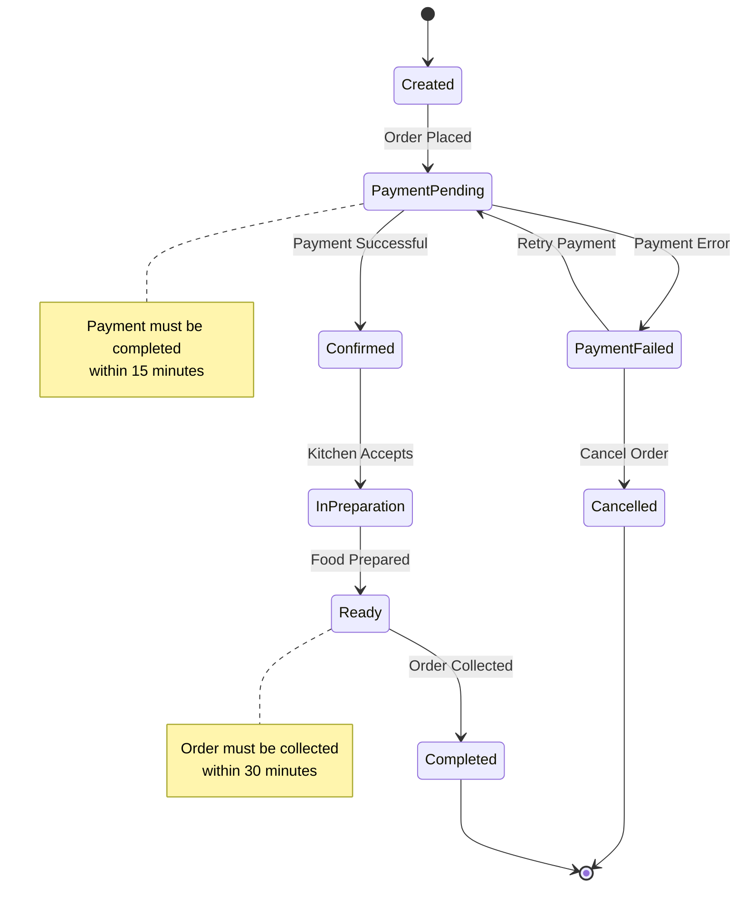

## Status
Reviewed : `INPUT[toggle:Reviewed]`

Progress :  
```meta-bind
INPUT[progressBar:Completion]
```

# Activity Diagram




# Use Case Diagram



# Sequence Diagram




# Class Diagram



# State Diagram



