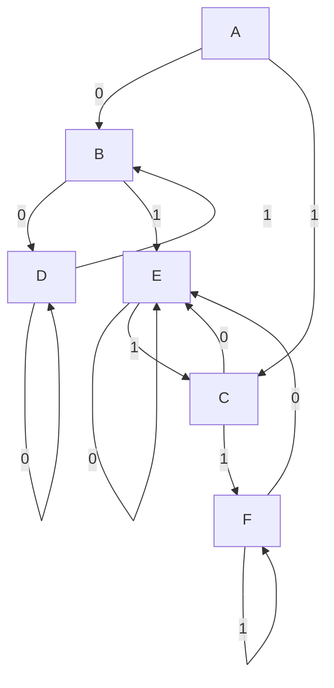

## Status
Reviewed : `INPUT[toggle:Reviewed]`

Progress :  
```meta-bind
INPUT[progressBar:Completion]
```


# Content


## Moore Machines

> [!NOTE] A **Moore machine** is a **6-tuple** defined as: $M = (Q, \Sigma, \Delta, q_0, \delta, \lambda)$ Where:
> 
> - $Q$ : Finite set of states
> - $\Sigma$ : Input alphabet
> - $\Delta$ : Output alphabet
> - $q_0$ : Initial state
> - $\delta$ : Transition function $\delta : Q \times \Sigma \rightarrow Q$
> - $\lambda$ : Output function $\lambda : Q \rightarrow \Delta$
- The ==**output** is associated with the **state**==.

<br>

#### Example Moore Machine

> [!image] Moore Machine Diagram
> ![[Pasted image 20250304202646.png]]

> [!table] Transition Table
> 
> | Present State | Input = 0 | Input = 1 | Output |
> |:------------- |:--------- |:--------- |:------ |
> | --&gt; A      | A         | B         | 0      |
> | B             | C         | A         | 1      |
> | C             | B         | C         | 2      |
> 

### Mealy Machines

- A **Mealy machine** differs from a Moore machine in that ==**outputs depend on transitions**== rather than states.
> [!NOTE] A **Mealy machine** is a **6-tuple** defined as: $M = (Q, \Sigma, \Delta, q_0, \delta, \lambda)$ Where:
> 
> - $Q$ : Finite set of states
> - $\Sigma$ : Input alphabet
> - $\Delta$ : Output alphabet
> - $q_0$ : Initial state
> - $\delta$ : Transition function $\delta : Q \times \Sigma \rightarrow Q$
> - $\lambda$ : Output function  $\lambda : Q \times \Sigma \rightarrow \Delta$


#### Example Mealy Machine


> [!image] Mealy Machine Diagram
> ![[Pasted image 20250305144604.png]]

> [!table] Transition Table
> 
> | Present State | Next State<br>(Input=0) | Output | Next State<br>(Input = 1) | Output |
> | :------------ | :------------------- | :----- | :------------------------ | :----- |
> | A             | B                    | 0      | C                         | 0      |
> | B             | B                    | 1      | C                         | 0      |
> | C             | B                    | 0      | C                         | 1      |
> 


### Moore vs. Mealy

|Feature|Moore Machine|Mealy Machine|
|---|---|---|
|Output depends on|State|Transition|
|Output length|$n+1$ (one extra output for the initial state)|$n$|

---

## 2. Pumping Lemma

Used to **prove that a language is not regular**.

### Statement:

For a regular language $L$, there exists a constant $n$ such that for any string $x \in L$ with $|x| \geq n$, we can split $x$ into three parts: x = uvw Such that:

- $|uv| \leq n$
- $|v| > 0$
- $\forall m \geq 0, u v^m w \in L$

#### Example: Proving $L = {0^n1^n \mid n \geq 0}$ is not regular

1. Assume $L$ is regular and satisfies the Pumping Lemma.
2. Choose $x = 0^n1^n$ where $|x| \geq n$.
3. By the lemma, $x$ can be written as $uvw$, with $v \neq \lambda$.
4. If $v$ contains only $0s$, then $uvvw$ has more $0s$ than $1s$, contradicting $L$.
5. If $v$ contains both $0s$ and $1s$, it disturbs order, contradicting $L$.
6. **Conclusion:** $L$ is **not regular**.

---

## 3. Applications of Finite Automata

### Reactive Systems

- **Vending machines, ATMs, communication protocols**
- **Control systems** for air-traffic, trains, nuclear plants

### Software Applications

- **Lexical analysis** (compilers)
- **Text editors** (regex-based search, substitution)
- **Pattern matching**

---

## 4. State Minimization of DFA

### Myhill-Nerode Theorem

**A language is regular iff there exists a unique minimum-state DFA for it.**

### DFA Minimization Algorithm

1. Create **distinguishability matrix**
2. Mark pairs where one is accepting, the other is not
3. Iterate through unmarked pairs and mark distinguishable states
4. Merge equivalent states

#### Example DFA Minimization



After **merging equivalent states**, the minimized DFA will have fewer states.

---

## References

- [MIT OpenCourseWare: Automata Theory](https://ocw.mit.edu/courses/electrical-engineering-and-computer-science/6-045j-automata-computability-and-complexity-spring-2011/)
- Lecture notes from **CS3063: Theory of Computing**

---

This study note includes **all major topics**, **Mermaid diagrams for state machines**, and **references for deeper learning** from MIT OpenCourseWare.