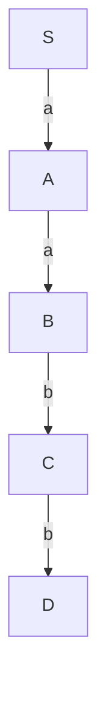
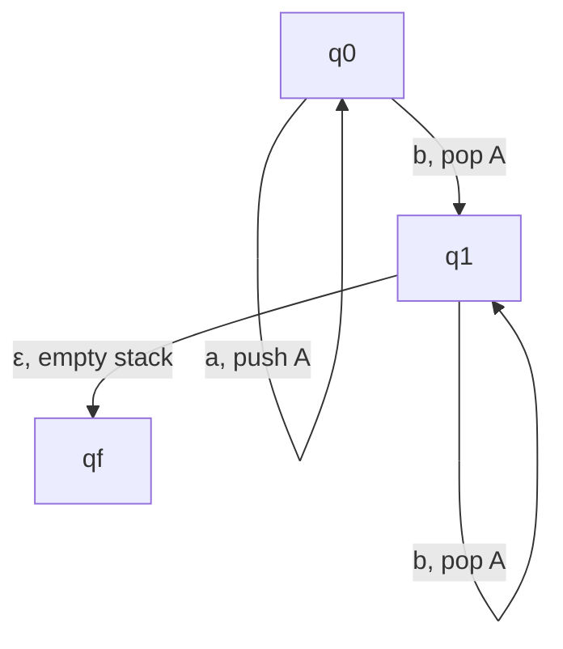

## Status
Reviewed : `INPUT[toggle:Reviewed]`

Progress :  
```meta-bind
INPUT[progressBar:Completion]
```


# Context-Free Languages (CFLs)

## Introduction

Context-Free Languages (CFLs) are a class of formal languages that can be generated by **Context-Free Grammars (CFGs)**. They are widely used in programming language syntax, natural language processing, and formal language theory.

---

## **1. Context-Free Grammars (CFGs)**

A **Context-Free Grammar (CFG)** is defined as a 4-tuple:

G=(V,Σ,S,P)G = (V, \Sigma, S, P)

where:

- **$V$** : Finite set of non-terminal symbols.
- **$\Sigma$** : Finite set of terminal symbols ($V \cap \Sigma = \emptyset$).
- **$S$** : Start symbol ($S \in V$).
- **$P$** : Finite set of production rules of the form: A→αA \to \alpha where $A \in V$ and $\alpha \in (V \cup \Sigma)^*$ (any combination of terminals and non-terminals).

### **Example: Grammar for Balanced Parentheses**

The following CFG generates balanced parentheses: S→(S)S∣εS \to (S)S \mid \varepsilon

- $(S)S$ ensures nested structures.
- $\varepsilon$ represents an empty string (base case).

---

## **2. Derivations and Parse Trees**

A **derivation** is a sequence of rule applications that transforms the start symbol into a string in the language.

### **Example**

Given CFG: $S→aSb∣abS$ to $aSb \mid ab$ Derivation of `aabb`: $S⇒\Rightarrow aSb \Rightarrow aaSbb \Rightarrow aabb$

A **derivation tree** (or **parse tree**) visually represents how a string is derived:



---

## **3. Context-Free vs. Regular Languages**

- **Regular languages** can be recognized by **finite automata** (e.g., DFAs, NFAs).
- **Context-Free Languages** require **pushdown automata (PDA)** for recognition.
- **Every regular language is also a CFL**, but **not every CFL is regular**.

### **Example: Regular vs. Context-Free Language**

| Language                             | Type                       |
| ------------------------------------ | -------------------------- |
| $L_1 = \{ a b \}$                    | Regular                    |
| $L_2 = \{\ a^n b^n \mid n \geq 1 \}$ | Context-Free (not regular) |
|                                      |                            |

---

## **4. Ambiguity in CFGs**

A grammar is **ambiguous** if there exists a string with **more than one derivation tree**.

### **Example of Ambiguity**

Given grammar: S→S+S∣S−S∣aS \to S + S \mid S - S \mid a String: `a + a - a` can have two derivation trees:

1. **Leftmost derivation:** $(a + a) - a$
2. **Rightmost derivation:** $a + (a - a)$

This ambiguity is resolved by **imposing precedence rules**.

---

## **5. Unambiguous Grammars**

Some ambiguous grammars can be rewritten as **unambiguous grammars** by structuring the rules appropriately.

### **Example: Unambiguous Arithmetic Expression Grammar**

To enforce operator precedence:

```
Expr → Expr + Term | Term
Term → Term * Factor | Factor
Factor → ( Expr ) | a
```

This ensures multiplication has higher precedence than addition.

---

## **6. Properties of Context-Free Languages**

CFLs are closed under:

- **Union**: If $L_1$ and $L_2$ are CFLs, then $L_1 \cup L_2$ is also a CFL.
- **Concatenation**: If $L_1$ and $L_2$ are CFLs, then $L_1 L_2$ is also a CFL.
- **Kleene Star**: If $L$ is a CFL, then $L^*$ is also a CFL.

However, CFLs are **not closed under intersection or complement**.

### **Example**

If:

- $L_1 = { a^n b^n c^m \mid n, m \geq 1 }$
- $L_2 = { a^m b^n c^n \mid n, m \geq 1 }$

Then $L_1 \cap L_2 = { a^n b^n c^n \mid n \geq 1 }$ is **not** a CFL.

---

## **7. Pushdown Automata (PDA) and CFLs**

A **Pushdown Automaton (PDA)** is a **finite automaton with a stack** that can recognize CFLs.

### **Definition**

A PDA is defined as a 6-tuple: M=(Q,Σ,Γ,δ,q0,F)M = (Q, \Sigma, \Gamma, \delta, q_0, F) where:

- $Q$ : Set of states
- $\Sigma$ : Input alphabet
- $\Gamma$ : Stack alphabet
- $\delta$ : Transition function
- $q_0$ : Initial state
- $F$ : Set of accepting states

PDAs **push and pop stack symbols** to keep track of context-sensitive information.

### **Example PDA for $ { a^n b^n \mid n \geq 1 } $**

1. **Push** `a` onto the stack for every `a` read.
2. **Pop** a `b` for every `b` read.
3. **Accept** if stack is empty at the end.



---

## **8. Conclusion**

- **Context-Free Languages** are generated by **CFGs** and recognized by **PDAs**.
- **CFGs can be ambiguous**, requiring transformation into **unambiguous grammars**.
- CFLs **have closure properties**, but are **not closed under intersection or complement**.
- **PDAs provide computational power beyond finite automata**, making them crucial for parsing programming languages.

For further reading, refer to:

- [MIT OpenCourseWare: Automata and Formal Languages](https://ocw.mit.edu/courses/electrical-engineering-and-computer-science/6-045j-automata-computability-and-complexity-spring-2011/)
- Lecture notes from **CS3063: Theory of Computing**