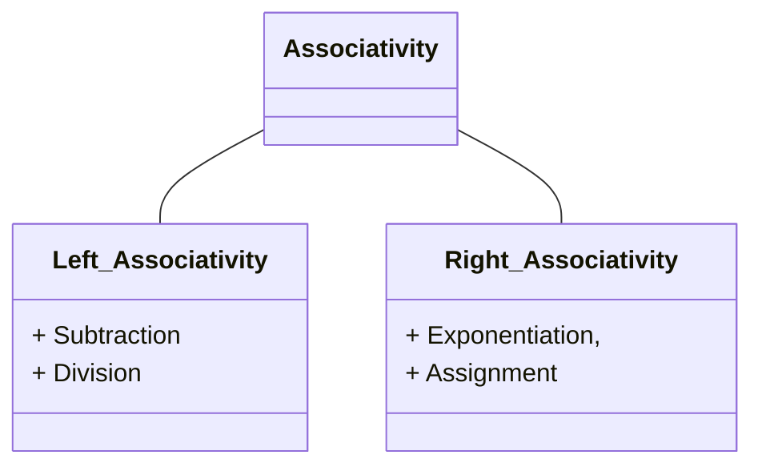

## Status
Reviewed : `INPUT[toggle:Reviewed]`

Progress :  
```meta-bind
INPUT[progressBar:Completion]
```


## Ambiguous CFGs


> [!info] **Ambiguous** CFG : 
> The grammar can produce a string that has more than one derivation tree.


> [!NOTE] Expression
> - A sum of **terms**
> >[!example] 
> > - Replace `S-->S+S` by `S-->S+T|T`

> [!NOTE] Term
> - A product of **factors**.
> >[!example] Example
> > - `T-->T*F|F` where `F` stands for factor
> 
- Here precedence of * over + is incorporated.
- Association from left to right is also incorporated.


> [!check] Unambiguous Expression
> Replace `S-->S+S` with the following grammar definition
> - `S-->S+T | T`
> - `T-->T*F | F`
> - `F-->(S) | a`


### Associativity of Operators


> [!NOTE] Associativity
> How to group operators with the same precedence when parentheses are not used.



## Simplified Forms and Normal Forms


> [!tip] Improvements to grammar <span style="color: rgb(0, 200, 255);">(without changing the language).</span>
> - Eliminate $\Lambda$ - **productions** ($A \rightarrow \Lambda$)
> - Eliminate **unit productions** ($S \rightarrow T$)
> - Standardize productions for a *"normal form"*

> [!NOTE] Theorem
> For every context-free grammar G = (V, ,S,P), the following algorithm produces a CFG G1 = (V, ,S,P1) having no-productions and satisfying L(G1) = L(G) −{ }.
>  1. Identify the nullable variables in V, and initialize P1 to P.
>  2. For every production A → α in P, add to P1 every production obtained
>  from this one by deleting from α one or more variable-occurrences involving
>  a nullable variable.
>  3. Delete every-production from P1, as well as every production of the form A→A.
>

> [!check] Properties
> - If A→B is a production and B= A, then B is A-derivable.
> - If C is A-derivable, C → B is a production, and B= A, then B is A-derivable.
> - No other variables are A-derivable.

### $\Lambda$ - Productions 


> [!info] Definition : <span style="color: rgb(0, 200, 255);">nullable non terminal</span>
>A nullable non-terminal in a CFG, G=(V, Σ, S, P), is defined as:
>- Any non-terminal A for which P contains the production A → Λ is nullable
>- If P contains the production A → B1B2...Bnand B1, B2,…, Bn are nullable, then A is nullable
> - No other non-terminal in V is nullable


> [!warning] Nullable non-terminals are those A for which A =>* Λ


> [!example] Example 7.1
> Let G be a CFG such that:
 >S → ABCBCDA
 >A → CD
 >C → a | Λ
 >B → Cb
 >D → bD | Λ
> > [!math]- Answer
> > ### Step 1: Identify Nullable Variables  
> > A variable $X$ is **nullable** if it can derive **λ** ($\lambda$), the empty string.  
> > We determine nullability as follows:  
> > 
> > 1. **Base case:** Any variable directly producing $\lambda$ is nullable:  
> > 
> >    $$ C \to \lambda \quad \Rightarrow \quad C \text{ is nullable} $$
> > 
> >    $$ D \to \lambda \quad \Rightarrow \quad D \text{ is nullable} $$
> > 
> > 2. **Propagation:** If a variable $X$ produces only nullable variables, it is also nullable:  
> > 
> >    $$ A \to CD, \quad C \text{ and } D \text{ are nullable} \quad \Rightarrow \quad A \text{ is nullable} $$
> > 
> >    $$ B \to Cb \quad (\text{since } b \text{ is not nullable, } B \text{ is NOT nullable}) $$
> > 
> >    $$ S \to ABCBCDA \quad (\text{since } B \text{ is not nullable, } S \text{ is NOT nullable}) $$
> > 
> > ---
> > 
> > ## Step 2: Generate New Productions by Eliminating $\lambda$
> > For each production containing nullable variables, generate all possible combinations where each nullable variable is optionally included or omitted.
> > 
> > #### **Updating Productions:**  
> > 
> > - **For $S$:**  
> > 
> >    $$ S \to ABCBCDA $$
> > 
> >    $$ S \to ABCBCA $$
> > 
> >    $$ S \to ABCBCD $$
> > 
> >    $$ S \to ABCBC $$
> > 
> > - **For $A$:**  
> > 
> >    $$ A \to CD $$
> > 
> >    $$ A \to C $$
> > 
> >    $$ A \to D $$
> > 
> >    $$ A \to \lambda \quad \text{(which we discard)} $$
> > 
> > - **For $C$:**  
> > 
> >    $$ C \to a $$
> > 
> > - **For $B$:**  
> > 
> >    $$ B \to Cb $$
> > 
> >    $$ B \to b $$
> > 
> > - **For $D$:**  
> > 
> >    $$ D \to bD $$
> > 
> >    $$ D \to b $$
> > 
> > ---
> > 
> > ### Step 3: Remove Remaining $\lambda$-Productions
> > Since $A \to \lambda$ was removed, all remaining rules are now free from $\lambda$-productions.
> > 
> > ---
> > 
> > ### Final $\lambda$-Free Grammar
> > 
> > $$ S \to ABCBCDA \mid ABCBCA \mid ABCBCD \mid ABCBC $$
> > 
> > $$ A \to CD \mid C \mid D $$
> > 
> > $$ C \to a $$
> > 
> > $$ B \to Cb \mid b $$
> > 
> > $$ D \to bD \mid b $$
> > 
> > This CFG is now equivalent to the original but without $\lambda$-productions.

### Algorithm <span style="color: rgb(244, 40, 0);">FindNull</span>


> [!tip] FindNull
> 
