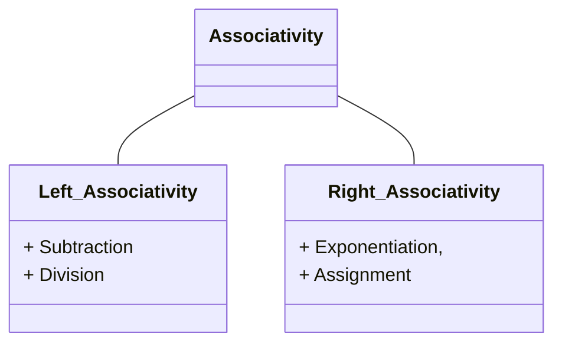

## Status
Reviewed : `INPUT[toggle:Reviewed]`

Progress :  
```meta-bind
INPUT[progressBar:Completion]
```


## Ambiguous CFGs


> [!info] **Ambiguous** CFG : 
> The grammar can produce a string that has more than one derivation tree.


> [!NOTE] Expression
> - A sum of **terms**
> >[!example] 
> > - Replace `S-->S+S` by `S-->S+T|T`

> [!NOTE] Term
> - A product of **factors**.
> >[!example] Example
> > - `T-->T*F|F` where `F` stands for factor
> 
- Here precedence of * over + is incorporated.
- Association from left to right is also incorporated.


> [!check] Unambiguous Expression
> Replace `S-->S+S` with the following grammar definition
> - `S-->S+T | T`
> - `T-->T*F | F`
> - `F-->(S) | a`


### Associativity of Operators


> [!NOTE] Associativity
> How to group operators with the same precedence when parentheses are not used.



## Simplified Forms and Normal Forms


> [!tip] Improvements to grammar <span style="color: rgb(0, 200, 255);">(without changing the language).</span>
> - Eliminate $\Lambda$ - **productions** ($A \rightarrow \Lambda$)
> - Eliminate **unit productions** ($S \rightarrow T$)
> - Standardize production for a *"normal form"*
 
### $\Lambda$ - Productions 


