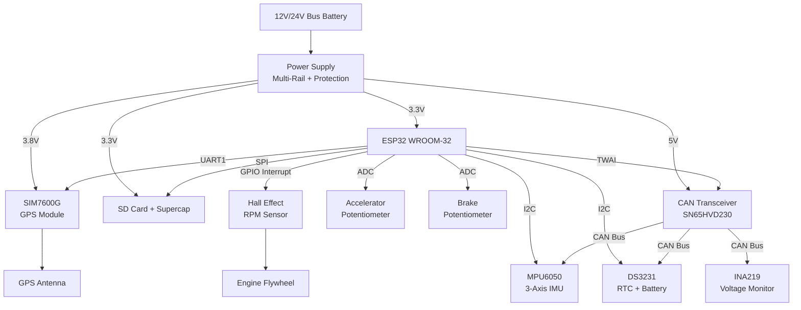
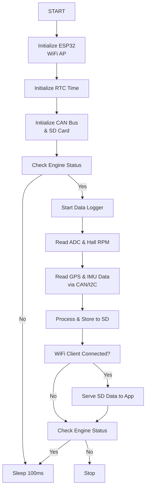

# Drive Parameter Recording Unit (DPR) Design Report


## 1. Microcontroller Selection

### Comparative Analysis of  Microcontrollers

|Parameter|ESP32-WROOM-32|STM32F407VGT6|Arduino Mega 2560|
|---|---|---|---|
|**Core**|Dual-core Tensilica LX6|ARM Cortex-M4|ATmega2560|
|**Clock Speed**|240 MHz|168 MHz|16 MHz|
|**Flash Memory**|4 MB|1 MB|256 KB|
|**SRAM**|520 KB|192 KB|8 KB|
|**GPIO Pins**|34|82|54|
|**ADC Channels**|18 (12-bit)|16 (12-bit)|16 (10-bit)|
|**UART**|3|4|4|
|**SPI**|4|3|1|
|**I2C**|2|3|1|
|**CAN Controller**|1 (TWAI)|1 (bxCAN)|No|
|**WiFi/Bluetooth**|Yes|No|No|
|**Real-time Clock**|Yes|Yes|No|
|**Power Consumption**|240mA active|200mA active|300mA active|
|**Cost (USD)**|$4-6|$8-12|$15-20|
|**Development Ease**|Easy|Moderate|Very Easy|
|**Cellular Integration**|Excellent|Good|Poor|
|**IoT Capabilities**|Native|External modules|External modules|

### **Choice: ESP32-WROOM-32**

**Justification:**

- **Superior connectivity**: Built-in WiFi and Bluetooth for local access point
- **Higher processing power**: 240MHz dual-core vs 168MHz single-core (STM32) and 16MHz (Arduino)
- **Better memory**: 4MB Flash and 520KB SRAM vs limited Arduino Mega resources
- **IoT-ready**: Native support for WiFi access point functionality
- **Cost-effective**: Lowest cost while providing maximum functionality
- **Integrated CAN**: Built-in TWAI controller eliminates external CAN controller need
- **Real-time capabilities**: FreeRTOS support for multitasking applications

---

## 2. Physical Interface Components

| Parameter               | Sensor/Component     | Interface Type    | Connection Method             |
| ----------------------- | -------------------- | ----------------- | ----------------------------- |
| **Date/Time**           | NTP Server           | Internet/WiFi     | Network time sync             |
| **Accelerator Pedal**   | Rotary Potentiometer | Analog/ADC        | Mechanical coupling to pedal  |
| **Brake Pedal**         | Linear Potentiometer | Analog/ADC        | Mechanical coupling to pedal  |
| **Engine RPM**          | Hall Effect Sensor   | Digital/Interrupt | Magnetic pickup from flywheel |
| **Vehicle Speed**       | SIM7600G Module      | UART Digital      | Satellite positioning         |
| **GPS Position**        | SIM7600G Module      | UART Digital      | Integrated GPS                |
| **3-Axis Acceleration** | MPU6050 IMU          | I2C Digital       | Accelerometer + Gyroscope     |
| **Backup Power**        | DS3231 RTC + Battery | I2C Digital       | Time backup during power loss |

### Interface Specifications:

- **Analog Inputs**: 0-3.3V range (ESP32 ADC limitation)
- **Digital Inputs**: 3.3V logic level compatible
- **Hall Effect**: Interrupt-driven pulse counting
- **I2C**: 400kHz fast mode for sensor communication
- **UART**: 9600-115200 baud for GPS communication
- **CAN**: TWAI protocol for module communication

---

## 3. GPS Module and Storage Selection

### **GPS Module: SIM7600G-H**

- **GPS**: Integrated GNSS (GPS, GLONASS, BeiDou)
- **Interface**: UART (AT commands)
- **Power**: 3.8V-4.2V, 2A peak
- **Antenna**: External GPS antenna

### **Storage Module: Adafruit MicroSD Breakout**

- **Interface**: SPI
- **Capacity**: 32GB SanDisk High Endurance
- **Speed**: Class 10 (10MB/s minimum)
- **Backup Power**: Supercapacitor (5.5V, 1F)
- **File System**: FAT32 for compatibility
- **Write Protection**: Hardware switch

### **Battery Backup System:**

- **Primary**: 18650 Li-ion (3.7V, 3000mAh)
- **Management**: TP4056 charging module
- **Backup Duration**: 2-3 hours continuous logging
- **Voltage Monitor**: Low battery warning via CAN

---

## 4. Engine RPM Measurement Method

### **Hall Effect Sensor Approach**

- **Sensor**: A3144 Hall Effect Switch
- **Installation**: Mount near engine flywheel or crankshaft pulley
- **Target**: Attach small neodymium magnets to flywheel teeth (or use existing teeth)
- **Signal Processing**: ESP32 interrupt-driven pulse counting
- **Calculation**: RPM = (Pulse Count × 60) / (Time × Number of Magnets)
- **Accuracy**: ±5 RPM with proper calibration
- **Update Rate**: Real-time (interrupt-based)

### **Implementation Details:**

- **Mounting**: Secure bracket to engine block, 2-5mm gap from flywheel
- **Wiring**: Shielded cable to prevent electromagnetic interference
- **Signal Conditioning**: Pull-up resistor and noise filtering capacitor
- **Calibration**: Count flywheel teeth during installation for accurate RPM calculation
- **Backup Method**: Secondary sensor for redundancy in critical applications


---

## 5. Peripheral Module Requirements

### **ESP32 Peripherals Used:**

- **UART0**: Debug/Programming
- **UART1**: SIM7600G communication
- **UART2**: Reserved for expansion
- **SPI (HSPI)**: SD card interface
- **I2C**: IMU sensor and RTC
- **ADC1**: Accelerator and brake pedal positions
- **GPIO Interrupt**: Hall effect sensor RPM counting
- **PWM**: Status LED indicators
- **Timer**: Precision timing for RPM calculations
- **TWAI (CAN)**: Communication with sensors and modules

### **External Components Required:**

- **Voltage level shifters**: 3.3V ↔ 5V interfaces for pedal sensors
- **Signal conditioning**: Pull-up resistors, noise filtering for Hall sensor
- **Voltage regulators**: Multiple rail power supply
- **Antenna switches**: For GPS
- **Protection circuits**: ESD protection for all interfaces
- **CAN Transceiver**: SN65HVD230 for CAN bus interfacing

---

## 6. Communication Protocol for Data Download

### **Primary: ESP32 WiFi Access Point**

- **Mode**: ESP32 acts as a WiFi access point
- **Protocol**: HTTP server for data download
- **Data Access**: Android app connects to ESP32's local network (SSID: DPR_BUS_XXX, Password: WPA2-PSK)
- **Security**: WPA2-PSK encryption for WiFi
- **Functionality**: SD card data retrieval, firmware updates
- **Implementation**: ESP32 hosts a web server to serve SD card files
- **Data Format**: JSON with timestamp, stored on SD card

### **CAN Bus Integration:**

- **Protocol**: CAN 2.0B (TWAI)
- **Nodes**: IMU, RTC, and voltage monitor connected via CAN bus
- **Bit Rate**: 500 kbps
- **Data**: Sensor data aggregated and sent to ESP32
- **Advantage**: Reduces wiring complexity, reliable in noisy environments

### **Data Storage Format:**

````json
{
  "device_id": "BUS_001",
  "timestamp": "2025-07-08T10:30:00Z",
  "location": {"lat": 6.7965, "lon": 79.9019},
  "vehicle_data": {
    "rpm": 1800,
    "speed": 45,
    "accelerator": 35,
    "brake": 0,
    "acceleration": {"x": 0.2, "y": 0.1, "z": 9.8}
  }
}
````

---

## 7. Power Supply Design

### **Input**: 12V/24V Bus Battery

### **Power Requirements:**

- ESP32: 3.3V, 240mA
- SIM7600G: 3.8V, 2A peak
- SD Card Module: 3.3V, 100mA
- CAN Transceiver: 5V, 50mA
- IMU Sensor: 3.3V, 3.5mA
- Backup Battery: 3.7V, 3000mAh

### **Power Circuit Design:**

1. **Input Protection**:
    - Fuse: 5A automotive blade fuse
    - TVS Diode: SMAJ24A (24V protection)
    - Reverse polarity: P-channel MOSFET
2. **Multi-Rail Supply:**
    - **12V/24V → 5V**: LM2596 switching regulator (3A)
    - **5V → 3.8V**: LM2596 adjustable (2.5A for SIM module)
    - **5V → 3.3V**: AMS1117-3.3 linear regulator (1A)
3. **Backup Power:**
    - **Battery**: 18650 Li-ion with protection PCB
    - **Charger**: TP4056 with load sharing
    - **Monitoring**: INA219 current/voltage sensor
4. **Supercapacitor Backup:**
    - **Capacity**: 5.5V, 1F supercapacitor
    - **Purpose**: SD card write completion during power loss
    - **Duration**: 5-10 seconds write protection

---

## 8. System Block Diagram



---

## 9. Software Algorithm Flowchart



---

## 10. Cost Estimate

### **Hardware Components:**

|Component|Quantity|Unit Price (USD)|Total (USD)|
|---|---|---|---|
|ESP32-WROOM-32 Dev Board|1|$6.00|$6.00|
|SIM7600G-H GPS Module|1|$45.00|$45.00|
|A3144 Hall Effect Sensor|1|$2.00|$2.00|
|Rotary Potentiometer 10kΩ|1|$3.00|$3.00|
|Linear Potentiometer 10kΩ|1|$4.00|$4.00|
|MPU6050 IMU|1|$3.00|$3.00|
|DS3231 RTC Module|1|$2.00|$2.00|
|32GB MicroSD Card|1|$8.00|$8.00|
|SD Card Breakout|1|$5.00|$5.00|
|18650 Li-ion Battery|1|$8.00|$8.00|
|TP4056 Charging Module|1|$2.00|$2.00|
|Supercapacitor 5.5V 1F|1|$5.00|$5.00|
|Power Supply Components|1|$15.00|$15.00|
|GPS Antenna|1|$8.00|$8.00|
|Signal Conditioning PCB|1|$10.00|$10.00|
|CAN Transceiver (SN65HVD230)|1|$2.00|$2.00|
|Mechanical Coupling Hardware|1|$15.00|$15.00|
|PCB & Enclosure|1|$35.00|$35.00|
|Connectors & Wiring|1|$20.00|$20.00|
|**Hardware Subtotal**|||**$198.00**|

### **Development Costs:**

|Activity|Time (Hours)|Rate (USD/hr)|Total (USD)|
|---|---|---|---|
|System Design|50|$50|$2,500|
|Analog Sensor Integration|35|$50|$1,750|
|Hall Effect RPM System|25|$50|$1,250|
|WiFi/Data Development|50|$50|$2,500|
|PCB Design|40|$50|$2,000|
|Software Development|90|$50|$4,500|
|Testing & Calibration|50|$50|$2,500|
|Documentation|25|$50|$1,250|
|**Development Subtotal**|||**$18,250**|

### **Production Costs (per unit):**

|Component|Cost (USD)|
|---|---|
|Manufacturing|$20.00|
|Assembly|$15.00|
|Testing|$8.00|
|**Production Subtotal**|**$43.00**|

### **Total Project Cost:**

- **Prototype Development**: $18,448
- **Per Unit Hardware Cost**: $241.00
- **Total Cost of Ownership (3 years)**: $241.00 per unit

### **Price References:**

- SIM7600G: Waveshare, SIMCom official distributors
- ESP32 modules: Espressif, Adafruit, SparkFun
- Hall effect sensors: Allegro Microsystems, Honeywell
- Potentiometers: Bourns, Alpha, Vishay
- CAN Transceiver: Texas Instruments
