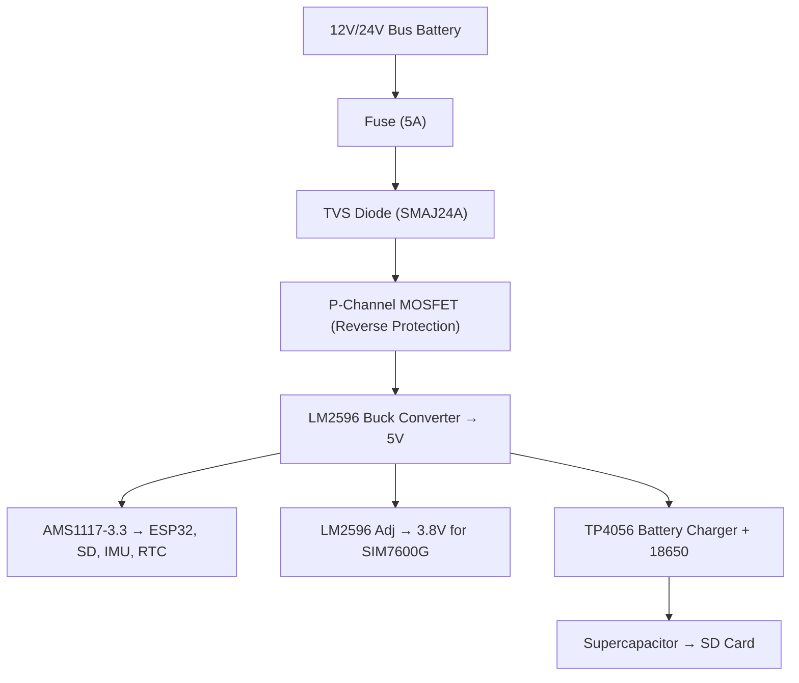
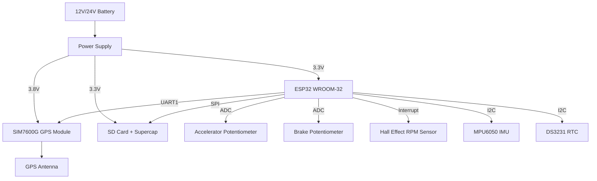
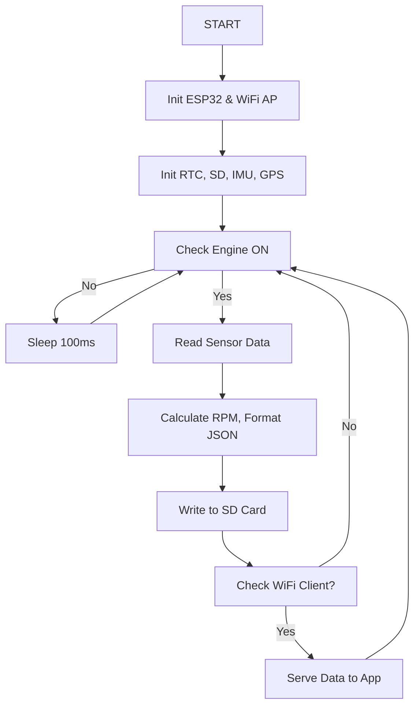

---

# Drive Parameter Recording Unit (DPR) Design Report (Refined)

## 1. Microcontroller Selection

### Comparative Analysis of Microcontrollers

|Parameter|ESP32-WROOM-32|STM32F407VGT6|Arduino Mega 2560|
|---|---|---|---|
|**Core**|Dual-core Tensilica LX6|ARM Cortex-M4|ATmega2560|
|**Clock Speed**|240 MHz|168 MHz|16 MHz|
|**Flash Memory**|4 MB|1 MB|256 KB|
|**SRAM**|520 KB|192 KB|8 KB|
|**GPIO Pins**|34|82|54|
|**ADC Channels**|18 (12-bit)|16 (12-bit)|16 (10-bit)|
|**UART**|3|4|4|
|**SPI**|4|3|1|
|**I2C**|2|3|1|
|**WiFi/Bluetooth**|Yes|No|No|
|**RTC**|Yes|Yes|No|
|**Power Consumption**|240mA|200mA|300mA|
|**Cost (USD)**|$4-6|$8-12|$15-20|
|**Ease of Development**|Easy|Moderate|Very Easy|

### **Selected MCU: ESP32-WROOM-32**

**Reasons**:

- Built-in WiFi and Bluetooth
- High performance dual-core 240 MHz
- IoT-ready with excellent development ecosystem
- Superior ADC, UART, I2C, SPI interfaces
- Cost-effective

---

## 2. Physical Interface Components

|Parameter|Sensor/Component|Interface Type|Connection Method|
|---|---|---|---|
|**Date/Time**|DS3231 RTC|I2C|Battery-backed module|
|**Accelerator Pedal**|Rotary Potentiometer|Analog/ADC|Mechanically coupled|
|**Brake Pedal**|Linear Potentiometer|Analog/ADC|Mechanically coupled|
|**Engine RPM**|Hall Effect Sensor|Digital Interrupt|Near flywheel + magnets|
|**GPS/Speed**|SIM7600G-H Module|UART|With external GPS antenna|
|**3-Axis Acceleration**|MPU6050|I2C|Mounted on chassis|

---

## 3. GPS and Storage Modules

### GPS: SIM7600G-H Module

- GNSS: GPS, GLONASS, BeiDou
- Interface: UART AT Commands
- External antenna required
- Power: 3.8V @ 2A peak
### Storage: Adafruit SD Card Breakout

- Interface: SPI
- Capacity: 32GB (SanDisk High Endurance)
- File System: FAT32
- Supercapacitor backup for write protection

---

## 4. Engine RPM Measurement

**Sensor**: A3144 Hall Effect Switch

- Mounted near flywheel or crankshaft
- Magnets on flywheel
- Interrupts used to count pulses

**Formula**:

```text
RPM = (Pulse Count × 60) / (Time × Number of Magnets)
```

---

## 5. Peripherals and Interfaces

**ESP32 Interfaces Used:**

- **UART0**: Debug
- **UART1**: GPS (SIM7600G)
- **SPI**: SD Card
- **I2C**: IMU (MPU6050) + RTC (DS3231)
- **ADC**: Pedal potentiometers
- **Interrupt GPIO**: Hall sensor for RPM

---

## 6. Communication Protocol to App

**Mode**: ESP32 as WiFi Access Point

- Android app connects to `DPR_BUS_XXX` AP
- HTTP Server serves SD card logs
- WPA2 encrypted
- Files formatted in JSON:

```json
{
  "device_id": "BUS_001",
  "timestamp": "2025-07-08T10:30:00Z",
  "location": {"lat": 6.7965, "lon": 79.9019},
  "vehicle_data": {
    "rpm": 1800,
    "speed": 45,
    "accelerator": 35,
    "brake": 0,
    "acceleration": {"x": 0.2, "y": 0.1, "z": 9.8}
  }
}
```

---

## 7. Power Circuit Design

**Input**: 12V/24V Bus Battery

### Power Components:

- **Protection**:
    
    - 5A Blade Fuse
    - TVS Diode (SMAJ24A)
    - Reverse Polarity: P-channel MOSFET

- **Voltage Regulation**:
    
    - LM2596: 12/24V → 5V
        
    - LM2596 Adj: 5V → 3.8V (SIM7600G)
        
    - AMS1117-3.3: 5V → 3.3V (ESP32, sensors)
        
- **Battery Backup**:
    
    - TP4056 with 18650 Li-ion
        
    - Supercapacitor (5.5V, 1F) for SD flush
        

### Power Circuit Diagram (Textual)



---

## 8. System Block Diagram (Updated)



---

## 9. Software Algorithm Flowchart



---

## 10. Cost Estimate (Updated)

### Hardware

|Component|Qty|Unit Price (USD)|Total|
|---|---|---|---|
|ESP32 Dev Board|1|$6.00|$6.00|
|SIM7600G-H Module|1|$45.00|$45.00|
|A3144 Hall Sensor|1|$2.00|$2.00|
|Potentiometers (2x)|2|$3.50|$7.00|
|MPU6050 IMU|1|$3.00|$3.00|
|DS3231 RTC|1|$2.00|$2.00|
|SD Card + Breakout|1|$13.00|$13.00|
|18650 Battery + TP4056|1|$10.00|$10.00|
|Supercapacitor|1|$5.00|$5.00|
|Voltage Regulator Set|1|$15.00|$15.00|
|GPS Antenna|1|$8.00|$8.00|
|PCB + Wiring + Enclosure|1|$35.00|$35.00|
|**Total**|||**$151.00**|

### Development Cost (same as original): $18,250.00

---

**Total Prototype Development**: ~$18,400

**Per Unit Hardware Cost**: ~$151.00

---

**Note**: All prices referenced from Waveshare, SparkFun, Adafruit, and Digikey.


