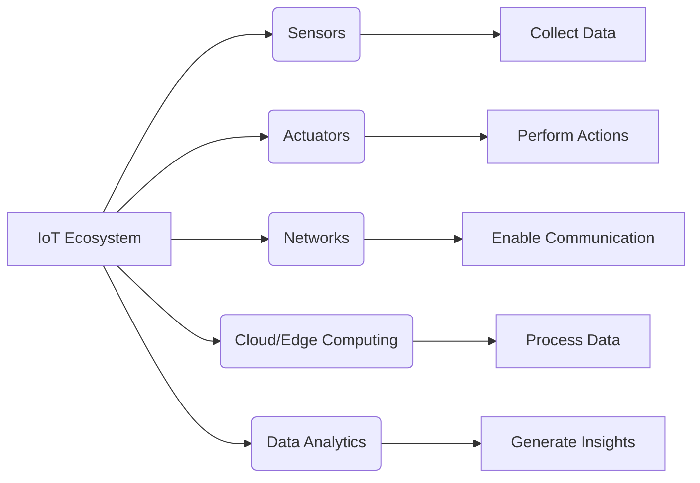
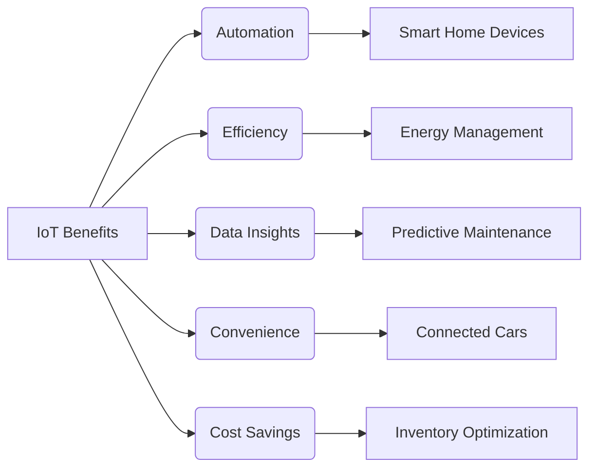
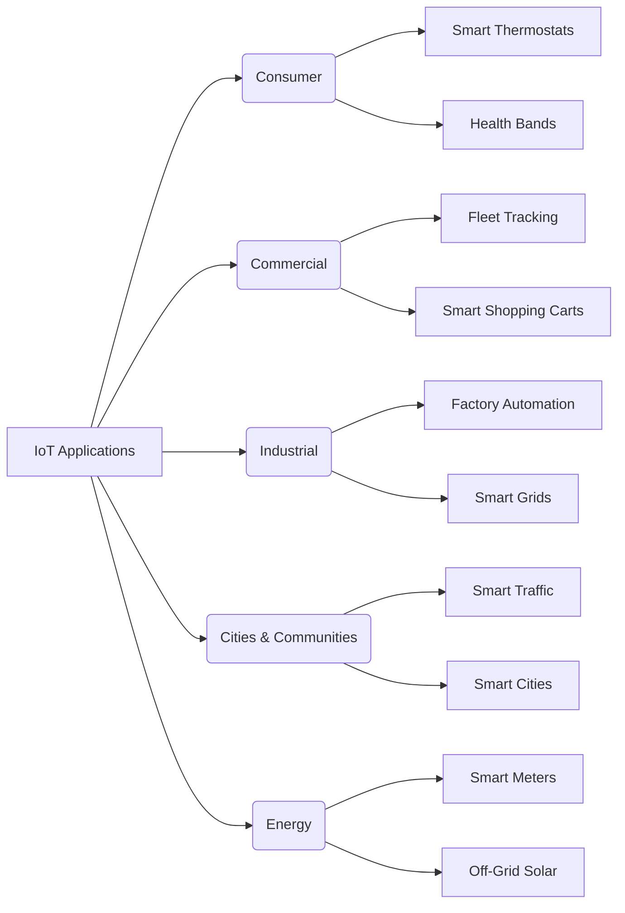
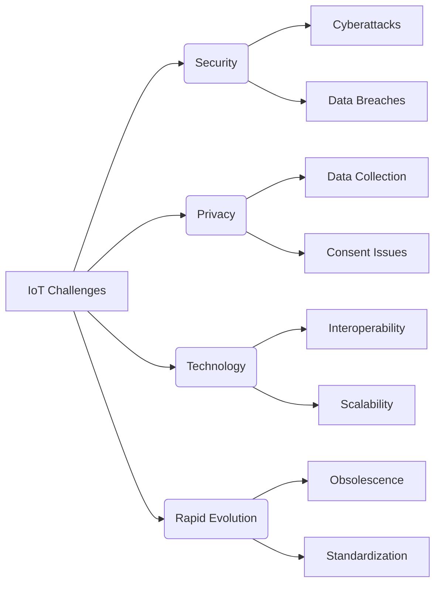
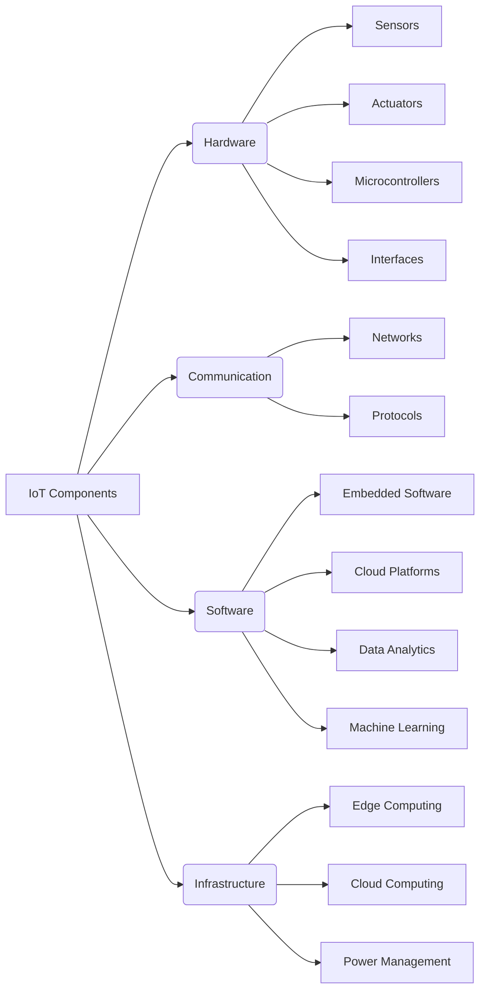

---
tags:
  - iot
Created: 2025-03-03 09:33
About: 
Reviewed: false
Completion: 0
---

## 1. What is IoT?

> [!info] Definition  
> The **Internet of Things (IoT)** refers to a network of ==interconnected physical devices== ("Things") embedded with sensors, actuators, and software, enabling them to ==collect, exchange, and act on data via the Internet==. It is often described as a "System of Systems," leveraging existing technologies to add value through networked intelligence.

IoT builds on matured technologies like microprocessors, RFID, and cellular networks, transforming everyday objects into "smart" devices capable of machine-to-machine communication. The term was coined by **Kevin Ashton** in 1999, emphasizing the potential of connected devices to enhance efficiency and automation.

### Key Characteristics

- **Connectivity**: Devices communicate over wired or wireless networks.
- **Intelligence**: Embedded systems enable data processing and decision-making.
- **Scalability**: IoT supports large-scale deployment of devices.
- **Data-Driven**: Data collected from devices drives analytics and applications.

For more details, see [IBM's IoT Overview](https://www.ibm.com/internet-of-things).

## 2. Why Do We Need IoT?

> [!tip] Importance of IoT  
> IoT enables smarter decision-making, operational efficiency, and enhanced user experiences by connecting devices, processes, and people. It drives innovation across industries, from consumer products to industrial automation.

### Benefits of IoT

1. **Automation**: Reduces manual intervention (e.g., smart thermostats adjusting temperature).
2. **Efficiency**: Optimizes resource usage (e.g., smart grids managing energy distribution).
3. **Data Insights**: Real-time analytics improve decision-making (e.g., predictive maintenance in factories).
4. **Convenience**: Enhances user experiences (e.g., connected cars with navigation assistance).
5. **Cost Savings**: Minimizes waste and operational costs (e.g., inventory management).

### Industry Impact

- **Consumer**: Smart homes and wearables improve daily life.
- **Commercial**: Fleet tracking and targeted advertising boost business efficiency.
- **Industrial**: Factory automation and smart manufacturing enhance productivity.

For further reading, check [Forbes on IoT Benefits]([What Is IoT? – Internet Of Things Explained](https://www.forbes.com/sites/technology/article/what-is-iot/)).

## 3. Examples of IoT Applications

> [!example] Real-World Applications  
> IoT is transforming industries and daily life through innovative applications. Below are examples categorized by domain, drawn from the document and web sources.

### Consumer Applications

- **Smart Thermostats**: Adjust home temperatures for energy efficiency.
- **Health Bands**: Monitor fitness and health metrics in real-time.
- **Smart Fridges**: Track inventory and suggest recipes.
- **Connected Cars**: Provide navigation and diagnostics (e.g., Tesla’s over-the-air updates).

### Commercial Applications

- **Vehicle Fleet Tracking**: Optimizes logistics and delivery routes.
- **Smart Shopping Carts**: Enable automated checkouts and personalized offers.
- **Remote Patient Monitoring**: Tracks patient health remotely for timely interventions.

### Industrial Applications

- **Factory Automation**: Streamlines production with IoT-enabled machinery.
- **Smart Grids**: Manages energy distribution for efficiency.
- **Remote Monitoring**: Ensures equipment health in real-time.

### City & Community Applications

- **Smart Traffic Management**: Reduces congestion using real-time data (e.g., Singapore’s traffic systems).
- **Smart Railways**: Enhances passenger convenience and safety.
- **Smart Cities**: Optimizes energy, reduces pollution, and improves public services.

### Energy Applications

- **Off-Grid Solar Energy**: Manages battery capacity to minimize grid reliance.
- **Smart Meters**: Monitor and optimize energy consumption.

For more examples, visit [IoT Analytics Case Studies](https://iot-analytics.com/case-studies/).

## 4. Issues and Challenges

> [!warning] Challenges in IoT  
> Despite its potential, IoT faces significant hurdles like **security risks** and **privacy violations** that must be addressed for widespread adoption.

### Security

- **Vulnerabilities**: IoT devices are often targets for cyberattacks due to weak security protocols.
- **Data Breaches**: Sensitive data collected by devices can be compromised.
- Example: In 2016, the Mirai botnet exploited IoT devices to launch DDoS attacks.

### Privacy

- **Data Collection**: IoT devices continuously collect personal data, raising privacy concerns.
- **Consent**: Users may not fully understand how their data is used or shared.

### Technology

- **Interoperability**: Diverse devices and protocols hinder seamless integration.
- **Scalability**: Managing millions of devices requires robust infrastructure.
- **Dependency**: IoT relies on power, networks, and cloud services, which may fail.

### Rapid Evolution

- **Obsolescence**: Fast-changing technologies can render devices outdated quickly.
- **Standardization**: Lack of universal standards complicates development.
- 

For a deeper dive, see [Top challenges of IoT adoption in the enterprise](https://www.techtarget.com/iotagenda/feature/Top-challenges-of-IoT-adoption-in-the-enterprise)

## 5. Components of IoT Solutions

> [!note] IoT Components  
> IoT solutions comprise interconnected components that enable functionality. These are categorized below based on the document and web insights.

### Hardware Components

- **Sensors**: Collect environmental data (e.g., temperature, motion).
- **Actuators**: Perform actions based on data (e.g., motors, relays).
- **Microcontrollers**: Process data locally (e.g., Arduino, Raspberry Pi).
- **Interfaces**: Enable device interaction (e.g., touchscreens, buttons).

### Communication Components

- **Networks**: Facilitate data transfer (e.g., Wi-Fi, Bluetooth, 5G).
- **Protocols**: Ensure reliable communication (e.g., MQTT/Message Queuing Telemetry Transport, CoAP).

### Software Components

- **Embedded Software**: Runs on devices for local processing.
- **Cloud Platforms**: Store and analyze data (e.g., AWS IoT, Google Cloud).
- **Data Analytics**: Derive insights from collected data.
- **Machine Learning**: Enable predictive capabilities.
- **Computer Vision & NLP**: Support advanced applications (e.g., facial recognition, voice assistants).

### Infrastructure Components

- **Edge Computing**: Processes data locally to reduce latency.
- **Cloud Computing**: Provides scalable storage and processing.
- **Power Management**: Ensures efficient energy use for devices.

For technical details, refer to [Microsoft Azure IoT Components](https://azure.microsoft.com/en-us/solutions/iot/).

> [!success] For further exploration, visit [IoT Analytics](https://iot-analytics.com/) or [xAI's API](https://x.ai/api) for IoT integration possibilities.
> 

