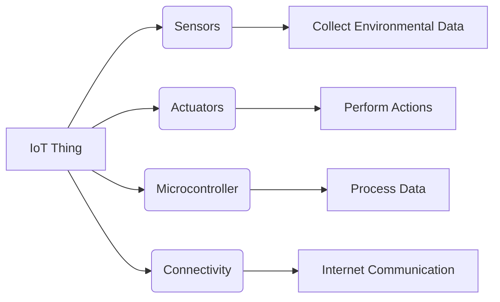
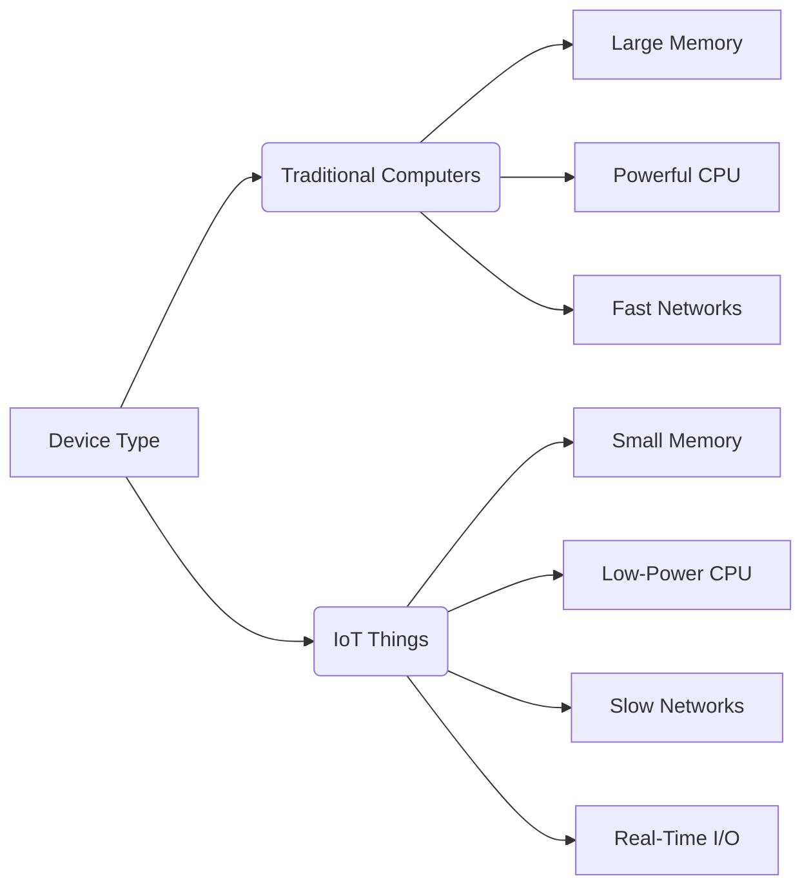
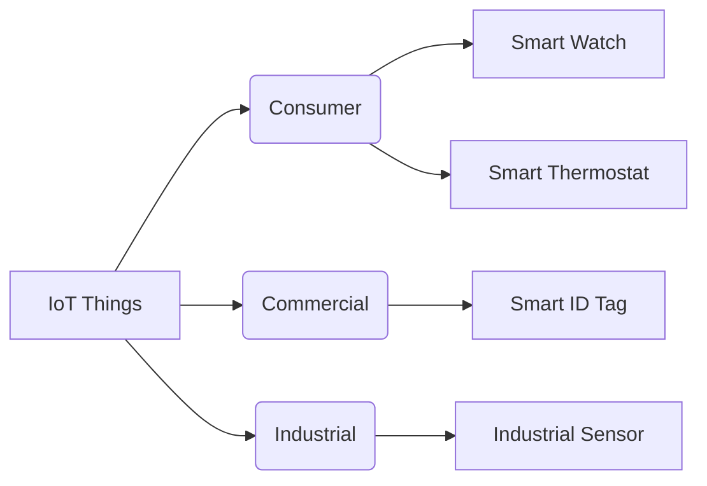
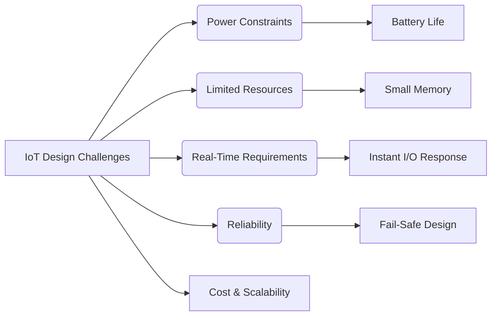
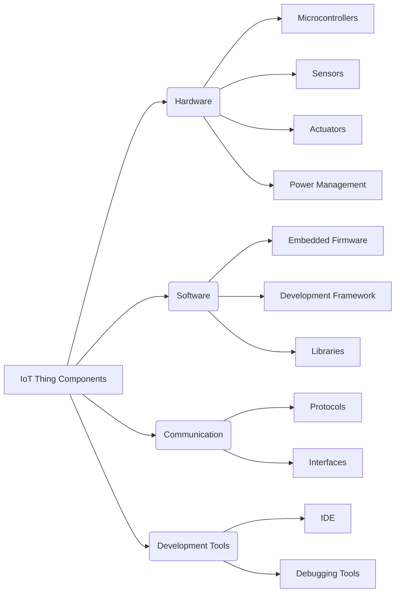
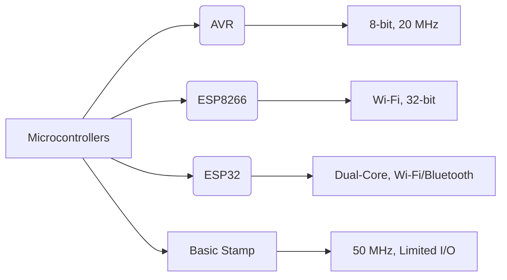
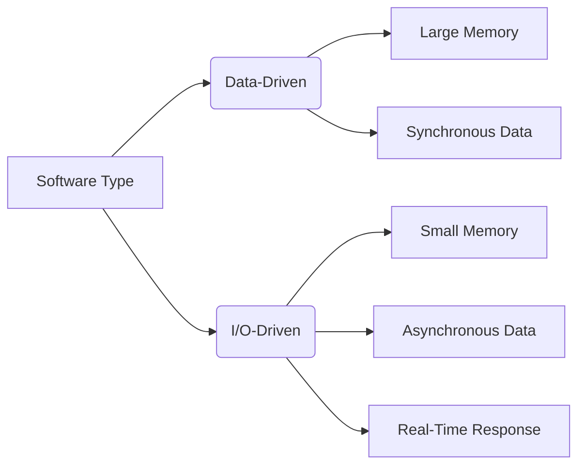

---
tags:
  - iot
Created: 2025-05-08 15:57
About: Based on CS3243-Lecture 02 Anatomy of a thing
Reviewed: true
---
## 1. What is an IoT Thing?

> [!info] Definition  
> An IoT "Thing" is a ==physical device== embedded with electronics, such as sensors, actuators, and microcontrollers, designed to ==interact with its environment and communicate over the Internet== . Unlike traditional computers, IoT Things prioritize energy efficiency, real-time responsiveness, and environmental interaction.

IoT Things, like smart watches, are computer-based but optimized for specific tasks with limited resources. They are built to handle diverse inputs/outputs (I/O) and operate reliably under constraints like battery power.

### Example: Smart Watch

- **Sensors**: Heart rate, motion, temperature.
- **Actuators**: Vibration motor, display.
- **Microcontroller**: Processes data and manages I/O.
- **Connectivity**: Wi-Fi or Bluetooth for data exchange.

![[Pasted image 20250508160106.png|360]]

## 2. Why Are IoT Things Different from Traditional Computers?

> [!tip] IoT Things vs. Computers  
> IoT Things are designed for environmental interaction and resource efficiency, contrasting with traditional computers built for data-intensive tasks. This distinction drives their unique architecture and functionality.

### Comparison

| Feature              | Traditional Computers            | IoT Things                          |
| -------------------- | -------------------------------- | ----------------------------------- |
| **Purpose**          | Data-intensive computing         | Environment interaction             |
| **Memory/Storage**   | Large, hierarchical              | Limited, small                      |
| **Processors**       | Powerful, general-purpose (CISC) | Specialized, low-power (RISC)       |
| **Network**          | Fast, reliable connections       | Slow, less reliable connections     |
| **User Interface**   | Large screens, keyboards         | Simple or headless                  |
| **I/O Capabilities** | Limited (USB, serial, etc.)      | Diverse (analog, digital, noisy)    |
| **Power**            | Grid-powered, no issue           | Battery-powered, energy-constrained |
| **Reliability**      | Reliable, not failsafe           | Failsafe, real-time response        |
| **Design Focus**     | Capacity, performance            | Energy saving, minimal components   |

### Architectural Differences

- **Computers**: Use multiple buses, large memory, and buffered I/O for high performance. Optimized for stored-program serial processing and expansion.
- **IoT Things**: Require minimal processing power, small fast memory, and real-time I/O responses. Focus on fail-safe operation and single-purpose functionality.

For further details, check [TechTarget on IoT Devices](https://www.techtarget.com/iotagenda/definition/IoT-device).

## 3. Examples of IoT Things

> [!example] Real-World Examples  
> IoT Things span consumer, commercial, and industrial applications, each leveraging unique hardware and software to interact with their environments.

- **Smart Watch**: Monitors health metrics and syncs with smartphones ([Fitbit](https://www.fitbit.com/global/us/products/smartwatches)).
- **Smart Thermostat**: Adjusts home temperature based on occupancy (e.g., Nest Thermostat).
- **Industrial Sensor**: Monitors machinery health in factories for predictive maintenance.
- **Connected Car Module**: Provides diagnostics and navigation (e.g., Tesla’s IoT systems).

> [!image] Smart Thermostat 
> ![[Pasted image 20250508160425.png|360]]

Explore more examples at [Popular IoT Devices in 2025](https://www.softwaretestinghelp.com/iot-devices/)

## 4. Issues and Challenges in Designing IoT Things

> [!warning] Design Challenges  
> Creating IoT Things involves overcoming constraints in power, processing, and reliability, which pose significant challenges.

- **Power Constraints**: Battery-powered devices must minimize energy use, limiting processing capabilities.
- **Limited Resources**: Small memory and low-power processors restrict complex computations.
- **Real-Time Requirements**: IoT Things must respond instantly to environmental changes, requiring efficient I/O handling.
- **Reliability**: Devices must operate in noisy or unstable environments with fail-safe mechanisms.
- **Cost and Scalability**: Minimizing components reduces costs but complicates design for large-scale deployment.

## 5. Components of an IoT Thing

> [!note] Component Categories  
> IoT Things are built using hardware and software components optimized for low power, real-time interaction, and connectivity. These are categorized below.

### Hardware Components

- **Microcontrollers**: System-on-Chip (SoC) units like AVR, ESP8266, or ESP32, with RISC processors for control tasks.
    - Example: ESP32 with Wi-Fi/Bluetooth ([Espressif](https://www.espressif.com/en/products/socs/esp32)).
- **Sensors**: Collect environmental data (e.g., temperature, motion).
- **Actuators**: Execute actions (e.g., motors, LEDs).
- **I/O Modules**: Support analog and digital interfaces for diverse devices.
- **Power Management**: Includes batteries, resistors, and capacitors for energy efficiency.
- **Development Boards**: Platforms like Arduino or NodeMCU for prototyping.

![[Pasted image 20250508163522.png|480]]

### Software Components

- **Embedded Firmware**: Runs on microcontrollers for device control.
- **Development Framework**: Tools like Arduino IDE or PlatformIO.
- **Programming Languages**: C/C++ for embedded systems.
- **Libraries**: Interface libraries for sensors, peripherals, and communication (e.g., MQTT).
- **Compilers/Debuggers**: Tools for code compilation and error checking.
- **Embedded OS**: Optional for complex devices (e.g., FreeRTOS).

### Communication Components

- **Protocols**: MQTT, CoAP for lightweight data exchange.
- **Interfaces**: Wi-Fi, Bluetooth, or serial for connectivity.

### Development Tools

- **IDE**: Arduino IDE or VS Code with PlatformIO.
- **Programming Port**: USB for firmware uploads.
- **Debugging Tools**: In-circuit debuggers for troubleshooting.

For technical specifications, refer to [Arduino Official Site](https://www.arduino.cc/).

## 6. Microcontrollers: The Heart of IoT Things

> [!info] Microcontrollers vs. Microprocessors  
> Microcontrollers are optimized for control tasks in IoT Things, unlike microprocessors used in traditional computers.

### Comparison

|Feature|Microprocessors|Microcontrollers|
|---|---|---|
|**Power Dissipation**|High (e.g., 95W)|Low (e.g., 0.25W)|
|**Clock Speed**|High (e.g., 5.0 GHz)|Low (e.g., 4 MHz)|
|**Instruction Set**|Large, CISC (1000+ instructions)|Small, RISC (e.g., 35 instructions)|
|**Memory**|External, large|Built-in, small (e.g., 8K ROM)|
|**Design**|Requires external components|System-on-Chip (SoC)|
|**Use Case**|Data processing|Control applications|

### Popular Microcontrollers

- **AVR**: 8-bit, up to 20 MHz, used in Arduino boards.
- **ESP8266**: Wi-Fi-enabled, 32-bit RISC, ideal for IoT connectivity.
- **ESP32**: Dual-core, Wi-Fi/Bluetooth, supports complex applications.
- **Parallax Basic Stamp**: Early SoC with 50 MHz and limited I/O.

> [!image] ESP32 SoC (System on Chip)
> ![[Pasted image 20250508162541.png]]

## 7. Software Design for IoT Things

> [!note] Data-Driven vs. I/O-Driven  
> IoT Things rely on I/O-driven software, contrasting with data-driven software in traditional computers.

### Comparison

|Feature|Data-Driven (Computers)|I/O-Driven (IoT Things)|
|---|---|---|
|**Data Source**|Memory-loaded, synchronous|Environment, asynchronous|
|**Memory Usage**|Large, fast-access|Limited, less critical|
|**Processing**|Serial, number-crunching|Real-time, event-based|
|**Event Handling**|Internal events|Multiple external events|
|**Response Time**|Non-critical|Guaranteed, immediate|

### Implications

- IoT software must handle asynchronous data from sensors, process multiple events simultaneously, and ensure real-time responses.
- Example: A smart thermostat adjusts temperature based on sensor data, requiring instant processing.

For software design tips, visit [Embedded.com](https://www.embedded.com).

