## 1. IoT Devices vs. General-Purpose Computers

> [!info] Key Differences  
> IoT devices operate under significant resource constraints compared to general-purpose computers, impacting their software design and development.

### Comparison

|Feature|General-Purpose Computers|IoT Devices|
|---|---|---|
|**Memory**|GBs to TBs|2 KB to 64 KB|
|**Storage**|TBs to PBs|32 KB to 512 KB|
|**Processors**|Fast, CISC, multi-threaded|Slower, RISC, single-threaded|
|**Power**|Grid-powered|Battery-powered, limited capacity|
|**I/O**|Rich UI, standardized|Basic, binary, hardware-dependent|
|**Execution Environment**|Managed, high-level|Unmanaged, low-level|
|**Programming Tools**|Advanced IDEs, debuggers|Basic languages, limited tools|

### Software Stack

- **PCs**: Use operating systems (OS) and BIOS for hardware abstraction, supporting multiple applications with device-independent access.
- **IoT Devices**: Rely on application software and device libraries, directly managing hardware with minimal abstraction.

![[Pasted image 20250508165320.png|480]]
For more details, see [IoT Stack Technology Layers with Detailed Overview](https://www.kaaiot.com/iot-knowledge-base/iot-technology-stack-5-layers-detailed-overview)

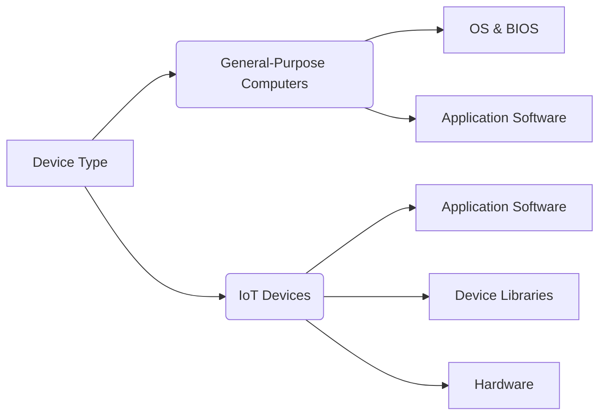

## 2. Hardware and Software Interactions

> [!note] Direct Hardware Management
> IoT software often directly manages hardware using low-level commands, unlike PCs where the OS abstracts hardware interactions.

### PC Software
- **Abstraction**: OS provides a virtual environment with high-level commands (e.g., sending MQTT messages without network details).
- **Examples**: Reading keyboard input as ASCII, printing to screen without resolution concerns, or opening files without disk knowledge.

### IoT Software
- **Direct Control**: Programs manage hardware via low-level protocols (e.g., GPIO, SPI, I2C, UART) and handle memory/flash directly.
- **Examples**: Checking connectivity before MQTT, translating key-switch status, or managing analog devices with ADC/DAC.

**Code Example: Reading a Sensor via I2C (Arduino)**  
```cpp
#include <Wire.h>
#define SENSOR_ADDR 0x48 // Sensor I2C address

void setup() {
  Wire.begin();
  Serial.begin(9600);
}

void loop() {
  Wire.beginTransmission(SENSOR_ADDR);
  Wire.write(0x00); // Request sensor data
  Wire.endTransmission();
  Wire.requestFrom(SENSOR_ADDR, 2); // Read 2 bytes
  if (Wire.available() >= 2) {
    int data = Wire.read() << 8 | Wire.read();
    Serial.println(data);
  }
  delay(1000);
}
````

For more on IoT hardware interactions, see [SparkFun I2C Guide](https://learn.sparkfun.com/tutorials/i2c).

![[Pasted image 20250508172309.png]]
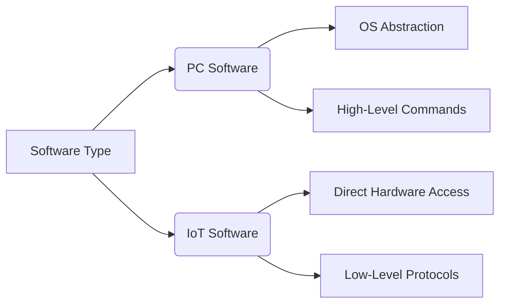

## 3. Cross-Platform Development Challenges

> [!warning] Development Constraints  
> IoT development requires coding and compiling on a separate environment from execution, with limited debugging tools.

- **PCs**: Code, compile, and test in the same environment with rich debugging (breakpoints, logs, test scripts).
- **IoT Devices**: Limited visibility, no real-time breakpoints, and reliance on external tools (e.g., JTAG, logic probes).

### Challenges

- **Limited Debugging**: No display for debug output, requiring external monitoring.
- **Hardware Dependency**: Specific devices complicate testing.
- **Real-Time Issues**: Timing-critical operations are hard to debug.

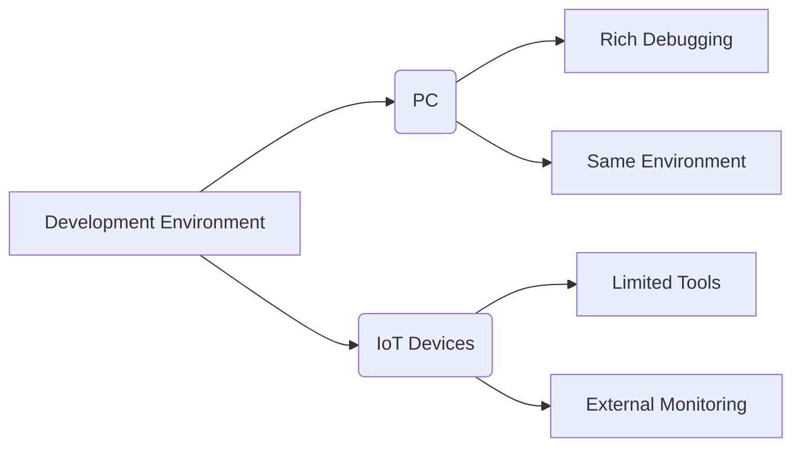

## 4. IoT Programming Languages

> [!info] Language Features  
> IoT programming languages are designed for efficiency, low resource use, and event-driven operations.

### Key Features

- **Lightweight**: Small runtime footprint, efficient code.
- **Embeddable**: Integrates with low-level hardware.
- **Event-Focused**: Supports asynchronous programming with timers and callbacks.
- **Extensible**: Modular design for diverse applications.
- **High-Level Abstractions**: Simple syntax, supports multiple paradigms (procedural, functional, object-oriented).

### Popular Languages

- **C/C++**: Low-level, efficient, widely used for embedded systems.
- **MicroPython**: Lightweight Python for microcontrollers, ideal for rapid prototyping.
- **Lua**: Small footprint, used in NodeMCU and Esplorer.
- **JavaScript (Node.js)**: For IoT applications with cloud integration.
- **Java**: Used in some high-level IoT frameworks.

**Code Example: MicroPython on ESP32**

```python
from machine import Pin
import time

led = Pin(2, Pin.OUT) # GPIO2 as output
while True:
    led.value(1) # Turn LED on
    time.sleep(1)
    led.value(0) # Turn LED off
    time.sleep(1)
```

For more on IoT languages, see [IoT Programming Languages](https://www.appstudio.ca/blog/iot-programming-languages/)

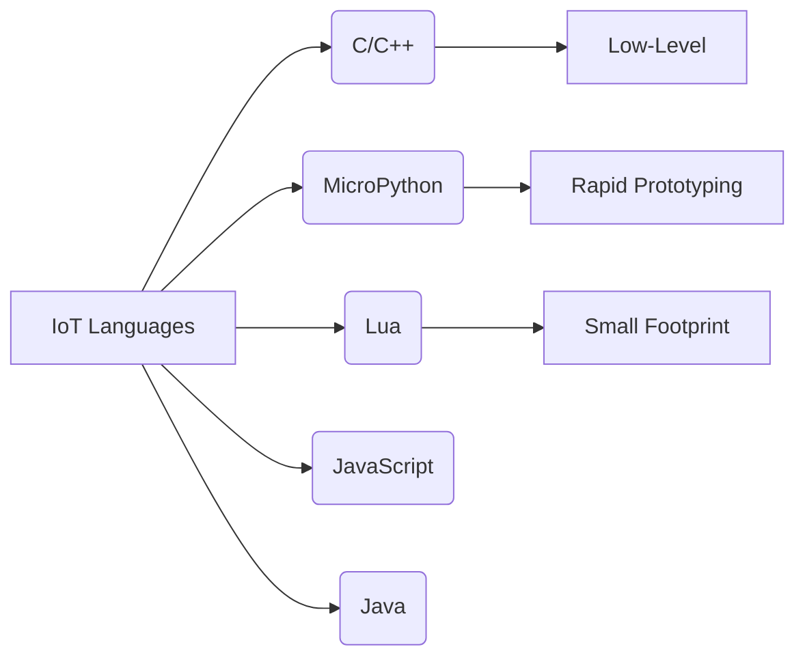

## 5. Development Environments

> [!note] IDEs and Tools  
> IoT development relies on Integrated Development Environments (IDEs) and libraries tailored for constrained environments.

### Popular IDEs

- **Arduino IDE**: Beginner-friendly, supports C/C++ for Arduino boards.
- **VS Code with PlatformIO**: Versatile, supports multiple platforms and languages.
- **Esplorer**: Lua-based for NodeMCU.
- **STM32CubeIDE**: For STM32 microcontrollers.
- **Eclipse**: General-purpose, supports Java and C++.

### Libraries

- **GPIO, WiFi, UART, PWM**: Hardware-specific interfaces.
- **MQTT**: Lightweight messaging protocol.
- **SSD1306**: OLED display control.

**Code Example: MQTT Publish with ESP8266 (Arduino)**

```cpp
#include <ESP8266WiFi.h>
#include <PubSubClient.h>

const char* ssid = "your-SSID";
const char* password = "your-PASSWORD";
const char* mqtt_server = "broker.mqtt.com";

WiFiClient espClient;
PubSubClient client(espClient);

void setup() {
  Serial.begin(115200);
  WiFi.begin(ssid, password);
  while (WiFi.status() != WL_CONNECTED) {
    delay(500);
    Serial.print(".");
  }
  client.setServer(mqtt_server, 1883);
}

void loop() {
  if (!client.connected()) {
    client.connect("ESP8266Client");
  }
  client.publish("test/topic", "Hello from ESP8266");
  delay(5000);
}
```


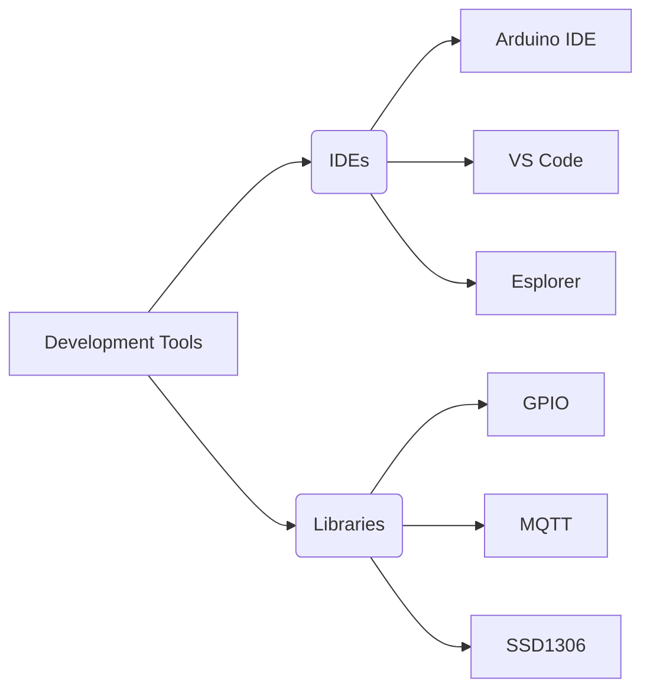

## 6. Key Development Concerns

> [!warning] Constraints and Considerations  
> IoT software development must address memory, real-time requirements, power, and interrupt handling.

- **Low-Level Coding**: Keep C/C++ code simple, avoid complex tasks.
- **Memory Constraints**: Use minimal data structures, appropriate data types.
- **Real-Time Requirements**: Use RTOS or bare-metal for task scheduling.
- **Power Management**: Optimize for sleep modes, low-power states.
- **Interrupt Handling**: Ensure low-latency responses.

**Code Example: Interrupt Callback (Arduino)**

```cpp
volatile int interruptCounter = 0;

void setup() {
  pinMode(2, INPUT_PULLUP);
  attachInterrupt(digitalPinToInterrupt(2), incrementCounter, FALLING);
  Serial.begin(9600);
}

void loop() {
  delay(1000);
  Serial.println(interruptCounter);
}

void incrementCounter() {
  interruptCounter++;
}
```


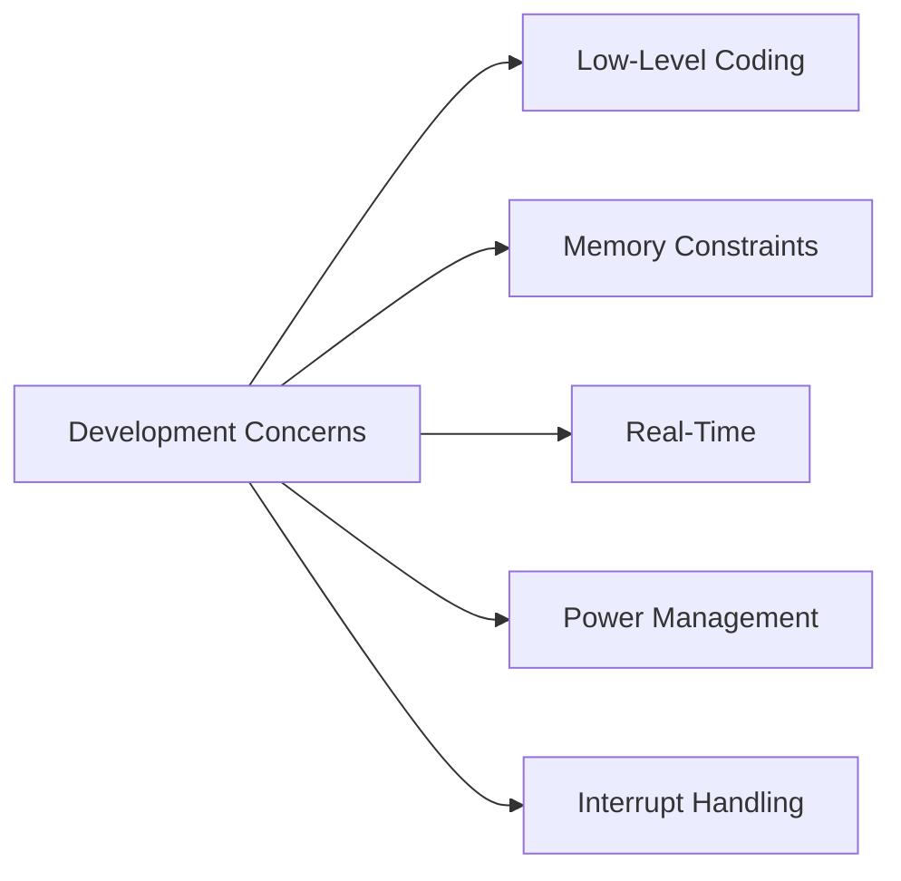

## 7. Main Loop and Asynchronous Behavior

> [!info] Non-Blocking Design  
> IoT applications require low-latency responses to external events, achieved through non-blocking main loops.

### Techniques

- **Interrupt Callbacks**: Runtime triggers functions for events.
- **Timer Interrupts**: Periodic callbacks for polling.
- **Timer Functions**: Non-blocking polling at intervals.
- **Native Management**: Manual event monitoring.

**Code Example: Timer Function (Arduino)**

```cpp
unsigned long previousMillis = 0;
const long interval = 1000; // 1-second interval

void setup() {
  Serial.begin(9600);
}

void loop() {
  unsigned long currentMillis = millis();
  if (currentMillis - previousMillis >= interval) {
    previousMillis = currentMillis;
    Serial.println("Timer triggered!");
    // Perform action, e.g., read sensor
  }
  // Other non-blocking tasks
}
```

For asynchronous programming, see [Arduino.cc](https://www.arduino.cc/reference/en/language/functions/time/millis/).

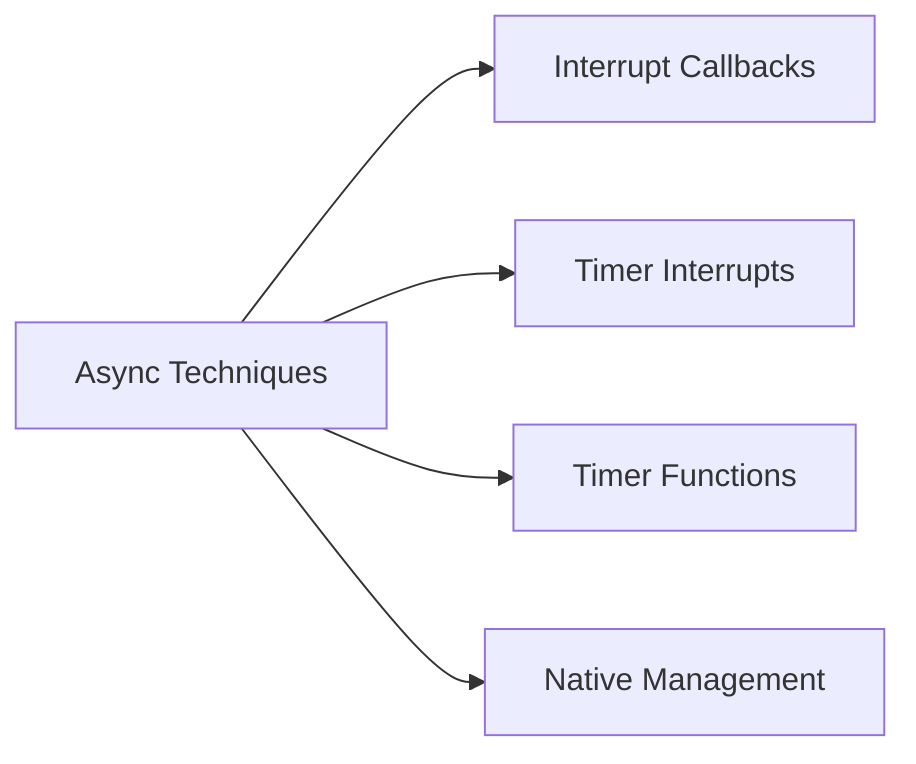

## 8. Security Considerations

> [!warning] Security Risks  
> IoT devices face risks like unauthorized access and data breaches, requiring robust security measures.

### Key Principles

- **Authentication**: Device and user verification.
- **Encryption**: Secure storage and communication (TLS/SSL).
- **Secure Boot**: Validate firmware integrity.
- **Secure Communication**: Use VPNs, sender/receiver verification.
- **Firmware Updates**: Secure OTA updates with rollback.

**Code Example: TLS Connection with ESP32 (Arduino)**

```cpp
#include <WiFiClientSecure.h>

const char* ssid = "your-SSID";
const char* password = "your-PASSWORD";
const char* server = "example.com";
const int httpsPort = 443;

WiFiClientSecure client;

void setup() {
  Serial.begin(115200);
  WiFi.begin(ssid, password);
  while (WiFi.status() != WL_CONNECTED) {
    delay(500);
  }
  client.connect(server, httpsPort);
  // Add certificate validation if needed
  Serial.println("Connected to secure server");
}

void loop() {}
```

For IoT security, see [IoT Security Foundation](https://www.iotsecurityfoundation.org/).

```mermaid
graph LR
    A[Security Principles] --> B[Authentication]
    A --> C[Encryption]
    A --> D[Secure Boot]
    A --> E[Secure Communication]
    A --> F[Firmware Updates]
```

## 9. Testing and Debugging Challenges

> [!warning] Limited Visibility  
> IoT systems lack PC-like debugging infrastructure, complicating testing.

### Challenges

- **Limited Visibility**: No built-in debugging displays.
- **Intermittent Behavior**: Power cycles, environmental factors.
- **Hardware Dependencies**: Specific devices required.
- **Real-Time Constraints**: Timing issues hard to reproduce.
- **Async Operations**: Unpredictable bug triggers.

### Techniques

- **Unit Testing**: Test isolated code (e.g., drivers).
- **Hardware-in-the-Loop (HIL)**: Simulate hardware interactions.
- **Simulators/Emulators**: Mimic device behavior.
- **Static Testing**: Ignore async timing.
- **Real-Time Trace**: Log system behavior.

**Code Example: Unit Test with Unity (C)**

```c
#include <unity.h>

void test_sensor_read(void) {
  int value = readSensor(); // Mock sensor function
  TEST_ASSERT_EQUAL(100, value);
}

void setup() {
  UNITY_BEGIN();
  RUN_TEST(test_sensor_read);
  UNITY_END();
}
```

For testing tools, see [ThrowTheSwitch.org](https://www.throwtheswitch.org/unity).

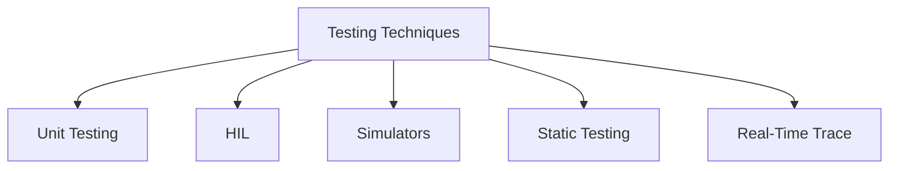

## 10. Power Management

> [!note] Energy Efficiency  
> IoT devices, often battery-powered, require efficient power management to extend lifecycle and reduce costs.

### Importance

- **Battery-Powered Devices**: Wearables, sensors need long life.
- **Cost and Portability**: Larger batteries increase size and cost.
- **Long Lifecycle**: Some devices operate for years without maintenance.

### Strategies

- **Sleep Modes**: Idle, Sleep, Deep Sleep, Hibernate with varying power use.
- **Dynamic Voltage and Frequency Scaling (DVFS)**: Adjust voltage/clock based on workload.
- **Event-Driven Management**: Wake on interrupts or thresholds.
- **Energy-Efficient Communication**: Use BLE, LoRa, optimize intervals.
- **Power-Aware Scheduling**: Prioritize tasks by power needs.

**Code Example: Deep Sleep with ESP32 (Arduino)**

```cpp
#include <esp_sleep.h>

void setup() {
  Serial.begin(115200);
  Serial.println("Going to deep sleep");
  esp_sleep_enable_timer_wakeup(5 * 1000000); // 5 seconds
  esp_deep_sleep_start();
}

void loop() {}
```

For power management, see [Espressif](https://docs.espressif.com/projects/esp-idf/en/latest/esp32/api-reference/system/power_management.html).

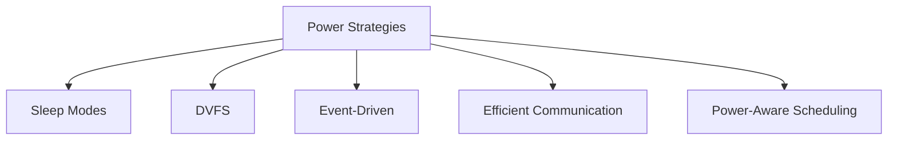

## 11. Software Design for Power Efficiency

> [!info] Optimized Algorithms  
> Efficient code and peripheral management reduce power consumption.

### Considerations

- **Efficient Algorithms**: Use bitwise operations, minimize CPU cycles.
- **Peripheral Management**: Turn off unused peripherals, use low-power sensors.
- **Networking**: Use BLE, batch data, reduce transmission power.
- **Sensor Sampling**: Periodic sampling, low-power modes.

**Code Example: Low-Power Sensor Sampling (Arduino)**

```cpp
#include <LowPower.h>

void setup() {
  pinMode(A0, INPUT); // Analog sensor
  Serial.begin(9600);
}

void loop() {
  int value = analogRead(A0);
  Serial.println(value);
  LowPower.powerDown(SLEEP_8S, ADC_OFF, BOD_OFF); // Sleep 8s
}
```


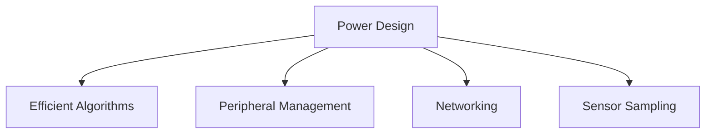

## 12. Deployment and Maintenance

> [!note] Field Updates  
> IoT devices require robust deployment and maintenance strategies for updates and diagnostics.

### Considerations

- **OTA Updates**: Secure, with rollback and versioning.
- **Diagnostics**: Remote data collection, privacy-aware.
- **Lifecycle Management**: End-of-life updates, security patches.

**Code Example: OTA Update with ESP32 (Arduino)**

```cpp
#include <WiFi.h>
#include <HTTPUpdate.h>

const char* ssid = "your-SSID";
const char* password = "your-PASSWORD";
const char* url = "http://server/firmware.bin";

void setup() {
  Serial.begin(115200);
  WiFi.begin(ssid, password);
  while (WiFi.status() != WL_CONNECTED) {
    delay(500);
  }
  t_httpUpdate_return ret = httpUpdate.update(url);
  if (ret == HTTP_UPDATE_OK) {
    Serial.println("Update successful");
  }
}

void loop() {}
```

For OTA updates, see [Espressif OTA Guide](https://docs.espressif.com/projects/arduino-esp32/en/latest/ota_web_update.html).

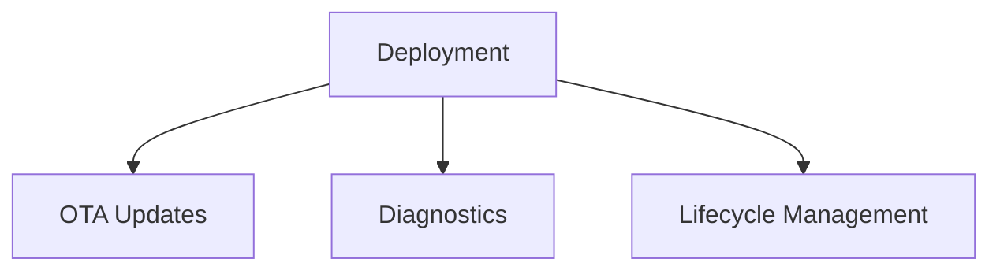

## 13. Best Practices

> [!tip] Development Guidelines  
> Follow structured approaches to ensure scalability, security, and efficiency.

- **Clear Architecture**: Plan hardware-software co-design.
- **Scalability**: Design for growth and maintenance.
- **Resource Awareness**: Optimize for memory and processing.
- **Thorough Testing**: Validate hardware and software.
- **Security-First**: Use secure coding practices.

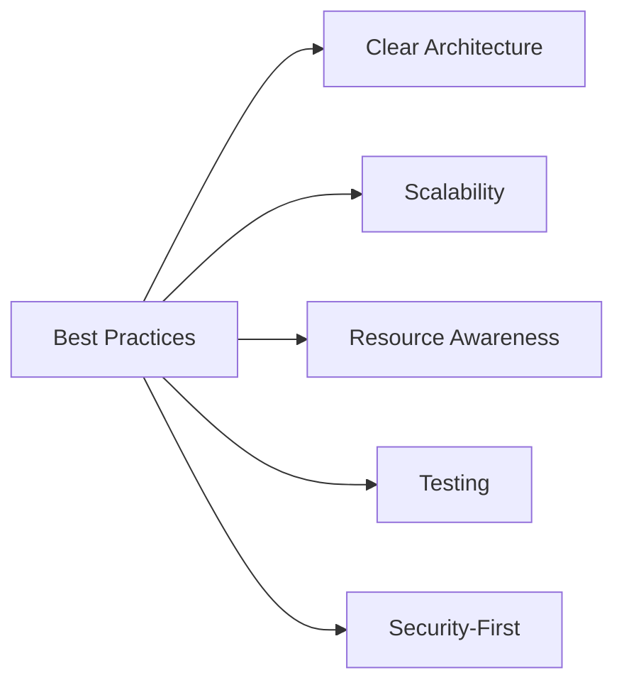


