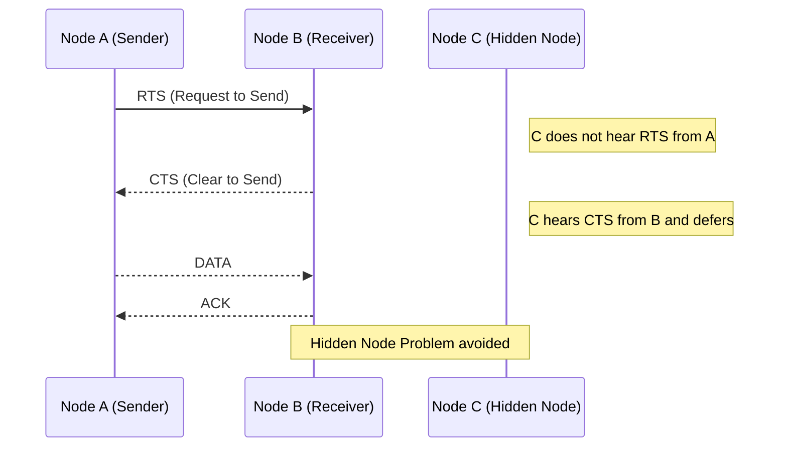
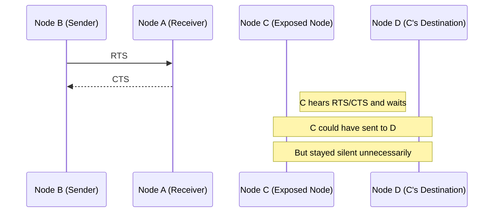

## Status
Reviewed : `INPUT[toggle:Reviewed]`

Progress :  
```meta-bind
INPUT[progressBar:Completion]
```


## 🔹 What is RTS/CTS Mechanism in IEEE 802.11?

> [!NOTE]   **Definition:**
> 
> **RTS (Request to Send)** and **CTS (Clear to Send)** are part of a handshaking protocol used in the IEEE 802.11 standard to reduce frame collisions, especially in scenarios where nodes might not hear each other.

---

### ✅ **How it works:**

1. **RTS Frame Sent:**  
    The sender first sends an RTS frame to the receiver, asking for permission to send data.
    
2. **CTS Frame Reply:**  
    If the receiver is ready and the medium is free, it replies with a CTS frame.
    
3. **Data Transmission:**  
    Upon receiving the CTS, the sender transmits the data.
    
4. **NAV (Network Allocation Vector):**  
    Any other stations that hear **RTS or CTS** will update their NAV and **remain silent** for the duration of the transmission.
    

---

### 🧠 Example:

Imagine 3 nodes:

- **A wants to send data to B**
    
- **C is in range of B but not A**
    

Without RTS/CTS:

- C doesn't know A is sending → may transmit → **collision at B**
    

With RTS/CTS:

- C hears CTS from B → **waits** → no collision
    

---

## 🔹 Does it solve the **Hidden Node Problem**?

####  **Yes, it does.**

###  **Justification:**

#### 🧩 Hidden Node Problem:

Occurs when two nodes (say A and C) are **not within each other's range**, but **both can communicate with a common node B**. If A and C transmit at the same time, **collisions** happen at B.

#### 📌 With RTS/CTS:

- A sends RTS to B
    
- B replies with CTS
    
- C hears **CTS** from B (even though it doesn't hear A), knows B is busy
    
- C **waits**, avoiding collision
    

✅ **Result:** The hidden node (C) **backs off**, avoiding interference.

---

## 🔹 Does it solve the **Exposed Node Problem**?

### ❌ **No, it does not completely solve it.**

### 🔎 **Justification:**

#### 🧩 Exposed Node Problem:

Occurs when a node **hears a transmission** from a nearby node and **incorrectly assumes** it cannot transmit — even though its own transmission **wouldn’t cause interference**.

#### 📌 Scenario:

- B is sending to A
    
- C wants to send to D
    
- C hears B’s transmission (or RTS/CTS), so it **backs off**
    
- But D is **out of range** of B → **C could have transmitted safely**
    

This happens because C **overhears** the RTS or CTS and **assumes the medium is busy**, even though its transmission wouldn’t interfere.

✅ RTS/CTS **helps coordinate medium access** but **can’t differentiate** between harmful and harmless interference in this case.

---

## 🔚 Summary Table:

|Problem|Solved by RTS/CTS?|Explanation|
|---|---|---|
|**Hidden Node**|✅ Yes|CTS informs hidden nodes to hold transmission|
|**Exposed Node**|❌ No|Nodes defer unnecessarily, even if their transmission wouldn't interfere|

---

## 🔗 Further Reading and References:

1. **IEEE 802.11 Standard Overview**  
    [https://standards.ieee.org/ieee/802.11/](https://standards.ieee.org/ieee/802.11/)
    
2. **Computer Networking: A Top-Down Approach** (Book by Kurose and Ross)  
    Excellent explanation of RTS/CTS and MAC layer behavior.
    
3. **NS-3 Wireless Network Simulations**  
    [https://www.nsnam.org/docs/models/html/wifi.html](https://www.nsnam.org/docs/models/html/wifi.html)
    
4. **Wikipedia - RTS/CTS**  
    [https://en.wikipedia.org/wiki/RTS/CTS](https://en.wikipedia.org/wiki/RTS/CTS)
    
5. **Hidden and Exposed Node Problem Explanation (GeeksforGeeks):**  
    [https://www.geeksforgeeks.org/hidden-terminal-problem-in-wireless-networks/](https://www.geeksforgeeks.org/hidden-terminal-problem-in-wireless-networks/)  
    [https://www.geeksforgeeks.org/exposed-terminal-problem-in-wireless-networks/](https://www.geeksforgeeks.org/exposed-terminal-problem-in-wireless-networks/)
    

---


- **A (Sender)**
- **B (Receiver)**
- **C (Hidden Node – can't hear A but can hear B)**

### 💠 RTS/CTS Handshake with Hidden Node Involved



---

### 💠 Exposed Node Problem Scenario (without full solution)




