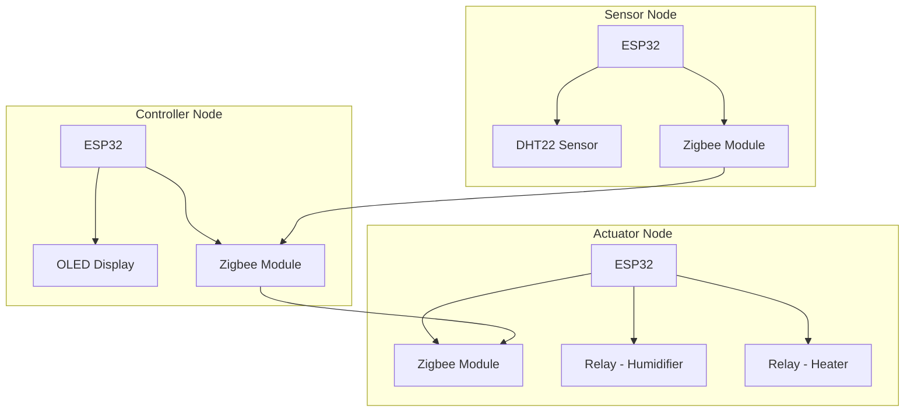
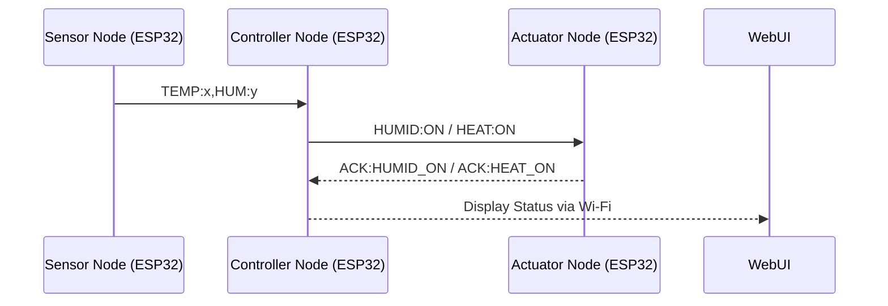

## 🔧 **System Overview**

### 🧩 Node Roles:

|Node|Purpose|Peripherals|
|---|---|---|
|**Sensor Node**|Read temp/humidity (DHT22)|DHT22, Zigbee Module|
|**Controller Node**|Display info, coordinate actions|OLED Display, Zigbee Module|
|**Actuator Node**|Trigger devices|Relay modules for humidifier & heater, Zigbee Module|

---

## 🧠 **Updated Workflow Diagram (Mermaid)**



---

## 🛠️ **Hardware Setup**

### 🧰 Components Per Node:

#### 1. Sensor Node:

- ESP32 Dev Board
- DHT22 sensor
- Zigbee module (e.g., XBee S2C, CC2530)
- 10K pull-up resistor for DHT22 data pin

#### 2. Controller Node:

- ESP32 Dev Board
- SSD1306 I2C OLED Display
- Zigbee module

#### 3. Actuator Node:

- ESP32 Dev Board
- 2x Relay Module (5V)
- Heating coil & humidifier
- Zigbee module

### 🖥️ Wiring (Example for CC2530 or XBee):

|ESP32|Zigbee|
|---|---|
|TX|RX|
|RX|TX|
|GND|GND|
|3.3V|VCC|

---

## 🔄 **Communication Setup**

1. **Configure Zigbee Modules**:
    
    - Set **Controller Node’s Zigbee** as **Coordinator**.
    - Set others as **End Devices** or **Routers**.
    - Use XCTU (for XBee) or flash Z-Stack firmware (for CC2530/2652).
    - Set all modules to the same **PAN ID** and **baud rate** (9600).

---

## 📜 **Step-by-Step Setup Guide**

### ✅ Step 1: Configure Zigbee modules

- Connect each Zigbee to your PC using FTDI adapter.
- For XBee: Use Digi’s XCTU tool.
- Set:
    - PAN ID = `1234`
    - Baud Rate = `9600`
    - Coordinator: `CE = 1`
    - Router/End Devices: `CE = 0`

---

### ✅ Step 2: Code Each Node

---

## 🧪 **Sensor Node Code**

Reads DHT22 and sends via Zigbee.

```cpp
#include <DHT.h>
#define DHTPIN 4
#define DHTTYPE DHT22
DHT dht(DHTPIN, DHTTYPE);

void setup() {
  Serial.begin(9600);
  dht.begin();
}

void loop() {
  float temp = dht.readTemperature();
  float hum = dht.readHumidity();

  if (!isnan(temp) && !isnan(hum)) {
    Serial.print("TEMP:");
    Serial.print(temp);
    Serial.print(",HUM:");
    Serial.println(hum);
  }

  delay(5000);
}
```

---

## 🖥️ **Controller Node Code**

Receives data, displays on OLED, decides actions.

```cpp
#include <Wire.h>
#include <Adafruit_SSD1306.h>
#define SCREEN_WIDTH 128
#define SCREEN_HEIGHT 64
Adafruit_SSD1306 display(SCREEN_WIDTH, SCREEN_HEIGHT, &Wire, -1);

float temp, hum;

void setup() {
  Serial.begin(9600);
  display.begin(SSD1306_SWITCHCAPVCC, 0x3C);
  display.clearDisplay();
}

void loop() {
  if (Serial.available()) {
    String input = Serial.readStringUntil('\n');

    if (input.startsWith("TEMP:")) {
      int tIndex = input.indexOf("TEMP:");
      int hIndex = input.indexOf(",HUM:");
      temp = input.substring(tIndex + 5, hIndex).toFloat();
      hum = input.substring(hIndex + 5).toFloat();

      display.clearDisplay();
      display.setTextSize(1);
      display.setTextColor(SSD1306_WHITE);
      display.setCursor(0, 0);
      display.print("Temp: ");
      display.println(temp);
      display.print("Humidity: ");
      display.println(hum);
      display.display();

      // Decision Logic
      if (temp < 22) Serial.println("HEAT:ON");
      if (hum < 40)  Serial.println("HUMID:ON");
    }
  }
  delay(100);
}
```

---

## 🦾 **Actuator Node Code**

Controls devices based on commands.

```cpp
#define HUMIDIFIER_PIN 5
#define HEATER_PIN 18

void setup() {
  pinMode(HUMIDIFIER_PIN, OUTPUT);
  pinMode(HEATER_PIN, OUTPUT);
  Serial.begin(9600);
}

void loop() {
  if (Serial.available()) {
    String cmd = Serial.readStringUntil('\n');

    if (cmd == "HEAT:ON") {
      digitalWrite(HEATER_PIN, HIGH);
    } else if (cmd == "HUMID:ON") {
      digitalWrite(HUMIDIFIER_PIN, HIGH);
    } else if (cmd == "HEAT:OFF") {
      digitalWrite(HEATER_PIN, LOW);
    } else if (cmd == "HUMID:OFF") {
      digitalWrite(HUMIDIFIER_PIN, LOW);
    }
  }
}
```

---

## 🧭 Enhancements

1. ✅ Acknowledgment messages from the **Actuator Node** to the **Controller Node**
2. 🌐 A **Wi-Fi dashboard** hosted on the **Controller Node** using `ESPAsyncWebServer` to show sensor data and actuator status in real-time.

---

## 🔁 **Updated Communication Flow (with Acknowledgment)**



---

## 🔧 Updates to Code

### 🦾 **Actuator Node – Send Acknowledgment**

```cpp
// Existing setup code...

void loop() {
  if (Serial.available()) {
    String cmd = Serial.readStringUntil('\n');

    if (cmd == "HEAT:ON") {
      digitalWrite(HEATER_PIN, HIGH);
      Serial.println("ACK:HEAT_ON");
    } else if (cmd == "HUMID:ON") {
      digitalWrite(HUMIDIFIER_PIN, HIGH);
      Serial.println("ACK:HUMID_ON");
    } else if (cmd == "HEAT:OFF") {
      digitalWrite(HEATER_PIN, LOW);
      Serial.println("ACK:HEAT_OFF");
    } else if (cmd == "HUMID:OFF") {
      digitalWrite(HUMIDIFIER_PIN, LOW);
      Serial.println("ACK:HUMID_OFF");
    }
  }
}
```

---

### 🖥️ **Controller Node – Wi-Fi Dashboard + Status Tracking**

You’ll need the following libraries:

```ini
ESPAsyncWebServer
AsyncTCP (ESP32)
Adafruit SSD1306
```

Install using PlatformIO or Arduino Library Manager.

#### 🛠 Code:

```cpp
#include <WiFi.h>
#include <AsyncTCP.h>
#include <ESPAsyncWebServer.h>
#include <Wire.h>
#include <Adafruit_SSD1306.h>

#define SCREEN_WIDTH 128
#define SCREEN_HEIGHT 64

Adafruit_SSD1306 display(SCREEN_WIDTH, SCREEN_HEIGHT, &Wire, -1);
AsyncWebServer server(80);

const char* ssid = "Your_SSID";
const char* password = "Your_PASSWORD";

float temp, hum;
String heaterStatus = "OFF";
String humidifierStatus = "OFF";

// HTML page
String htmlPage() {
  return "<!DOCTYPE html><html><head><title>IoT Dashboard</title></head><body>" 
         "<h2>Sensor Readings</h2>"
         "<p>Temperature: " + String(temp) + " °C</p>"
         "<p>Humidity: " + String(hum) + " %</p>"
         "<h2>Actuator Status</h2>"
         "<p>Heater: " + heaterStatus + "</p>"
         "<p>Humidifier: " + humidifierStatus + "</p>"
         "</body></html>";
}

void setup() {
  Serial.begin(9600);

  // OLED setup
  display.begin(SSD1306_SWITCHCAPVCC, 0x3C);
  display.clearDisplay();

  // Wi-Fi setup
  WiFi.begin(ssid, password);
  while (WiFi.status() != WL_CONNECTED) delay(1000);

  server.on("/", HTTP_GET, [](AsyncWebServerRequest *request){
    request->send(200, "text/html", htmlPage());
  });
  server.begin();
}

void loop() {
  if (Serial.available()) {
    String input = Serial.readStringUntil('\n');

    if (input.startsWith("TEMP:")) {
      int tIndex = input.indexOf("TEMP:");
      int hIndex = input.indexOf(",HUM:");
      temp = input.substring(tIndex + 5, hIndex).toFloat();
      hum = input.substring(hIndex + 5).toFloat();

      display.clearDisplay();
      display.setCursor(0, 0);
      display.setTextSize(1);
      display.setTextColor(SSD1306_WHITE);
      display.print("Temp: ");
      display.println(temp);
      display.print("Humidity: ");
      display.println(hum);
      display.display();

      if (temp < 22) {
        Serial.println("HEAT:ON");
        heaterStatus = "Requested";
      }
      if (hum < 40) {
        Serial.println("HUMID:ON");
        humidifierStatus = "Requested";
      }
    }

    if (input.startsWith("ACK:")) {
      if (input.indexOf("HEAT_ON") > 0) heaterStatus = "ON";
      else if (input.indexOf("HUMID_ON") > 0) humidifierStatus = "ON";
      else if (input.indexOf("HEAT_OFF") > 0) heaterStatus = "OFF";
      else if (input.indexOf("HUMID_OFF") > 0) humidifierStatus = "OFF";
    }
  }
}
```

---

## 🌐 Dashboard Preview

When you go to `http://<esp32-ip>`, it will show:

```
Sensor Readings
Temperature: 23.4 °C
Humidity: 35 %

Actuator Status
Heater: ON
Humidifier: ON
```

---

Awesome, Cryo! Let’s go step by step with all three enhancements to your Zigbee-based IoT project:

---

## ① 🧰 Wiring Diagrams for Each Node

### **Sensor Node (ESP32 + DHT22 + Zigbee)**

```plaintext
[ESP32]       [DHT22]         [Zigbee TX/RX]
--------      ---------       ----------------
3.3V -------- VCC             3.3V ------------ VCC
GND --------- GND             GND ------------- GND
GPIO4 ------- DATA            TX  <-> GPIO17 (RX)
                               RX  <-> GPIO16 (TX)
```

- DHT22 Data Pin to GPIO4
    
- Zigbee TX → ESP32 RX (GPIO16), RX → ESP32 TX (GPIO17)
    

---

### **Actuator Node (ESP32 + Relay Module + Zigbee)**

```plaintext
[ESP32]       [Relay Module]  [Zigbee TX/RX]
--------      --------------  ----------------
5V ---------- VCC             3.3V ------------ VCC
GND --------- GND             GND ------------- GND
GPIO13 ------ IN1 (Heater)    TX  <-> GPIO17 (RX)
GPIO14 ------ IN2 (Humidifier) RX <-> GPIO16 (TX)
```

- IN1 triggers the **heater**, IN2 triggers the **humidifier**
    

---

### **Controller Node (ESP32 + OLED + Zigbee + Wi-Fi)**

```plaintext
[ESP32]       [OLED (I2C)]    [Zigbee TX/RX]
--------      -------------   ----------------
3.3V -------- VCC             3.3V ------------ VCC
GND --------- GND             GND ------------- GND
GPIO21 ------ SDA             TX  <-> GPIO17 (RX)
GPIO22 ------ SCL             RX  <-> GPIO16 (TX)
```

- OLED uses I2C (SDA: GPIO21, SCL: GPIO22)
    

---

## ② ⚙️ Flashing & Configuring Zigbee Modules (e.g., CC2530 or XBee)

### Option 1: **CC2530 with ZNP firmware (for Zigbee-to-Serial use)**

#### 🔧 Requirements:

- CC2530 board with UART pins
- USB to Serial adapter (e.g., FTDI)
- TI SmartRF Flash Programmer
- Z-Stack firmware (ZNP for Zigbee)
    

#### 🪛 Steps:

1. Connect the **CC2530** to the USB Serial Programmer:
    
    ```
    CC2530        USB2Serial
    -------       ----------
    VCC --------> VCC
    GND --------> GND
    P2_2 (RX) --> TX
    P2_1 (TX) <-- RX
    RST ----------> DTR or manual switch
    ```
    
2. Use [SmartRF Programmer](https://www.ti.com/tool/FLASH-PROGRAMMER) to flash the **ZNP firmware** (e.g., `CC2530ZNP-Pro.hex`)
    
3. After flashing, connect Zigbee TX/RX to the respective ESP32 as per above diagrams.
    

---

### Option 2: **XBee Series 2 Modules**

#### 🧰 Requirements:

- XBee Series 2
- XBee USB Adapter
- X-CTU Software

#### 🔩 Steps:

1. Plug into PC and open **X-CTU** (from Digi)
2. Flash:
    - **Coordinator** firmware to Controller Zigbee
    - **Router** firmware to Sensor/Actuator Zigbees

3. Set PAN ID the same for all nodes (e.g., `0x1234`)
    
4. Set destination addresses:
    - Sensor/Actuator set `DH + DL` to Controller’s address
    - Controller uses broadcast (`DH: 0`, `DL: FFFF`) or assigns specific

---

## ③ 🌐 Add Remote Control From Web Dashboard

Now we’ll enhance the Controller Node's server with buttons to send manual control messages.

### 🔁 Updated HTML

```cpp
String htmlPage() {
  return R"rawliteral(
    <!DOCTYPE html><html><head><title>Dashboard</title></head><body>
    <h2>Sensor Readings</h2>
    <p>Temperature: )rawliteral" + String(temp) + R"rawliteral( °C</p>
    <p>Humidity: )rawliteral" + String(hum) + R"rawliteral( %</p>
    <h2>Actuator Status</h2>
    <p>Heater: )rawliteral" + heaterStatus + R"rawliteral(</p>
    <p>Humidifier: )rawliteral" + humidifierStatus + R"rawliteral(</p>

    <h2>Manual Controls</h2>
    <button onclick="fetch('/heater/on')">Heater ON</button>
    <button onclick="fetch('/heater/off')">Heater OFF</button><br><br>
    <button onclick="fetch('/humidifier/on')">Humidifier ON</button>
    <button onclick="fetch('/humidifier/off')">Humidifier OFF</button>
    </body></html>
  )rawliteral";
}
```

### 🔌 Add HTTP Routes in `setup()`

```cpp
server.on("/heater/on", HTTP_GET, [](AsyncWebServerRequest *req){
  Serial.println("HEAT:ON");
  heaterStatus = "Requested";
  req->redirect("/");
});

server.on("/heater/off", HTTP_GET, [](AsyncWebServerRequest *req){
  Serial.println("HEAT:OFF");
  heaterStatus = "Requested OFF";
  req->redirect("/");
});

server.on("/humidifier/on", HTTP_GET, [](AsyncWebServerRequest *req){
  Serial.println("HUMID:ON");
  humidifierStatus = "Requested";
  req->redirect("/");
});

server.on("/humidifier/off", HTTP_GET, [](AsyncWebServerRequest *req){
  Serial.println("HUMID:OFF");
  humidifierStatus = "Requested OFF";
  req->redirect("/");
});
```

---

## ✅ Summary of Milestones Achieved:

- 🛠 Sensor Node wired and configured with Zigbee
- 🔥 Actuator Node reacts to control and sends acknowledgment
- 📟 Controller Node logs, displays, and controls everything
- 🌐 Wi-Fi Dashboard with real-time status and manual control
- 🔁 Zigbee modules flashed and linked

---


