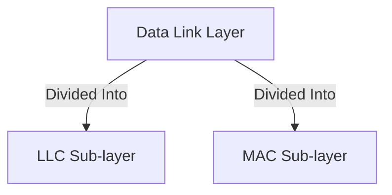

## Status
Reviewed : `INPUT[toggle:Reviewed]`

Progress :  
```meta-bind
INPUT[progressBar:Completion]
```


# Data Link Layer in the IEEE 802 Reference Model

> [!NOTE] Overview
> The **Data Link Layer (DLL)** is the second layer in the OSI model and plays a crucial role in reliable node-to-node communication. The IEEE 802 Reference Model refines the OSI model for LAN and MAN networking.

## Sub-Layers of the Data Link Layer

The IEEE 802 standard further divides the Data Link Layer into two sub-layers:
1. **Logical Link Control (LLC) Sub-layer**
2. **Media Access Control (MAC) Sub-layer**



### 1. Logical Link Control (LLC) Sub-layer
- Provides a common interface for network layer protocols.
- Manages error checking and flow control.
- Supports multiplexing of multiple network protocols over the same network interface.
- Uses Service Access Points (SAPs) to distinguish between different network layer protocols.

### 2. Media Access Control (MAC) Sub-layer
- Responsible for **addressing** and **channel access**.
- Provides the physical addressing via **MAC addresses**.
- Implements access control methods such as **CSMA/CD (Carrier Sense Multiple Access with Collision Detection)** in Ethernet and **CSMA/CA (Collision Avoidance)** in Wi-Fi.
- Determines when devices can transmit data to avoid collisions.

> [!table] IEEE 802 Standards
> - The **IEEE 802** working groups define specific network standards for different types of wired and wireless communications:
> 
> | IEEE 802 Standard | Description |
> |------------------|-------------|
> | **802.3** | Ethernet (Wired LAN) |
> | **802.11** | Wi-Fi (Wireless LAN) |
> | **802.15** | Bluetooth & WPAN |
> | **802.16** | WiMAX (Broadband Wireless) |
> | **802.1Q** | VLANs |
> 

## Data Frame Structure

> [!image] Frame
> The Data Link Layer encapsulates packets into **frames**, which consist of different fields such as:
> 
> ```mermaid
> graph TD;
>   A[Frame] -->|Header| B["MAC Address (source/destination)"];
>   B --> C[Frame Control];
>   C --> D[Data Payload];
>   D --> E["Frame Check Sequence (FCS)"];
> ```
> 

### Ethernet Frame Format

> [!image] An **Ethernet frame** consists of multiple fields, each defined in **octets (bytes)**:
> 
> ```mermaid
> flowchart TD
>     A["Preamble (7 bytes)"] --> B["SFD (1 byte)"]
>     B --> C["Destination MAC (6 bytes)"]
>     C --> D["Source MAC (6 bytes)"]
>     D --> E["EtherType/Length (2 bytes)"]
>     E --> F["Payload (46-1500 bytes)"]
>     F --> G["FCS (4 bytes)"]
> ```
> 

> [!table]  IEEE 802.3 Ethernet Frame
> 
> | Field               | Size (Octets)   | Description |
> |---------------------|----------------|-------------|
> | **Preamble**       | 7              | Synchronization pattern (10101010) |
> | **Start Frame Delimiter (SFD)** | 1 | Marks the start of the frame (10101011) |
> | **Destination MAC Address** | 6 | Identifies the recipient device |
> | **Source MAC Address** | 6 | Identifies the sender device |
> | **Length/Type** | 2 | Defines either the payload size or the protocol type |
> | **MAC Client Data (Payload)** | 46-1500 | Contains the actual data |
> | **Pad** | Variable | Used if data is smaller than the minimum frame size |
> | **Frame Check Sequence (FCS)** | 4 | CRC error-checking mechanism |
> | **Extension** | Optional | Used in some Gigabit Ethernet frames |
> 

### **Transmission Order**
- **Bits transmitted left to right**  
- **Octets transmitted top to bottom**


> [!tip] Explanation of Fields:
> - **Preamble (7 bytes)**: Synchronization pattern for receiver.
> - **SFD (Start Frame Delimiter, 1 byte)**: Marks the beginning of the frame.
> - **Destination MAC (6 bytes)**: Identifies the recipient device.
> - **Source MAC (6 bytes)**: Identifies the sender device.
> - **EtherType/Length (2 bytes)**: Defines the payload type or size.
> - **Payload (46–1500 bytes)**: Contains the actual data.
> - **FCS (4 bytes)**: Used for error checking.

## Error Detection and Correction
The Data Link Layer ensures data integrity through:
- **Parity Bits**: Adds an extra bit for error detection.
- **Cyclic Redundancy Check (CRC)**: Uses polynomial division for error detection.
- **Automatic Repeat reQuest (ARQ)**: Retransmits data if errors are found.

## Media Access Control Techniques
Different network environments use different **MAC protocols**:
- **Contention-Based Access**: CSMA/CD (Ethernet), CSMA/CA (Wi-Fi)
- **Scheduled Access**: Token Ring, TDMA (used in cellular networks)

## Role in Networking
The Data Link Layer is essential for:
- Reliable transmission over physical media.
- Addressing and switching in LANs.
- Error control and flow management.

---

### Additional Resources
- [Ethernet Frame Structure - Wikipedia](https://en.wikipedia.org/wiki/Ethernet_frame)
- [IEEE 802 Standards Overview - IEEE](https://standards.ieee.org/standard/802.html)
- [Data Link Layer - GeeksforGeeks](https://www.geeksforgeeks.org/data-link-layer-in-osi-model/)

