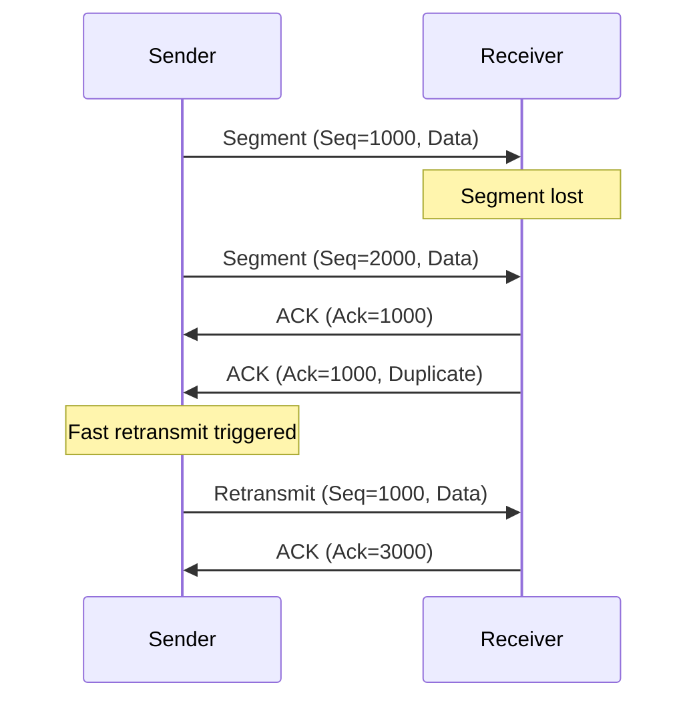
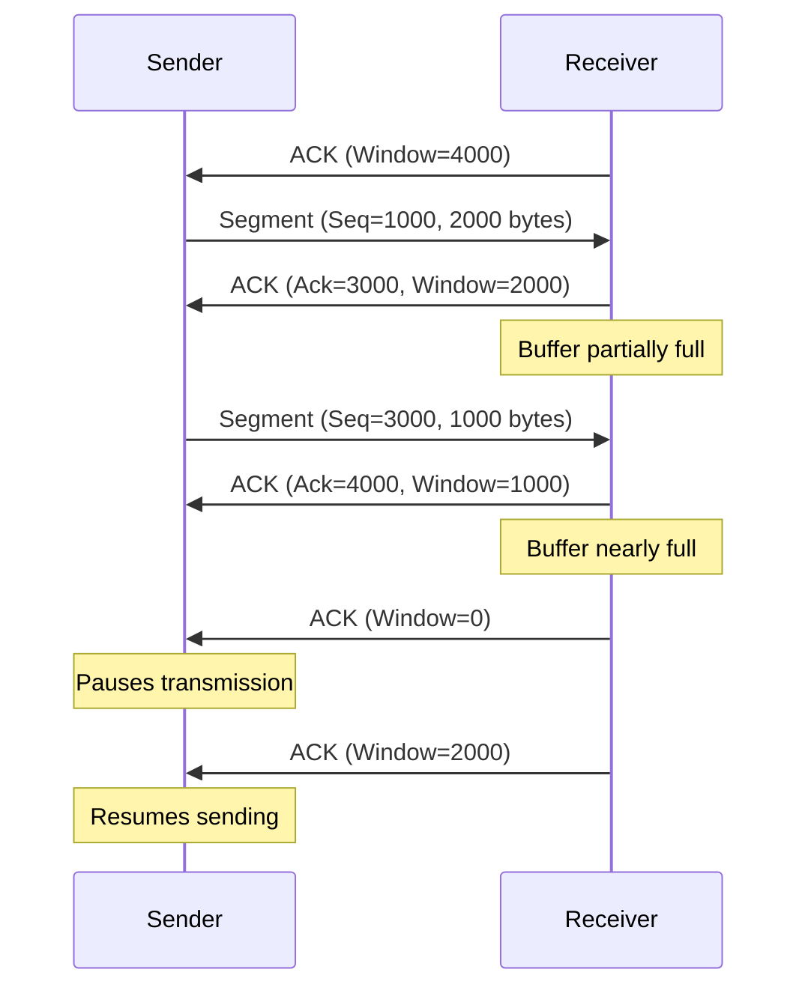

# TCP Study Note

## TCP Introduction

Transmission Control Protocol (TCP) is a core protocol in the Internet Protocol Suite, functioning at the transport layer of the OSI model. It provides reliable, connection-oriented, and stream-based communication between devices over a network. TCP guarantees accurate and ordered data delivery, making it essential for applications like web browsing (HTTP/HTTPS), email (SMTP), and file transfers (FTP). It works with IP, which handles packet routing and addressing.

> [!info] Key Fact  
> Standardized in RFC 793 (1981), TCP remains a cornerstone of modern networking due to its reliability and adaptability.

## TCP Features

TCP’s key features ensure robust data transfer:

- **Connection-Oriented**: Establishes a session via a three-way handshake before data exchange.
- **Reliable Delivery**: Uses acknowledgments, retransmissions, and checksums for error-free delivery.
- **Ordered Data Delivery**: Ensures data arrives in the correct sequence using sequence numbers.
- **Flow Control**: Prevents buffer overflow using a sliding window mechanism.
- **Congestion Control**: Manages network overload by adjusting transmission rates.
- **Multiplexing**: Supports multiple applications to share a connection using ports.

> [!important] Highlight  
> TCP prioritizes data integrity, making it ideal for applications requiring high reliability, unlike UDP.

## TCP Format

The TCP header encapsulates data for control and delivery. Typically 20 bytes (excluding options), it includes fields for connection management and reliability.

### TCP Header Fields

- **Source Port (16 bits)**: Identifies the sender’s application port.
- **Destination Port (16 bits)**: Identifies the receiver’s application port.
- **Sequence Number (32 bits)**: Tracks the byte position in the data stream.
- **Acknowledgment Number (32 bits)**: Specifies the next expected byte.
- **Data Offset (4 bits)**: Indicates header length in 32-bit words.
- **Reserved (3 bits)**: Set to zero for future use.
- **Flags (9 bits)**: Includes URG, ACK, PSH, RST, SYN, FIN for control.
- **Window Size (16 bits)**: Advertises receiver’s buffer capacity.
- **Checksum (16 bits)**: Verifies header and data integrity.
- **Urgent Pointer (16 bits)**: Points to urgent data if URG flag is set.
- **Options (variable)**: Supports features like Maximum Segment Size (MSS) or Window Scaling.

### Mermaid Packet Diagram

> [!note] Header Insight  
> Optional fields in the TCP header enable customization for diverse network scenarios.

## TCP Operations

### Basic Data Transfer

TCP treats data as a continuous byte stream, dividing it into segments. Each segment carries a sequence number for correct reassembly at the receiver. The sender transmits segments, and the receiver acknowledges them.

- **Segmentation**: Data is split into segments, limited by the Maximum Segment Size (MSS).
- **Sliding Window Protocol**: Allows sending multiple segments before waiting for ACKs, improving throughput.
- **Buffering**: Sender and receiver use buffers to manage data flow and reordering.

**Example**: During a file download, TCP segments the file, sends segments, and reassembles them at the destination.

> [!tip] Efficiency  
> The sliding window reduces idle time by enabling parallel segment transmission.

### Reliability

TCP ensures data arrives correctly using:

- **Acknowledgments (ACKs)**: Receiver confirms segment receipt, indicating the next expected byte.
- **Retransmissions**: Lost or corrupted segments are retransmitted after a timeout or duplicate ACKs (fast retransmit).
- **Checksum**: Validates header and payload integrity.
- **Sequence Numbers**: Detects missing, duplicate, or out-of-order segments.

#### Retransmission Timeout Schemes

- **Round-Trip Time (RTT)**: Measures the time taken for a segment to be sent and acknowledged. TCP continuously samples RTT to estimate network latency.
- **Smoothed Round-Trip Time (SRTT)**: A weighted average of RTT samples to smooth out variations. Calculated as:  
    $$  
    SRTT_{new} = \alpha \cdot SRTT_{old} + (1 - \alpha) \cdot RTT_{sample}  
    $$  
    where $\alpha$ (typically 0.8–0.9) balances old and new measurements.
- **Retransmission Timeout (RTO)**: The time TCP waits before retransmitting a segment. RTO is based on SRTT and variance (RTTVAR):  
    $$
    RTO = SRTT + 4 \cdot RTTVAR  
    $$ 
    RTTVAR accounts for network jitter. A minimum RTO (e.g., 1 second) prevents premature retransmissions.

**Example**: If a segment (Seq=1000) is lost, duplicate ACKs trigger a fast retransmit. If no ACKs arrive, the sender waits for RTO before retransmitting.

#### Mermaid Diagram: TCP Reliability

> [!warning] Reliability Overhead  
> Retransmissions, ACKs, and timeout calculations increase latency and bandwidth usage compared to UDP.

### Flow Control

Flow control prevents buffer overflow at the receiver using a sliding window protocol. The receiver advertises its window size (buffer capacity) in each ACK, and the sender adjusts its transmission rate.

- **Window Size**: Number of bytes the receiver can accept. Dynamically updated based on buffer availability.
- **Sliding Window**: Sender tracks unacknowledged segments, sliding the window as ACKs arrive.
- **Zero Window**: Receiver advertises a zero window when its buffer is full, pausing sender transmission.
- **Window Probing**: Sender sends small segments to check if the receiver’s window has reopened.

#### Effect of Window Size on Data Flow

- **Large Window**: Allows more unacknowledged segments to be sent, increasing throughput. Ideal for high-bandwidth, low-latency networks (e.g., fiber connections). However, it risks congestion if the network is unstable.
    - **Example**: A 64KB window enables sending 64KB before waiting for ACKs, maximizing bandwidth usage.
- **Small Window**: Limits the number of unacknowledged segments, reducing throughput but preventing buffer overflow. Suitable for low-capacity receivers or congested networks.
    - **Example**: A 4KB window restricts sending to 4KB at a time, ensuring the receiver isn’t overwhelmed.

**Example**: A receiver with a 4000-byte buffer advertises a 4000-byte window. After receiving 2000 bytes, it updates the window to 2000 bytes.

#### Mermaid Diagram: TCP Flow Control

> [!info] Flow Control Benefit  
> Dynamic window sizing ensures efficient data transfer without overwhelming the receiver.

### Multiplexing

Multiplexing enables multiple applications on a host to share a TCP connection using port numbers.

- **Ports**: 16-bit identifiers (0–65535) for applications (e.g., 80 for HTTP, 443 for HTTPS). Categorized as well-known (0–1023), registered (1024–49151), and ephemeral (49152–65535).
- **Socket**: Combines source IP, source port, destination IP, and destination port to uniquely identify a connection.
- **Demultiplexing**: Receiver uses ports to route segments to the correct application.

**Example**: A device can browse a website (port 443) and stream video (port 554) concurrently using distinct sockets.

> [!note] Multiplexing Advantage  
> Multiplexing optimizes resource usage for concurrent network activities.

### Connections

TCP’s connection-oriented nature involves explicit setup, data transfer, and teardown phases.

- **Three-Way Handshake** (Connection Setup):
    1. Sender sends SYN with an initial sequence number (ISN).
    2. Receiver responds with SYN-ACK, acknowledging the sender’s ISN and sending its ISN.
    3. Sender sends ACK, acknowledging the receiver’s ISN.
- **Data Transfer**: Bidirectional exchange using sequence numbers and ACKs.
- **Four-Way Handshake** (Connection Termination):
    1. One side sends FIN to close its sending direction.
    2. Other side sends ACK.
    3. Other side sends FIN to close its direction.
    4. First side sends ACK.

#### Connection States

TCP connections transition through states during their lifecycle:

- **CLOSED**: No connection exists.
- **LISTEN**: Server waits for incoming connection requests.
- **SYN-SENT**: Client has sent SYN, awaiting SYN-ACK.
- **SYN-RECEIVED**: Server has received SYN, sent SYN-ACK, awaiting ACK.
- **ESTABLISHED**: Connection is active; data transfer occurs.
- **FIN-WAIT-1**: One side has sent FIN, awaiting ACK or FIN.
- **FIN-WAIT-2**: One side has received ACK for its FIN, awaiting FIN.
- **CLOSE-WAIT**: Other side has received FIN, awaiting application to close.
- **LAST-ACK**: Other side has sent FIN, awaiting final ACK.
- **CLOSING**: Both sides sent FIN simultaneously, awaiting ACKs.
- **TIME-WAIT**: Ensures all segments are processed before closing (typically 2x Maximum Segment Lifetime).

#### State-Changing Events

- **Active Open**: Client initiates connection (CLOSED → SYN-SENT).
- **Passive Open**: Server listens for connections (CLOSED → LISTEN).
- **Receive SYN**: Triggers SYN-ACK (LISTEN → SYN-RECEIVED).
- **Receive SYN-ACK**: Triggers ACK (SYN-SENT → ESTABLISHED).
- **Receive ACK**: Completes handshake (SYN-RECEIVED → ESTABLISHED).
- **Send FIN**: Initiates close (ESTABLISHED → FIN-WAIT-1).
- **Receive FIN**: Triggers ACK (ESTABLISHED → CLOSE-WAIT).
- **Receive ACK**: Advances close (FIN-WAIT-1 → FIN-WAIT-2).
- **Application Close**: Triggers FIN (CLOSE-WAIT → LAST-ACK).
- **Receive Final ACK**: Completes close (LAST-ACK → CLOSED).
- **Timeout**: Ensures TIME-WAIT transitions to CLOSED.

**Example**: A client in SYN-SENT receives SYN-ACK, moves to ESTABLISHED, and begins data transfer. After transfer, it sends FIN, entering FIN-WAIT-1.

> [!important] Connection Robustness  
> State transitions and handshakes ensure synchronized communication and graceful session management.