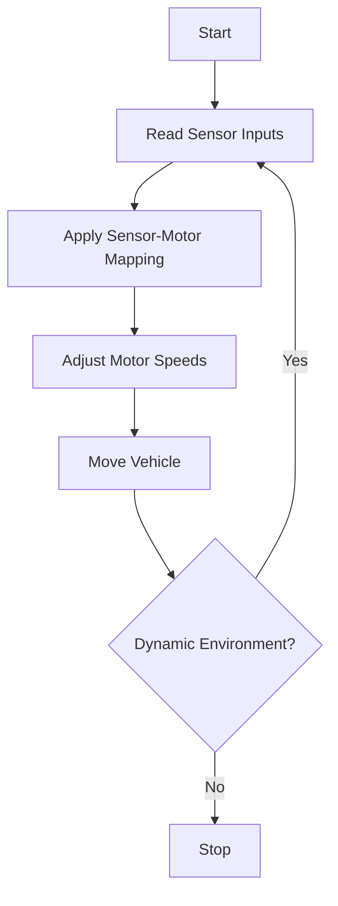
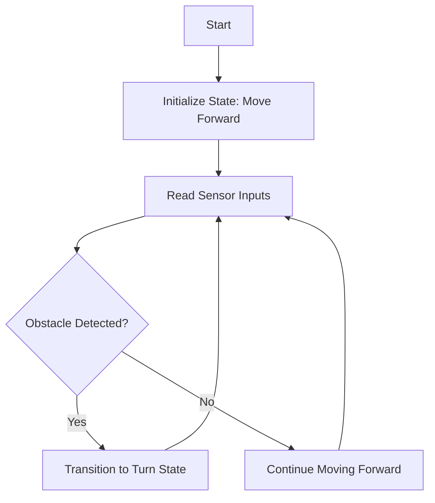
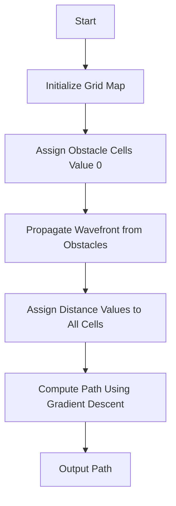
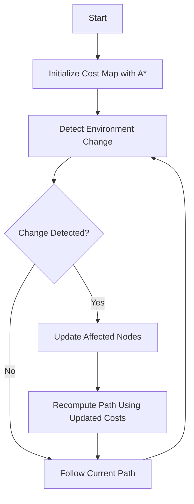
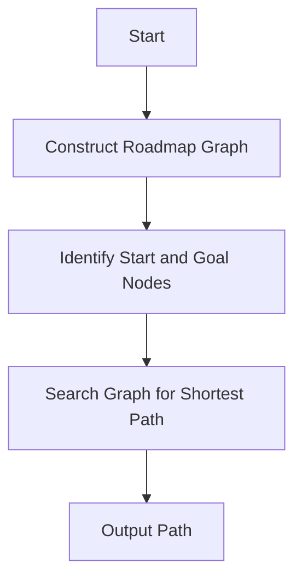
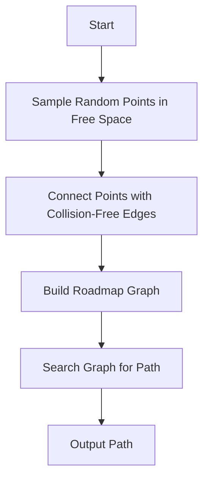
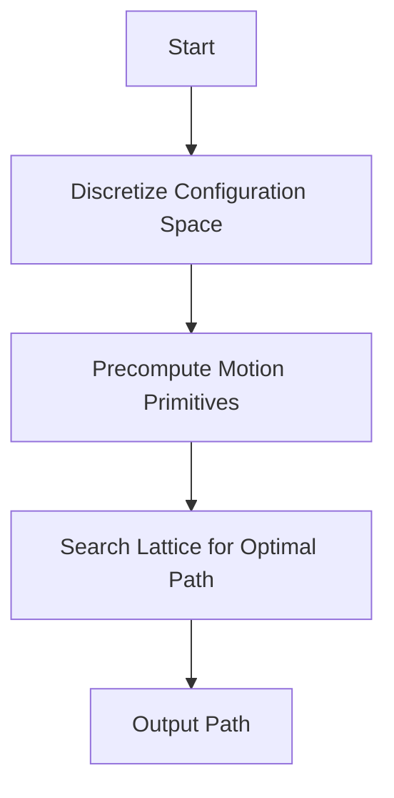
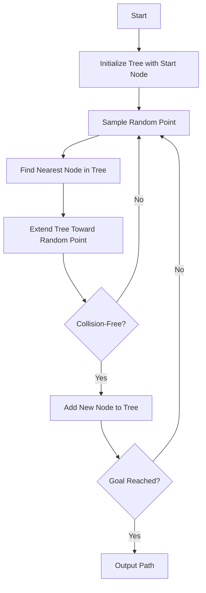

---
tags:
  - Robotics
Created: 2025-05-22 14:14
About: 
Reviewed: false
Completion: 0
---
## Introduction

- Robotics navigation enables autonomous robots to move effectively in their environments, avoiding obstacles and reaching target locations. 
- Two primary navigation paradigms: **reactive navigation** and **map-based planning**. 
- Reactive navigation relies on real-time sensor data for immediate responses, while map-based planning uses pre-constructed or dynamically updated maps for path planning. 
---

## 1. Reactive Navigation

- Reactive navigation involves real-time decision-making based on sensory inputs without requiring a global map. It is computationally lightweight and suitable for dynamic environments but may struggle with complex goals or global optimization.

### 1.1 Braitenberg Vehicles

> [!note] **Braitenberg vehicles** are simple robotic models that exhibit complex behaviors through direct sensor-motor couplings, inspired by biological systems.

- Braitenberg vehicles use basic rules to map sensor inputs (e.g., light or proximity) to motor outputs, producing behaviors like attraction, avoidance, or aggression. For example, a vehicle with two sensors and two motors may connect the left sensor to the right motor and vice versa, causing it to move toward or away from a stimulus.

> [!tip] Braitenberg vehicles demonstrate emergent behaviors from simple rules, making them ideal for studying reactive navigation principles.

#### Algorithm Flowchart

### 1.2 Simple Automata

> [!note] **Simple automata** are finite-state machines that govern robot behavior based on predefined states and transitions triggered by sensor inputs.

- Simple automata use a set of states (e.g., "move forward," "turn left," "stop") and transition rules based on environmental inputs. For instance, a robot may switch from "move forward" to "turn left" when a proximity sensor detects an obstacle.

> [!tip] Simple automata are robust in predictable environments but may fail in scenarios requiring long-term planning or memory.

#### Algorithm Flowchart

---

## 2. Map-Based Planning

- Map-based planning uses a representation of the environment to compute optimal or feasible paths. These methods are computationally intensive but excel in structured environments and global goal-directed navigation.

### 2.1 Distance Transform

> [!note] **Distance transform** computes the shortest distance from each point in a grid-based map to the nearest obstacle, creating a cost map for path planning.

- The algorithm assigns each grid cell a value representing its distance to the nearest obstacle, often using a wavefront propagation approach. Paths are then planned to minimize traversal through high-cost (near-obstacle) regions.

> [!tip] **Distance transform** is efficient for grid-based environments but assumes a static map, limiting its use in dynamic settings.

> [!warning] Distance Transform is agnostic to vehicle motion constraints unless explicitly modified to include them.

#### Algorithm Flowchart

### 2.2 D* (Dynamic A*)

> [!note] **D* (Dynamic A*)** is an incremental path-planning algorithm that updates paths in dynamic environments by re-planning only affected portions of the map.

- D* extends the A* algorithm by maintaining a cost map and updating it when changes (e.g., new obstacles) are detected. It is widely used in robotics for its efficiency in handling dynamic updates.

> [!tip] D* is optimal for dynamic environments but requires significant computational resources for large maps.

> [!warning] Standard D* does not account for vehicle motion constraints but can be extended to do so with custom cost functions.

#### Algorithm Flowchart

### 2.3 Road-Mapping

> [!note] _Road-mapping_ constructs a network of feasible paths (roads) in the environment, connecting key points like the start, goal, and waypoints.

- Road-mapping simplifies path planning by reducing the search space to a graph of predefined paths. It is effective in structured environments like warehouses but less adaptable to open or cluttered spaces.

> [!tip] Road-mapping is computationally efficient but relies on a well-designed roadmap, which may not cover all possible scenarios.

> [!warning] **Road-Mapping** can account for motion constraints if the roadmap is tailored to the vehicle’s kinematics, but this is not guaranteed in all implementations.

#### Algorithm Flowchart

### 2.4 Probabilistic Roadmap Method (PRM)

> [!note] _Probabilistic Roadmap Method (PRM)_ generates a roadmap by randomly sampling the configuration space and connecting collision-free points to form a graph.

- PRM builds a probabilistic roadmap by sampling points in the free space and connecting them if a collision-free path exists. It then uses graph search (e.g., A*) to find a path from start to goal.

> [!tip] PRM is effective in high-dimensional spaces but may miss narrow passages due to random sampling.

>[!warning] **PRM** effectively accounts for vehicle motion constraints when configured with appropriate motion models during roadmap construction.

#### Algorithm Flowchart

### 2.5 Lattice Planner

> [!note] **Lattice planner** discretizes the configuration space into a lattice of states and precomputes **feasible motion primitives** to plan paths.

- The lattice planner uses a regular grid of states (e.g., position, orientation) and precomputed motion primitives to construct paths. It is particularly effective for robots with complex kinematics, like wheeled robots.

> [!tip] Lattice planners balance efficiency and kinematic accuracy but require significant preprocessing for motion primitives.

> [!warning] **Lattice Planner** is highly effective at incorporating vehicle motion constraints through its use of motion primitives.

#### Algorithm Flowchart

### 2.6 Rapidly Exploring Random Tree (RRT)

> [!note] **Rapidly Exploring Random Tree (RRT)** grows a tree of feasible paths by randomly sampling the configuration space and connecting new points to the nearest existing node.

- RRT incrementally builds a tree by extending toward random points, checking for collision-free connections. It is well-suited for high-dimensional spaces and dynamic environments.

> [!tip] RRT is probabilistically complete but may produce suboptimal paths due to its random nature.

> [!warning] **RRT** effectively accounts for vehicle motion constraints when using appropriate motion models during tree growth.

#### Algorithm Flowchart

---

## Comparison of Navigation Techniques

|**Technique**|**Computational Complexity**|**Environment Suitability**|**Path Optimality**|**Dynamic Adaptation**|**Use Case**|
|---|---|---|---|---|---|
|**Braitenberg Vehicles**|Low|Dynamic, simple|None|High|Simple reactive tasks (e.g., obstacle avoidance)|
|**Simple Automata**|Low|Predictable, simple|Low|Moderate|Basic state-based navigation|
|**Distance Transform**|Moderate|Static, grid-based|High|Low|Grid-based path planning|
|**D***|High|Dynamic, structured|High|High|Real-time replanning in dynamic spaces|
|**Road-Mapping**|Low-Moderate|Structured, predefined|Moderate|Low|Warehouse or factory navigation|
|**PRM**|Moderate-High|High-dimensional, static|Moderate|Low|Complex configuration spaces|
|**Lattice Planner**|High|Structured, kinematic|High|Moderate|Kinematically constrained robots|
|**RRT**|Moderate|High-dimensional, dynamic|Low-Moderate|High|Rapid exploration in complex spaces|

> [!warning] **Reactive methods** (Braitenberg vehicles, simple automata) excel in simplicity and speed but lack global awareness, while **map-based methods** offer optimality at the cost of computational complexity and map dependency.

