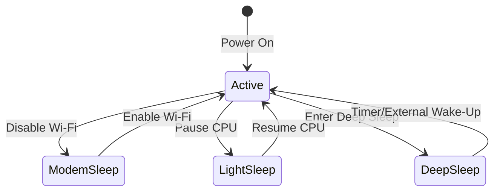
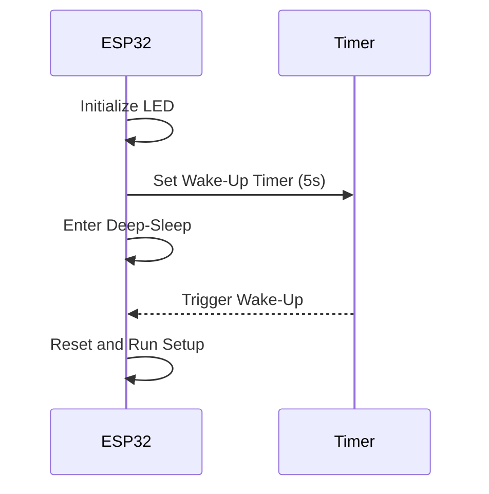

## 1. Overview of ESP32 Sleep Modes

The ESP32 supports multiple operating modes to balance performance and power efficiency. These modes control the state of the CPU, system clock, Wi-Fi module, and Real-Time Clock (RTC). The key modes are:

- **Active Mode**: Full operation with all components powered.
- **Modem-Sleep Mode**: Wi-Fi is disabled, but the CPU and system clock remain active.
- **Light-Sleep Mode**: CPU is paused, and most peripherals are off, but the system can quickly resume.
- **Deep-Sleep Mode**: Minimal power consumption with only the RTC and Ultra-Low-Power (ULP) co-processor active.

### 1.1 Comparison of Sleep Modes

Based on the provided document (noting that it references ESP8266 but applies similarly to ESP32 with minor differences), here’s a comparison of sleep modes tailored for ESP32:

|Mode|CPU|System Clock|Wi-Fi|RTC|Power Consumption|Wake-Up Time|
|---|---|---|---|---|---|---|
|Active|ON|ON|ON|ON|~100–240 mA|N/A|
|Modem-Sleep|ON|ON|OFF|ON|~15–20 mA|< 1 ms|
|Light-Sleep|Paused|OFF|OFF|ON|~0.8–1 mA|~3–5 ms|
|Deep-Sleep|OFF|OFF|OFF|ON|~10–20 µA|~100–200 ms|

> **Note**: Power consumption varies based on ESP32 model (e.g., ESP32-WROOM-32 vs. ESP32-S2) and peripherals used. Always measure power usage in your specific setup.

#### Mermaid Diagram: Sleep Mode States



## 2. When to Use Each Sleep Mode

Choosing the appropriate sleep mode depends on the application’s requirements for power efficiency, responsiveness, and functionality.

### 2.1 Active Mode

- **Use Case**: Continuous processing, Wi-Fi communication, or real-time sensor monitoring.
- **Examples**: Smart home hubs, real-time data streaming devices.
- **When to Use**: When the device needs to be fully operational, such as during data transmission or user interaction.
- **Limitations**: High power consumption makes it unsuitable for battery-powered devices without frequent recharging.

> [!Tip] : Minimize time in Active mode by offloading tasks to sleep modes when possible.

### 2.2 Modem-Sleep Mode

- **Use Case**: Applications requiring CPU activity but no Wi-Fi connectivity.
- **Examples**: Local data processing, sensor data filtering before transmission.
- **When to Use**: When the device is idle between Wi-Fi transmissions but needs to perform computations or monitor GPIOs.
- **How It Works**: Automatically enabled when Wi-Fi is not in use in station mode, with the ESP32 maintaining DTIM (Delivery Traffic Indication Map) beacon monitoring to stay connected to the access point.

> [!Info] : Modem-Sleep is enabled by default in the ESP32 Arduino core when using `WiFi.mode(WIFI_STA)` and no active Wi-Fi tasks are running.

### 2.3 Light-Sleep Mode

- **Use Case**: Short idle periods where quick wake-up is needed.
- **Examples**: Wearables, smart sensors with periodic readings.
- **When to Use**: When the device needs to conserve power but must resume operations quickly (e.g., checking for user input or sensor thresholds).
- **How It Works**: The CPU is paused, and most peripherals are powered down, but RAM and RTC remain active for fast wake-up.

> [!Warning] : Light-Sleep requires careful management of wake-up sources (e.g., timers, GPIOs) to avoid unintended wake-ups.

### 2.4 Deep-Sleep Mode

- **Use Case**: Ultra-low-power applications with infrequent activity.
- **Examples**: Environmental sensors, battery-powered trackers.
- **When to Use**: When the device can remain inactive for extended periods (seconds to hours) and only needs to wake up for specific events.
- **How It Works**: Only the RTC and ULP co-processor are powered, with the main CPU and most peripherals off. The ESP32 resets upon wake-up, behaving like a fresh boot.

> **Summary**: Deep-Sleep is ideal for maximizing battery life but requires careful state management due to the system reset on wake-up.

## 3. How to Implement Sleep Modes

### 3.1 Modem-Sleep Mode

Modem-Sleep is automatically managed by the ESP32 when Wi-Fi is idle. To ensure it activates:

1. Set the ESP32 to station mode (`WiFi.mode(WIFI_STA)`).
2. Avoid continuous Wi-Fi operations (e.g., disable background scanning).

#### Code Example: Enabling Modem-Sleep

```cpp
#include <WiFi.h>

void setup() {
  Serial.begin(115200);
  WiFi.mode(WIFI_STA);
  WiFi.begin("Your_SSID", "Your_Password");
  while (WiFi.status() != WL_CONNECTED) {
    delay(500);
  }
  Serial.println("Connected");
}

void loop() {
  // Perform tasks without Wi-Fi
  delay(1000); // Modem-Sleep activates during idle periods
}
```

> [!Tip] : Use `WiFi.setSleep(true)` to explicitly enable Modem-Sleep in the ESP-IDF framework.

### 3.2 Light-Sleep Mode

Light-Sleep requires explicit configuration of wake-up sources (e.g., timers, GPIOs) using the ESP-IDF or Arduino core.

#### Code Example: Light-Sleep with Timer Wake-Up

```cpp
#include <esp_sleep.h>

void setup() {
  Serial.begin(115200);
  // Configure wake-up source (e.g., timer for 5 seconds)
  esp_sleep_enable_timer_wakeup(5 * 1000000); // Time in microseconds
}

void loop() {
  Serial.println("Entering Light-Sleep");
  esp_light_sleep_start();
  Serial.println("Woke up from Light-Sleep");
  delay(1000);
}
```

> [!Warning] : Ensure peripherals (e.g., Serial) are reinitialized if affected by Light-Sleep.

### 3.3 Deep-Sleep Mode

Deep-Sleep is implemented using `esp_deep_sleep_start()`, with wake-up triggered by timers or external signals. The document highlights connecting GPIO16 to the RST pin for timer-based wake-up, but modern ESP32 boards use the RTC GPIO for wake-up without external connections.

#### Code Example: Deep-Sleep with Timer Wake-Up

```cpp
#define ledPin 2

void setup() {
  Serial.begin(115200);
  pinMode(ledPin, OUTPUT);
  digitalWrite(ledPin, HIGH);
  delay(5000); // Keep LED ON for 5 seconds
  Serial.println("Entering Deep-Sleep");
  digitalWrite(ledPin, LOW);
  esp_sleep_enable_timer_wakeup(5 * 1000000); // 5 seconds
  esp_deep_sleep_start();
}

void loop() {
  // Empty, as ESP32 resets after Deep-Sleep
}
```

#### Mermaid Diagram: Deep-Sleep Workflow



#### External Wake-Up

External wake-up uses RTC GPIOs to trigger the ESP32 from Deep-Sleep. For example, a button press can be configured as a wake-up source.

#### Code Example: Deep-Sleep with External Wake-Up

```cpp
#define BUTTON_PIN 0 // RTC GPIO (e.g., GPIO0)

void setup() {
  Serial.begin(115200);
  Serial.println("Woke up!");
  // Configure GPIO0 as wake-up source (LOW to wake)
  esp_sleep_enable_ext0_wakeup(GPIO_NUM_0, 0);
  Serial.println("Entering Deep-Sleep");
  esp_deep_sleep_start();
}

void loop() {
  // Empty
}
```

> [!Warning] : Do not connect GPIO16 to RST for timer wake-up unless explicitly required by your board, as most ESP32 modules support timer wake-up natively.

## 4. Industry Best Practices for ESP32 Sleep Modes

To maximize efficiency and reliability in IoT applications, follow these best practices:

### 4.1 Optimize Wake-Up Frequency

- **Practice**: Minimize wake-up frequency in Deep-Sleep to reduce power consumption. For example, a temperature sensor might wake up every 10 minutes instead of every minute.
- **Why**: Each wake-up cycle consumes significant power during the boot process.
- **Example**: Use data aggregation to batch sensor readings before transmission.

### 4.2 Use RTC Memory for State Persistence

- **Practice**: Store critical data (e.g., sensor counts, timestamps) in RTC memory during Deep-Sleep to maintain state across resets.
- **How**: Use `RTC_DATA_ATTR` to declare variables in RTC memory.
- **Code Example**:
    
    ```cpp
    RTC_DATA_ATTR int bootCount = 0;
    
    void setup() {
      Serial.begin(115200);
      bootCount++;
      Serial.printf("Boot number: %d\n", bootCount);
      esp_sleep_enable_timer_wakeup(5 * 1000000);
      esp_deep_sleep_start();
    }
    ```
    

> [!Info] : RTC memory is limited (8 KB), so use it sparingly for essential data.

### 4.3 Minimize Peripheral Power Draw

- **Practice**: Disable unused peripherals (e.g., LEDs, sensors) before entering sleep modes.
- **How**: Set GPIO pins to input mode or use pull-down resistors to prevent floating pins.
- **Example**: Turn off an external sensor via a GPIO-controlled power switch.

### 4.4 Measure and Profile Power Consumption

- **Practice**: Use a power analyzer (e.g., Joulescope, Nordic Power Profiler) to measure actual power consumption in each mode.
- **Why**: Datasheet values are averages; real-world conditions (e.g., temperature, Wi-Fi interference) affect power usage.
- **Example**: Profile Deep-Sleep current to ensure it’s below 20 µA, indicating no leakage.

### 4.5 Handle Wi-Fi Reconnection Efficiently

- **Practice**: In Deep-Sleep applications, store Wi-Fi credentials in RTC memory or use WiFiManager to avoid repeated configuration.
- **Why**: Wi-Fi connection can take 100–500 ms, consuming significant power.
- **Example**: Use `WiFi.persistent(true)` to save credentials across resets.

### 4.6 Use ULP Co-Processor for Low-Power Tasks

- **Practice**: Offload simple tasks (e.g., monitoring ADC or GPIOs) to the ULP co-processor during Deep-Sleep.
- **Why**: The ULP consumes ~150 µA, far less than the main CPU.
- **Example**: Monitor a temperature sensor threshold with the ULP and wake the main CPU only when necessary.

### 4.7 Test Wake-Up Reliability

- **Practice**: Validate wake-up sources (timers, GPIOs) under various conditions (e.g., low battery, noisy environment).
- **Why**: Unreliable wake-ups can cause device failures in the field.
- **Example**: Simulate button presses or timer intervals to ensure consistent behavior.

### 4.8 Implement Error Handling

- **Practice**: Add fallback mechanisms for failed wake-ups or Wi-Fi connections.
- **Example**: If Wi-Fi fails to connect after waking from Deep-Sleep, revert to Deep-Sleep to conserve power.
- **Code Example**:
    
    ```cpp
    if (WiFi.status() != WL_CONNECTED) {
      Serial.println("Wi-Fi failed, sleeping...");
      esp_deep_sleep_start();
    }
    ```

## 5. Common Issues and Debugging

> [!Bug] : High power consumption in Deep-Sleep?
> 
> - Check for floating GPIOs or active peripherals.
> - Measure current with a multimeter to identify leakage.

> [!Bug] : ESP32 not waking from Deep-Sleep?
> 
> - Verify wake-up source configuration (e.g., correct GPIO, timer duration).
> - Ensure the ESP32 is not in a low-power state preventing wake-up (e.g., brownout reset).

> [!Bug] : Unstable Wi-Fi after Light-Sleep?
> 
> - Reinitialize Wi-Fi stack if necessary, as Light-Sleep may disrupt connections.

## 6. Practical Applications

- **Smart Agriculture**: Use Deep-Sleep for soil moisture sensors that wake up hourly to transmit data.
- **Wearables**: Leverage Light-Sleep for heart rate monitors that check readings every few seconds.
- **Asset Tracking**: Combine Deep-Sleep with ULP for GPS trackers that wake only when motion is detected.

