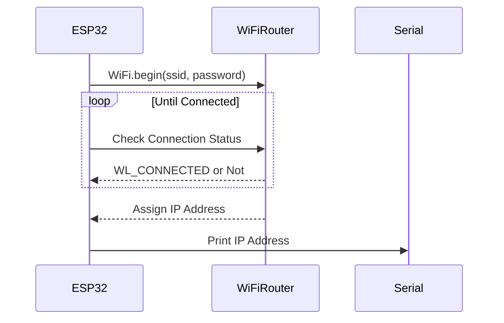
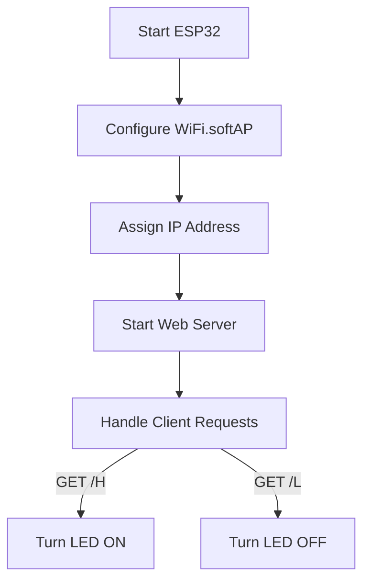
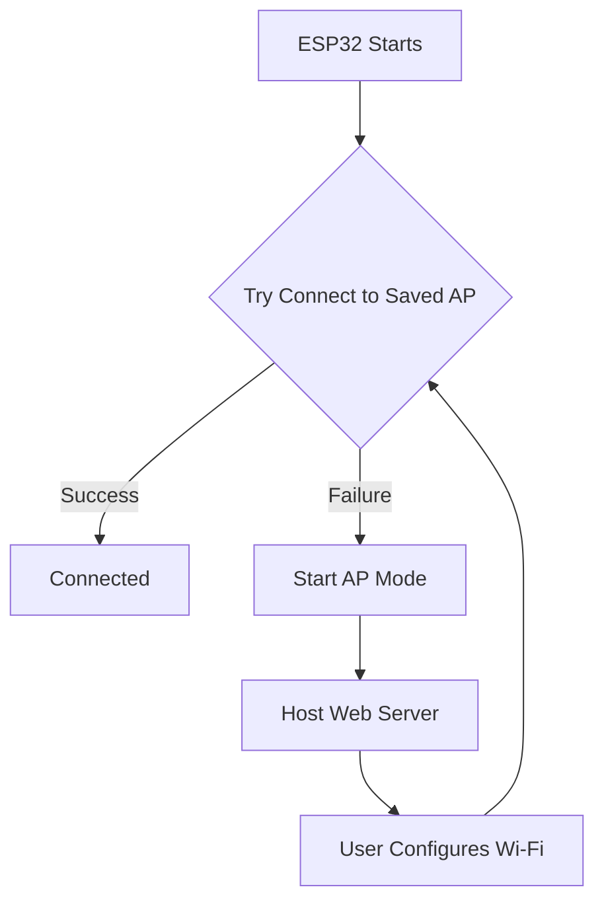
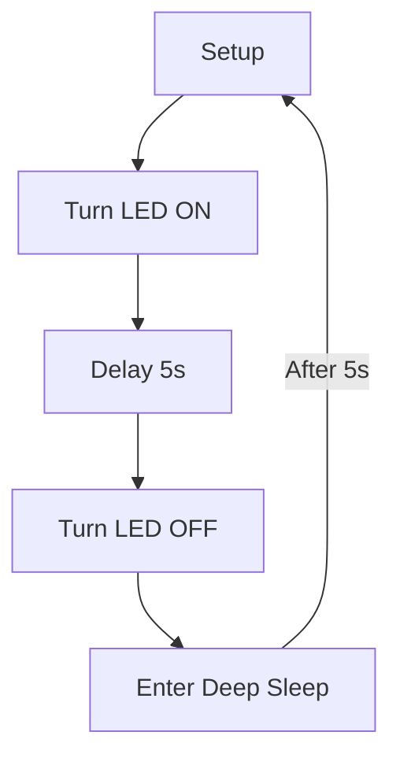

## 1. Wi-Fi Networks and ESP32

### 1.1 Key Wi-Fi Concepts

Wi-Fi networks are identified and managed using specific parameters:

- **SSID (Service Set Identifier)**: The name of the Wi-Fi network (e.g., `UoM_Wireless`).
- **BSSID**: The MAC address of the access point.
- **RSSI (Received Signal Strength Indicator)**: Measures signal strength in dBm (e.g., -60 dBm indicates a strong signal).
- **Channels**: Smaller bands within Wi-Fi frequency bands (2.4 GHz or 5 GHz) used for data transmission.

> [!note] : ESP32 supports both 2.4 GHz and 5 GHz bands, but most IoT applications use 2.4 GHz for better range.

### 1.2 Scanning Wi-Fi Networks

ESP32 can scan for available Wi-Fi networks to retrieve SSID, BSSID, RSSI, and channel information. 
#### Code Example: Wi-Fi Scan
```cpp
#include <Arduino.h>
#include "WiFi.h"

void setup() {
  Serial.begin(115200);
  // Set WiFi to station mode and disconnect from an AP if it was previously connected.
  WiFi.mode(WIFI_STA);
  WiFi.disconnect();
  delay(100);

  Serial.println("Setup done");
}

void loop() {
  Serial.println("Scan start");

  // WiFi.scanNetworks will return the number of networks found.
  int n = WiFi.scanNetworks();
  Serial.println("Scan done");
  if (n == 0) {
    Serial.println("no networks found");
  } else {
    Serial.print(n);
    Serial.println(" networks found");
    Serial.println("Nr | SSID                             | RSSI | CH | Encryption");
    for (int i = 0; i < n; ++i) {
      // Print SSID and RSSI for each network found
      Serial.printf("%2d", i + 1);
      Serial.print(" | ");
      Serial.printf("%-32.32s", WiFi.SSID(i).c_str());
      Serial.print(" | ");
      Serial.printf("%4ld", WiFi.RSSI(i));
      Serial.print(" | ");
      Serial.printf("%2ld", WiFi.channel(i));
      Serial.print(" | ");
      switch (WiFi.encryptionType(i)) {
        case WIFI_AUTH_OPEN:            Serial.print("open"); break;
        case WIFI_AUTH_WEP:             Serial.print("WEP"); break;
        case WIFI_AUTH_WPA_PSK:         Serial.print("WPA"); break;
        case WIFI_AUTH_WPA2_PSK:        Serial.print("WPA2"); break;
        case WIFI_AUTH_WPA_WPA2_PSK:    Serial.print("WPA+WPA2"); break;
        case WIFI_AUTH_WPA2_ENTERPRISE: Serial.print("WPA2-EAP"); break;
        case WIFI_AUTH_WPA3_PSK:        Serial.print("WPA3"); break;
        case WIFI_AUTH_WPA2_WPA3_PSK:   Serial.print("WPA2+WPA3"); break;
        case WIFI_AUTH_WAPI_PSK:        Serial.print("WAPI"); break;
        default:                        Serial.print("unknown");
      }
      Serial.println();
      delay(10);
    }
  }
  Serial.println("");
  // Delete the scan result to free memory for code below.
  WiFi.scanDelete();
  // Wait a bit before scanning again.
  delay(5000);
}
```

```
Scan start
Scan done
6 networks found

Nr | SSID                             | RSSI | CH | Encryption
 1 | eduroam                          |  -71 |  1 | WPA2-EAP
 2 | UoM_Wireless                     |  -72 |  1 | open
 3 | DIRECT-34-HP 4003dw LJ           |  -86 |  6 | WPA2
 4 | eduroam                          |  -88 | 11 | WPA2-EAP
 5 | UoM_Wireless                     |  -89 | 11 | open
 6 | Dialog 4G 952                    |  -91 | 10 | WPA2
```

> [!Tip] : Use the `WiFi.scanNetworks()` function in the ESP32 Arduino core to perform Wi-Fi scans programmatically.

### 1.3 Connecting to a Wi-Fi Network

To connect ESP32 to a Wi-Fi network, you need the SSID and password. The ESP32 is set to station mode (`WIFI_STA`) to act as a client.

#### Code Example: Wi-Fi Client Connection

```cpp
#include <WiFi.h>

const char* ssid = "Your_SSID";
const char* password = "Your_Password";

void setup() {
  Serial.begin(115200);
  Serial.print("Connecting to ");
  Serial.println(ssid);
  
  WiFi.mode(WIFI_STA); // Set ESP32 as a Wi-Fi client
  WiFi.begin(ssid, password);
  
  while (WiFi.status() != WL_CONNECTED) {
    delay(500);
    Serial.print(".");
  }
  
  Serial.println("");
  Serial.println("WiFi connected");
  Serial.print("IP address: ");
  Serial.println(WiFi.localIP());
}

void loop() {
  // Your code here
}
```

> [!Info] : The `WiFi.mode(WIFI_STA)` ensures the ESP32 does not act as an access point, preventing network conflicts.

#### Mermaid Diagram: Wi-Fi Connection Process



## 2. Setting Up a Wi-Fi Access Point (AP)

ESP32 can create its own Wi-Fi access point, allowing other devices to connect to it.

### 2.1 Steps to Start an Access Point

1. Configure the ESP32 in AP mode using `WiFi.softAP(ssid, password)`.
2. Assign an IP address (default is `192.168.4.1`).
3. Start a server to handle client requests.

#### Code Example: Wi-Fi Access Point with Web Server

```cpp
#include <Arduino.h>
#include <WiFi.h>
#define LED_BUILTIN 2

const char *ssid = "medibox";
const char *password = "12345678";
WiFiServer server(80);

void setup(){
  pinMode(LED_BUILTIN, OUTPUT);

  Serial.begin(115200);
  Serial.println();
  Serial.println("Configuring access point...");

  if (!WiFi.softAP(ssid, password)){
    Serial.println("Soft AP creation failed.");
    while (1)
      ;
  }
  IPAddress myIP = WiFi.softAPIP();
  Serial.print("AP IP address: ");
  Serial.println(myIP);
  server.begin();

  Serial.println("Server started");
}

void loop(){
  WiFiClient client = server.available(); // listen for incoming clients

  if (client){                                // if you get a client,
    Serial.println("New Client."); // print a message out the serial port
    String currentLine = "";       // make a String to hold incoming data from the client
    while (client.connected()){ // loop while the client's connected
      if (client.available()){  // if there's bytes to read from the client,
        char c = client.read(); // read a byte, then
        Serial.write(c);        // print it out the serial monitor
        if (c == '\n') { // if the byte is a newline character
          // if the current line is blank, you got two newline characters in a row.
          // that's the end of the client HTTP request, so send a response:
          if (currentLine.length() == 0) {
            client.println("HTTP/1.1 200 OK");
            client.println("Content-type:text/html");
            client.println();
            client.print("Click <a href=\"/H\">here</a> to turn ON the LED.<br>");
            client.print("Click <a href=\"/L\">here</a> to turn OFF the LED.<br>");
            client.println();
            break;
          }
          else {
            currentLine = "";
          }
        } else if (c != '\r'){
          currentLine += c;
        }

        if (currentLine.endsWith("GET /H")){
          digitalWrite(LED_BUILTIN, HIGH);
        }
        if (currentLine.endsWith("GET /L")){
          digitalWrite(LED_BUILTIN, LOW);
        }
      }
    }
    client.stop();
    Serial.println("Client Disconnected.");
  }
}
```

> [!Warning] : Ensure the password is at least 8 characters long, as shorter passwords are not supported by `WiFi.softAP()`.

#### Mermaid Diagram: Access Point Setup



## 3. ESP32 Web Server

### 3.1 HTTP Protocol Overview

The ESP32 can host a simple web server using the `WiFiServer` class to handle HTTP requests (GET, POST). The server responds with:

- **Status Code**: e.g., `200 OK` or `404 Not Found`.
- **Content Type**: e.g., `text/html`, `image/png`.
- **Content Body**: The actual data, such as HTML code.

#### Example HTTP Response

```
HTTP/1.1 200 OK
Date: Sun, 08 Feb 2025 01:11:12 GMT
Server: Apache/1.3.29
Content-Type: text/html

<h1>My Home page</h1>
```

> **Summary**: The web server handles one client at a time, making it suitable for simple IoT applications like controlling LEDs.

## 4. WiFiManager for Dynamic Wi-Fi Configuration

WiFiManager simplifies Wi-Fi configuration by allowing the ESP32 to create a captive portal when it cannot connect to a saved network.

### 4.1 How WiFiManager Works

1. ESP32 starts in station mode (`WIFI_STA`) and attempts to connect to a saved access point.
2. If unsuccessful, it switches to AP mode, creates a network (e.g., `AutoConnectAP`), and hosts a web server at `192.168.4.1`.
3. Users connect to the AP and configure Wi-Fi credentials via a web interface.

#### Code Example: WiFiManager

```cpp
#include <WiFiManager.h>

void setup() {
  Serial.begin(115200);
  Serial.println("Booting up...");
  WiFiManager wifiManager;
  bool connected = wifiManager.autoConnect("Medibox", "12345678");
  if (!connected) {
    Serial.println("Failed");
    ESP.restart();
  }
  else{
    Serial.print("Done!!!");
  }
}

void loop() {
  // Your code here
}
```

> **Tip**: Use `wm.resetSettings()` to clear saved Wi-Fi credentials for testing.

#### Mermaid Diagram: WiFiManager Flow



## 5. NTP Server for Time Synchronization

ESP32 can synchronize time with an NTP (Network Time Protocol) server, useful for time-sensitive IoT applications.

### 5.1 Implementation

The `NTPClient` library is used to fetch time from an NTP server.

#### Code Example: NTP Client

```cpp
#include <Arduino.h>
#include <WiFiManager.h>
#include <NTPClient.h>
#include <WiFiUdp.h>

WiFiUDP ntpUDP;
NTPClient timeClinet(ntpUDP); 

void setup()
{
  Serial.begin(115200);
  Serial.println("Booting up...");

  WiFiManager wifiManager;
  bool connected = wifiManager.autoConnect("Medibox", "12345678");
  if (!connected){
    Serial.println("Failed");
    ESP.restart();
  }
  else{
    Serial.print("Done!!!");
  }
  timeClinet.begin();
}

void loop(){
  timeClinet.update();
  Serial.println(timeClinet.getFormattedTime());
  delay(1000);
}
```

> **Info**: The NTP client fetches time in UTC; adjust for local time zones if needed.

## 6. ESP32 Sleep Modes

ESP32 supports multiple sleep modes to optimize power consumption, critical for battery-powered IoT devices.

### 6.1 Sleep Modes Overview

|Mode|CPU|System Clock|Wi-Fi|RTC|Power Consumption|
|---|---|---|---|---|---|
|Active|ON|ON|ON|ON|~100 mA|
|Modem-Sleep|ON|ON|OFF|ON|18 mA|
|Light-Sleep|Pause|OFF|OFF|ON|0.9 mA|
|Deep-Sleep|OFF|OFF|OFF|ON|20 µA|

> **Note**: The table above is based on ESP8266 data from the document but applies similarly to ESP32 with slight variations.

### 6.2 Deep Sleep with Timer Wake-Up

Deep Sleep mode minimizes power consumption, and the ESP32 can wake up automatically using a timer.

#### Code Example: Deep Sleep with Timer

```cpp
#define ledPin 2

void setup() {
  pinMode(ledPin, OUTPUT);
  digitalWrite(ledPin, HIGH);
  delay(5000); // Keep LED ON for 5 seconds
  digitalWrite(ledPin, LOW);
  ESP.deepSleep(5e6); // Sleep for 5 seconds
}

void loop() {
  // Empty, as ESP32 resets after deep sleep
}
```

> [!Warning] : Connect GPIO16 to the RST pin for timer-based wake-up only after uploading the code, as it may interfere with the upload process.

#### Mermaid Diagram: Deep Sleep Cycle



## 7. Practical Applications

- **Smart Home Devices**: Control LEDs, relays, or sensors via a web interface.
- **Environmental Monitoring**: Use NTP for timestamped sensor data logging.
- **Battery-Powered Sensors**: Leverage Deep Sleep for extended battery life.

## 8. Common Issues and Debugging

> [!Bug] : If the ESP32 fails to connect to Wi-Fi, check:
> 
> - Correct SSID and password.
> - Signal strength (RSSI > -80 dBm).
> - Wi-Fi channel interference.

> [!Bug] : Web server not responding? Ensure the server is started with `server.begin()` and the client is connected to the correct IP.

> [!bug] [ 32772][E][esp32-hal-adc.c:170] __analogReadRaw(): GPIO26: ESP_ERR_TIMEOUT: ADC2 is in use by Wi-Fi.
> This error occurs because **ADC2** on the ESP32 (which includes GPIO26) cannot be used for analogRead when the Wi-Fi is active. The ESP32 hardware shares ADC2 between Wi-Fi and analog input, so when Wi-Fi is running, ADC2 is locked and analogRead on those pins fails, returning 0 and showing this error.
> 
> >[!check] **How to fix:**
> > 
> > **Use ADC1 Pins Instead:**  
> >    - Use a pin that belongs to **ADC1** for your LDR sensor. ADC1 pins are not affected by Wi-Fi.  
> >    - Common ADC1 pins: GPIO32, GPIO33, GPIO34, GPIO35, GPIO36, GPIO39, GPIO38, GPIO37.

