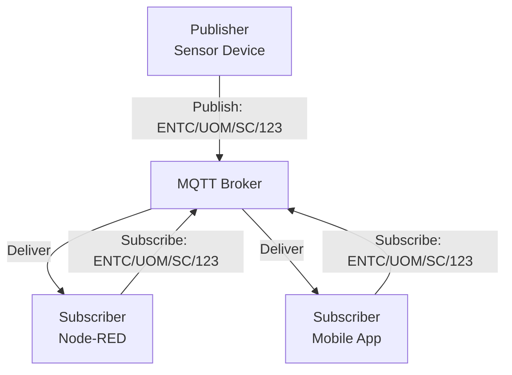
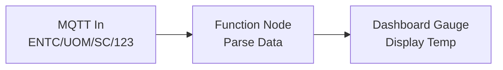
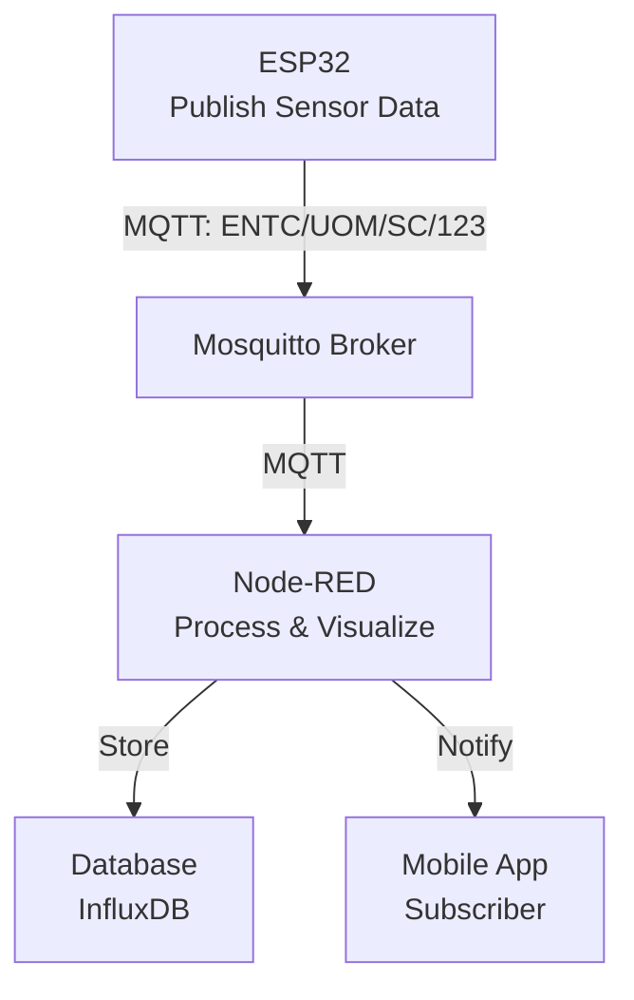

## Introduction to MQTT

> [!INFO] What is MQTT?  
> MQTT (Message Queue Telemetry Transport) is a lightweight, broker-based publish/subscribe messaging protocol designed for resource-constrained devices and unreliable networks. Developed by IBM and Eurotech, it operates over TCP/IP and is ideal for telemetry and remote monitoring in IoT applications.

- **Key Features**:
    - **Lightweight**: Minimal overhead, suitable for low-power devices.
    - **Publish/Subscribe**: Decouples publishers and subscribers via a broker.
    - **Bidirectional**: Supports two-way communication.
    - **Scalable**: Handles one-to-many data distribution.
    - **Open Standard**: Simple to implement, with wide adoption.

> [!NOTE] MQTT Use Cases  
> Ideal for IoT scenarios like sensor data collection, smart home automation, and industrial monitoring, where devices have limited battery, processor, or memory resources.

## MQTT Architecture

> [!SUMMARY] Publish/Subscribe Pattern  
> MQTT uses a publish/subscribe (pub/sub) architecture, where publishers send messages to a broker, and subscribers receive messages on topics they’re interested in, mediated by the broker.

- **Components**:
    - **Publisher**: Generates data and sends it to a topic via the broker.
    - **Subscriber**: Registers with the broker to receive messages on specific topics.
    - **Broker**: Relays messages, ensures security, and manages topic subscriptions.
- **Topics**:
    - Messages are published to hierarchical addresses (e.g., `ENTC/UOM/SC/123`).
    - Clients can subscribe to multiple topics, receiving all messages published to them.
    - Supports wildcards: `+` (single-level, e.g., `ENTC/+/SC`) and `#` (multi-level, e.g., `ENTC/#`).

> [!TIP] Topic Design  
> Use hierarchical topics for organized data (e.g., `device/type/id/sensor`). Avoid overly broad subscriptions (e.g., `#`) to reduce network load.

### Mermaid Diagram: MQTT Architecture



## MQTT and TCP/IP Protocol Stack

> [!INFO] MQTT in the Protocol Stack  
> MQTT operates at the application layer of the TCP/IP protocol stack, relying on TCP for reliable transport.

- **TCP/IP Layers** (from PDF):
    - **Application Layer**: MQTT handles message exchange (e.g., publish/subscribe).
    - **Transport Layer**: TCP ensures reliable delivery; UDP is not typically used.
    - **Network Layer**: IP routes packets (e.g., source IP: `192.168.1.101`, destination IP: `192.168.1.102`).
    - **Data Link Layer**: Manages frames with MAC addresses.
    - **Physical Layer**: Transmits signals over the network.

> [!NOTE] MQTT Packet Structure  
> MQTT messages consist of a payload (data) and headers (metadata like topic, QoS). Headers are added at each layer and removed upon reaching the destination.

## MQTT Methods

> [!SUMMARY] Core MQTT Methods  
> MQTT defines methods (verbs) to manage communication with the broker, as outlined in the PDF.

- **Connect**: Establishes a connection to the broker. Includes client ID and optional credentials.
- **Disconnect**: Closes the TCP/IP session after completing pending tasks.
- **Subscribe**: Registers the client to receive messages on specified topics.
- **Unsubscribe**: Removes the client from one or more topics.
- **Publish**: Sends a message to a topic, returning immediately to the application.

> [!WARNING] Connection Management  
> Ensure proper handling of `Connect` retries in case of broker unavailability to avoid application crashes, especially on resource-constrained devices.

## MQTT Broker: Eclipse Mosquitto

> [!INFO] Mosquitto Overview  
> Eclipse Mosquitto is an open-source MQTT broker (EPL/EDL licensed) supporting MQTT versions 5.0, 3.1.1, and 3.1. It’s lightweight, suitable for devices from single-board computers to servers.

- **Features**:
    - Provides a C library for MQTT clients.
    - Includes command-line tools: `mosquitto_pub` (publish) and `mosquitto_sub` (subscribe).
    - Part of the Eclipse Foundation, sponsored by cedalo.com.
- **Installation**:
    - On Linux: `sudo apt-get install mosquitto mosquitto-clients`.
    - Run as a service: `mosquitto -c /etc/mosquitto/mosquitto.conf`.

> [!TIP] Testing with Mosquitto  
> Use `mosquitto_sub -h test.mosquitto.org -t "test/topic"` and `mosquitto_pub -h test.mosquitto.org -t "test/topic" -m "Hello"` to test connectivity with the public test broker.

## MQTT with Node-RED

> [!NOTE] Node-RED Integration  
> Node-RED provides MQTT nodes for seamless integration with MQTT brokers, enabling IoT data processing and visualization.

- **Nodes**:
    - **MQTT In**: Subscribes to a topic, receiving messages as `msg.payload`.
    - **MQTT Out**: Publishes messages to a topic.
- **Configuration**:
    - Set broker details (e.g., `test.mosquitto.org`, port 1883).
    - Specify topics for subscription or publishing.
- **Example Flow**:
    - **MQTT In**: Subscribe to `ENTC/UOM/SC/123`.
    - **Function Node**: Process incoming data.
    - **Dashboard Node**: Display results.

**Example Function Node Code**:

```javascript
// Process temperature data
msg.payload = {
    temperature: parseFloat(msg.payload),
    timestamp: new Date().toISOString()
};
return msg;
```

### Mermaid Diagram: Node-RED MQTT Flow



## MQTT on ESP32

> [!INFO] ESP32 Implementation  
> The ESP32 microcontroller can act as an MQTT client, publishing sensor data or subscribing to control messages, as shown in the PDF.

- **Libraries**:
    - Use `PubSubClient` for Arduino or similar libraries for ESP32.
- **Key Functions**:
    - **Connect to Broker**: Attempts connection with a client ID, retrying on failure.
    - **Receive Callback**: Handles incoming messages on subscribed topics.

**Example Code** :

```cpp
#include <Arduino.h>
#include <WiFi.h>
#include <PubSubClient.h>

DHT dht(DHTPIN, DHTTYPE);
WiFiClient espClient;
PubSubClient mqttClient(espClient);

String ssid = "Wokwi-GUEST";
String password = "";

void connectToBroker()
{
  while (!mqttClient.connected())
  {
    Serial.print("Attempting MQTT connection...");
    if (mqttClient.connect("ESP32-000789458"))
    {
      Serial.println("connected");
      mqttClient.subscribe("CSE/UOM/SC/test");
    }
    else
    {
      Serial.print("failed, rc=");
      Serial.print(mqttClient.state());
      delay(5000);
    }
  }
}

void receiveCallback(char *topic, byte *payload, unsigned int length)
{
  Serial.print("Message arrived [");
  Serial.print(topic);
  Serial.print("] ");
  String message;
  for (int i = 0; i < length; i++)
  {
    message += (char)payload[i];
  }
  Serial.println(message);
}

void setupWifi()
{
  WiFi.begin(ssid, password);
  while (WiFi.status() != WL_CONNECTED)
  {
    delay(1000);
    Serial.println("Connecting to WiFi...");
  }
  Serial.println("Connected to WiFi");
}

void setupMqtt()
{
  mqttClient.setServer("test.mosquitto.org", 1883);
  while (WiFi.status() != WL_CONNECTED)
    delay(1000);
  mqttClient.setCallback(receiveCallback);
  connectToBroker();
}

void setup()
{
  Serial.begin(115200);
  setupWifi();
  setupMqtt();
}

void loop()
{
  if (!mqttClient.connected())
    connectToBroker();
  mqttClient.loop();
  mqttClient.publish("CSE/UOM/SC/test", "Hello from ESP32");
  delay(2000);
}
```

> [!WARNING] ESP32 Resource Constraints  
> Monitor memory usage when handling large payloads or frequent messages. Use QoS 0 for minimal overhead in non-critical applications.

## Practical Considerations for IoT Pipelines

> [!SUMMARY] Building an End-to-End IoT Pipeline  
> MQTT enables efficient data flow from devices to applications in IoT systems.

- **Pipeline Components**:
    - **Devices**: ESP32 or similar publish sensor data.
    - **Broker**: Mosquitto routes messages.
    - **Processing**: Node-RED processes and visualizes data.
    - **Storage/Analysis**: Integrate with databases or cloud services (e.g., InfluxDB, AWS IoT).
- **Security**:
    - Use TLS for encrypted communication (port 8883).
    - Implement authentication in Mosquitto (e.g., username/password or certificates).
- **Quality of Service (QoS)**:
    - QoS 0: At most once (fast, no guarantee).
    - QoS 1: At least once (ensures delivery, possible duplicates).
    - QoS 2: Exactly once (highest reliability, most overhead).

> [!TIP] Optimizing Performance  
> Use QoS 0 for high-frequency sensor data where occasional loss is acceptable. Cache data in Node-RED context to reduce broker load.

### Mermaid Diagram: IoT Pipeline



> [!SUMMARY] Conclusion  
> MQTT’s lightweight, pub/sub architecture makes it ideal for IoT pipelines, connecting devices like ESP32 to brokers like Mosquitto and processing platforms like Node-RED. Proper configuration, security, and QoS settings ensure reliable, scalable IoT systems.


### MQTT 2 way communication Example

> [!code]
> ```cpp
> #include <Arduino.h>
> #include <WiFi.h>
> #include <PubSubClient.h>
> #include <DHT.h>
> 
> #define DHTPIN 12     // GPIO pin where the DHT22 is connected
> #define DHTTYPE DHT22 // DHT 22 (AM2302)
> #define LED_PIN 2
> 
> 
> DHT dht(DHTPIN, DHTTYPE);
> WiFiClient espClient;
> PubSubClient mqttClient(espClient);
> 
> struct wifi_config
> {
>   const char *ssid;
>   const char *password;
> };
> 
> wifi_config wokwi = {
>     .ssid = "Wokwi-GUEST",
>     .password = ""};
> 
> wifi_config demon = {
>     .ssid = "Demon_net",
>     .password = "nopassword123"};
> 
> char temp[6];
> 
> void setupLed()
> {
>   pinMode(LED_PIN, OUTPUT);
>   digitalWrite(LED_PIN, LOW);
> }
> 
> void connectToBroker()
> {
>   while (!mqttClient.connected())
>   {
>     Serial.print("Attempting MQTT connection...");
>     if (mqttClient.connect("ESP32-000789458"))
>     {
>       Serial.println("connected");
>       mqttClient.subscribe("CSE/UOM/SC/ON-OFF");
>     }
>     else
>     {
>       Serial.print("failed, rc=");
>       Serial.print(mqttClient.state());
>       delay(5000);
>     }
>   }
> }
> 
> void receiveCallback(char *topic, byte *payload, unsigned int length)
> {
>   Serial.print("Message arrived [");
>   Serial.print(topic);
>   Serial.print("] ");
>   String message;
>   for (int i = 0; i < length; i++)
>   {
>     message += (char)payload[i];
>   }
>   Serial.println(message);
> 
>   strcmp(topic, "CSE/UOM/SC/ON-OFF") == 0 && message == "ON" ? digitalWrite(LED_PIN, HIGH) : digitalWrite(LED_PIN, LOW);
>   Serial.print("LED is ");
>   Serial.println(digitalRead(LED_PIN) == HIGH ? "ON" : "OFF");
> }
> 
> void setupWifi()
> {
>   int n = WiFi.scanNetworks();
>   const char* ssid = nullptr;
>   const char* password = nullptr;
> 
>   // Check for Wokwi-GUEST
>   for (int i = 0; i < n; ++i) {
>     if (WiFi.SSID(i) == wokwi.ssid) {
>       ssid = wokwi.ssid;
>       password = wokwi.password;
>       break;
>     }
>   }
>   // If not found, use demon
>   if (ssid == nullptr) {
>     ssid = demon.ssid;
>     password = demon.password;
>   }
> 
>   Serial.print("Connecting to WiFi: ");
>   Serial.println(ssid);
>   WiFi.begin(ssid, password);
>   while (WiFi.status() != WL_CONNECTED)
>   {
>     delay(1000);
>     Serial.println("Connecting to WiFi...");
>   }
>   Serial.println("Connected to WiFi");
> }
> 
> void setupMqtt()
> {
>   mqttClient.setServer("test.mosquitto.org", 1883);
>   while (WiFi.status() != WL_CONNECTED)
>     delay(1000);
>   mqttClient.setCallback(receiveCallback);
>   connectToBroker();
> }
> 
> void getTemp()
> {
>   float h = dht.readHumidity();
>   float t = dht.readTemperature();
>   if (isnan(h) || isnan(t))
>   {
>     Serial.println("Failed to read from DHT sensor!");
>     return;
>   }
>   Serial.print("Humidity: ");
>   Serial.print(h);
>   Serial.print(" %\t");
>   Serial.print("Temperature: ");
>   Serial.print(t);
>   Serial.println(" *C");
>   String(t, 2).toCharArray(temp, 6);
> }
> 
> void setup()
> {
>   Serial.begin(115200);
>   setupWifi();
>   setupMqtt();
>   setupLed();
>   dht.begin();
> }
> 
> void loop()
> {
>   if (!mqttClient.connected())
>     connectToBroker();
>   mqttClient.loop();
>   getTemp();
>   mqttClient.publish("CSE/UOM/SC/test", temp);
>   delay(2000);
> }
> ```