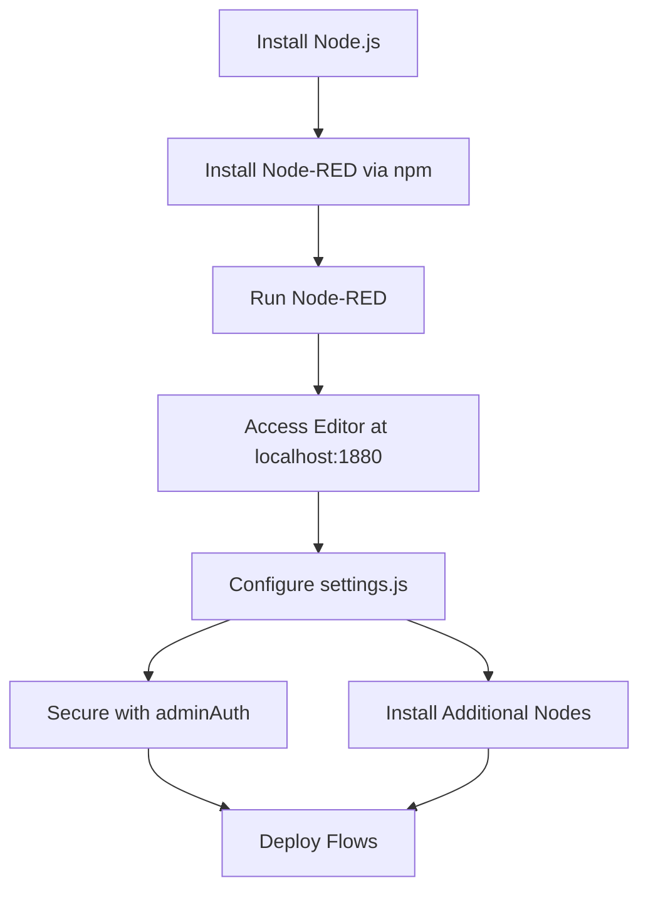

## Part 1: Setting Up Node-RED

> [!INFO] What is Node-RED?  
> Node-RED is a flow-based programming tool, initially developed by IBM and now part of the JS Foundation. It provides a browser-based editor to wire together flows using a palette of nodes, enabling rapid deployment with a single click. It’s particularly suited for IoT applications due to its ability to connect devices, APIs, and services.

### Installation Options

Node-RED can be installed and run in various environments, offering flexibility based on user needs.

> [!TIP] Choosing the Right Environment  
> Select the environment based on your use case: local for development, cloud for scalability, or IoT devices for edge computing.

- **Local Installation**:
    - Requires Node.js (LTS version recommended).
    - Install via npm: `npm install -g node-red`.
    - Run with: `node-red`.
    - Access the editor at `http://localhost:1880`.
- **Cloud Platforms**:
    - Services like IBM Cloud, Microsoft Azure, or AWS support Node-RED.
    - Example: FlowFuse (previously Node-RED FlowForge) offers managed Node-RED instances.
- **IoT Devices**:
    - Run on devices like Raspberry Pi for edge computing.
    - Install similarly to local setup, ensuring Node.js compatibility.
- **Docker**:
    - Use Docker for containerized deployment: `docker run -it -p 1880:1880 nodered/node-red`.

> [!NOTE] System Requirements  
> Ensure Node.js is installed (version 12.x or later). For resource-constrained devices like Raspberry Pi, use lightweight configurations to optimize performance.

### Initial Configuration

After installation, configure Node-RED for secure and efficient operation.

- **Settings File**:
    - Located at `~/.node-red/settings.js`.
    - Customize ports, enable authentication, or configure HTTPS.
- **Securing Node-RED**:
    - Enable admin authentication by setting `adminAuth` in `settings.js`.
    - Example:
        
```javascript
adminAuth: {
	type: "credentials",
	users: [{ username: "admin", password: "$2a$08...", permissions: "*" }]
}
```
        
- **Installing Additional Nodes**:
    - Use the Palette Manager in the editor or `npm install` in the `~/.node-red` directory.
    - Example: Install Dashboard nodes: `npm install node-red-dashboard`.

> [!WARNING] Security Considerations  
> Always secure the editor with authentication, especially for cloud or public-facing instances, to prevent unauthorized access.

### Mermaid Diagram: Node-RED Setup Workflow



