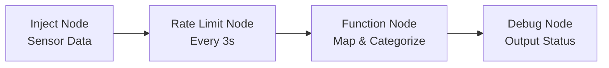

## Part 2: Getting Started with Node-RED Basics

> [!SUMMARY] Core Concepts  
> Node-RED’s strength lies in its visual flow-based programming, where nodes are connected to create data-processing workflows. Understanding basic nodes and message objects is key to building effective flows.

### Basic Nodes

- **Inject Node**:
    - Triggers flows manually or at intervals.
    - Configurable payloads: String, number, boolean, timestamp, etc.
    - Example: Set a timestamp payload to trigger every 5 seconds.
- **Debug Node**:
    - Displays messages in the Debug sidebar.
    - Toggle output with the node’s button to avoid clutter.
    - Recommended: Disable unused Debug nodes.
- **Function Node**:
    - Executes custom JavaScript code on incoming messages.
    - Messages are objects with a `msg.payload` property.
    - Example: Transform `msg.payload` with JavaScript logic.

> [!TIP] Debugging Effectively  
> Use the Debug node to inspect `msg` properties at different flow stages. Limit output to specific properties (e.g., `msg.payload`) for clarity.

### Message Object

The `msg` object is the core data structure in Node-RED, carrying data between nodes.

- **Structure**:
    - `msg.payload`: Main data (e.g., "Hello world", 20).
    - `msg.topic`: Optional identifier (e.g., "foo").
    - Custom properties: Added by nodes (e.g., `msg.greet`, `msg.num`).
- **Example**:
```json
{
	"payload": "Hello world",
	"topic": "foo",
	"greet": "Hello",
	"num": 20,
	"bin": true
}
```

### Building a Simple Flow

> [!NOTE] Example: Temperature Sensor Processing  
> Design a flow for a temperature sensor emitting data every 500ms, as described in the PDF:
> 
> - Limit data rate to every 3 seconds.
> - Map sensor values (0-1024) to Celsius (0-100).
> - Print "HIGH" (>75°C), "MEDIUM" (50-75°C), or "LOW" (<50°C).

**Flow Steps**:

1. **Inject Node**: Simulate sensor data (payload: 0-1024).
2. **Rate Limit Node**: Restrict to one message every 3 seconds.
3. **Function Node**: Map values and categorize temperature.
4. **Debug Node**: Output results.

**Function Node Code**:

```javascript
// Map 0-1024 to 0-100
msg.payload = (msg.payload / 1024) * 100;

// Categorize temperature
if (msg.payload > 75) {
    msg.status = "HIGH";
} else if (msg.payload >= 50) {
    msg.status = "MEDIUM";
} else {
    msg.status = "LOW";
}
return msg;
```

### Mermaid Diagram: Temperature Sensor Flow




