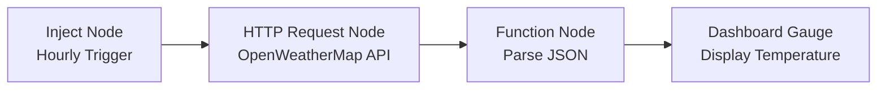

## Part 3: Advanced Node-RED Features

> [!INFO] Extending Node-RED  
> Advanced features like dashboards, context storage, and external API integration make Node-RED powerful for complex IoT applications.

### Node-RED Dashboard

The `node-red-dashboard` module creates interactive web-based dashboards.

- **Key Nodes**:
    - **UI Nodes**: Button, gauge, chart, text, etc.
    - **Layout**: Organized in tabs and groups.
- **Installation**:
    
```bash
npm install node-red-dashboard
```
    
- **Access**: Dashboard at `http://<host>:1880/ui`.
- **Example**: Display temperature readings on a gauge.

> [!TIP] Dashboard Design  
> Group related widgets in tabs for clarity. Use charts for time-series data like sensor readings.

### Context Storage

Context allows data sharing between nodes without passing messages.

- **Scopes**:
    - **Node**: Private to a single node.
    - **Flow**: Shared across a flow tab.
    - **Global**: Accessible to all nodes.
- **Methods**:
    - `flow.get/set/keys`: For flow scope.
    - `global.get/set/keys`: For global scope.
- **Example**: Store a running average of sensor data.
    
    ```javascript
    let sum = context.get("sum") || 0;
    let count = context.get("count") || 0;
    sum += msg.payload;
    count++;
    context.set("sum", sum);
    context.set("count", count);
    msg.payload = sum / count;
    return msg;
    ```
    

### External APIs: OpenWeatherMap

Integrate with external services using HTTP request nodes.

- **Setup**:
    - Use an HTTP Request node to fetch data (e.g., weather from OpenWeatherMap).
    - Configure with API key and endpoint (e.g., `api.openweathermap.org/data/2.5/weather`).
- **Example Flow**:
    1. Inject Node: Trigger every hour.
    2. HTTP Request Node: Fetch weather data.
    3. Function Node: Parse JSON response.
    4. Dashboard Node: Display temperature.

### Adding Custom Nodes

Extend Node-RED by installing or creating nodes.

- **Install via Palette Manager**:
    - Navigate to Menu–

> Manage Palette –> Install.

- **Create Custom Nodes**:
    - Use Node-RED’s node creation API.
    - Example: A node to process specific IoT protocols.
- **Community Nodes**:
    - Explore nodes like `node-red-contrib-mqtt` for MQTT integration.

### Mermaid Diagram: Weather Dashboard Flow



> [!WARNING] API Rate Limits  
> Respect API rate limits (e.g., OpenWeatherMap’s free tier). Use context to cache results and reduce requests.

> [!SUMMARY] Conclusion  
> Node-RED’s visual interface, combined with its extensibility, makes it ideal for IoT and automation projects. Start with basic flows, leverage dashboards and context for interactivity, and integrate external APIs for real-world applications.


