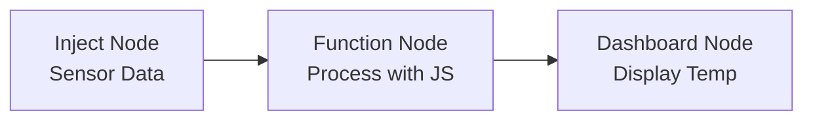

## Introduction to JavaScript

> [!INFO] What is JavaScript?  
> JavaScript, invented in 1995 at Netscape (originally called LiveScript), is a lightweight, interpreted scripting language designed to add interactivity to HTML pages. It runs in browsers, is supported by all major browsers, and is distinct from Java despite syntactic similarities.

- **Key Characteristics**:
    - **Interpreted**: Executes without compilation, converting code to executable format when loaded.
    - **Front-End Focus**: Primarily used for client-side web interactivity, but also supports back-end (e.g., Node.js).
    - **Dynamic Typing**: Variables can hold any data type without strict type declarations.
    - **Syntax**: Similar to C, but simpler and more flexible.

> [!NOTE] JavaScript vs. Java
> 
> - JavaScript: Interpreted, browser-based, dynamic typing, used for web apps.
> - Java: Compiled, runs on JVM, static typing, used for various applications.

## Variables in JavaScript

> [!SUMMARY] Declaring Variables  
> JavaScript offers three ways to declare variables, each with distinct scoping and mutability rules.

- **var**: Older method, function-scoped, may be deprecated. Can be redeclared and updated.
- **let**: Introduced in ES6 (2015), block-scoped, can be updated but not redeclared in the same scope.
- **const**: Block-scoped, cannot be updated or redeclared; used for constants.

**Example Code**:

```javascript
var oldVar = 10; // Function-scoped, redeclarable
let mutableVar = 20; // Block-scoped, updatable
const fixedVar = 30; // Block-scoped, immutable
mutableVar = 25; // Valid
// fixedVar = 35; // Error: Assignment to constant
```

## Data Types

> [!INFO] JavaScript Data Types  
> JavaScript has primitive and composite (non-primitive) data types, enabling flexible data handling.

- **Primitive Types**:
    - Number (e.g., `42`, `3.14`)
    - String (e.g., `"hello"`)
    - Boolean (e.g., `true`, `false`)
    - Undefined (e.g., a variable without a value)
    - Null (e.g., intentional absence of value)
    - Symbol (ES6, unique identifiers)
    - BigInt (ES2020, for large integers)
- **Composite Types**:
    - Object (e.g., `{ key: "value" }`)
    - Array (e.g., `[1, 2, 3]`)
    - Function (e.g., `function() {}`)

> [!TIP] Null vs. Undefined
> 
> - `null`: Explicitly set to indicate no value (e.g., `let x = null`).
> - `undefined`: Default for uninitialized variables (e.g., `let x;`).

**Example Code**:

```javascript
let num = 42; // Number
let str = "Hello"; // String
let bool = true; // Boolean
let undef; // undefined
let nul = null; // null
let obj = { key: "value" }; // Object
let arr = [1, 2, 3]; // Array
```

## Objects in JavaScript

> [!SUMMARY] Working with Objects  
> Objects store key-value pairs, where keys are strings (or symbols) and values can be any type.

- **Creating Objects**:
    - Use object literal syntax: `const obj = { key: "value" };`.
- **Accessing Properties**:
    - Dot notation: `obj.key`
    - Bracket notation: `obj["key"]`
- **Example from PDF**:
    
    ```javascript
    let person = {
        firstName: "John",
        lastName: "Doe",
        age: 50,
        eyeColor: "blue"
    };
    console.log(person.firstName); // "John"
    console.log(person["lastName"]); // "Doe"
    ```
    

**Example: Object in Node-RED**:

```javascript
// Function Node to process a message object
msg.payload = {
    sensor: "temperature",
    value: 25,
    unit: "Celsius"
};
return msg;
```

## Arrays in JavaScript

> [!INFO] Arrays for Ordered Data  
> Arrays are ordered lists, indexed from 0, with powerful methods for manipulation.

- **Creating Arrays**:
    - Literal syntax: `const arr = [1, 2, 3];`
- **Accessing/Modifying**:
    - Index-based: `arr[0]` (access), `arr[0] = 4` (modify).
- **Common Methods** (from PDF):
    - `push()`, `pop()`, `shift()`, `unshift()`, `map()`, `filter()`, `forEach()`, etc.

**Example: Array Manipulation**:

```javascript
const colors = ["red", "green", "blue"];
colors[0] = "black"; // Modify
colors.push("yellow"); // Add to end
console.log(colors); // ["black", "green", "blue", "yellow"]
let mapped = colors.map(c => c.toUpperCase()); // ["BLACK", "GREEN", "BLUE", "YELLOW"]
```

**Example: Array in Node-RED**:

```javascript
// Function Node to store sensor readings
msg.payload = msg.payload || []; // Initialize array
msg.payload.push(new Date().getTime()); // Add timestamp
return msg;
```

## Flow Control

> [!SUMMARY] Controlling Program Flow  
> JavaScript supports conditionals and loops to manage execution logic.

- **Conditionals**:
    - `if`, `else if`, `else` for decision-making.
    - Example:
        
        ```javascript
        let temp = 25;
        if (temp > 75) {
            console.log("HIGH");
        } else if (temp >= 50) {
            console.log("MEDIUM");
        } else {
            console.log("LOW");
        }
        ```
        
- **Loops**:
    
    - `for`: Iterates with a counter.
    - `while`: Runs while a condition is true.
    - Example:
        
        ```javascript
        for (let i = 0; i < 5; i++) {
            console.log(i); // 0, 1, 2, 3, 4
        ```
        
    
    емы  
    ```
    

**Example: Flow Control in Node-RED** (from PDF exercise):

```javascript
// Function Node for temperature sensor
let value = (msg.payload / 1024) * 100; // Map 0-1024 to 0-100
msg.payload = value;
if (value > 75) {
    msg.status = "HIGH";
} else if (value >= 50) {
    msg.status = "MEDIUM";
} else {
    msg.status = "LOW";
}
return msg;
```

## Practical Application: Node-RED Integration

> [!NOTE] JavaScript in Node-RED  
> In Node-RED, JavaScript is used in Function Nodes to process `msg` objects, enabling custom logic for IoT applications.

**Example: Temperature Dashboard**:

```javascript
// Function Node to format temperature data
let temp = (msg.payload / 1024) * 100; // Map sensor value
msg.payload = {
    value: temp,
    status: temp > 75 ? "HIGH" : temp >= 50 ? "MEDIUM" : "LOW",
    timestamp: new Date().toISOString()
};
return msg;
```

## Mermaid Diagram: JavaScript in Node-RED Flow



> [!TIP] Best Practices
> 
> - Use `let` and `const` over `var` for better scoping.
> - Leverage array methods like `map` and `filter` for concise code.
> - In Node-RED, always return the `msg` object in Function Nodes.


