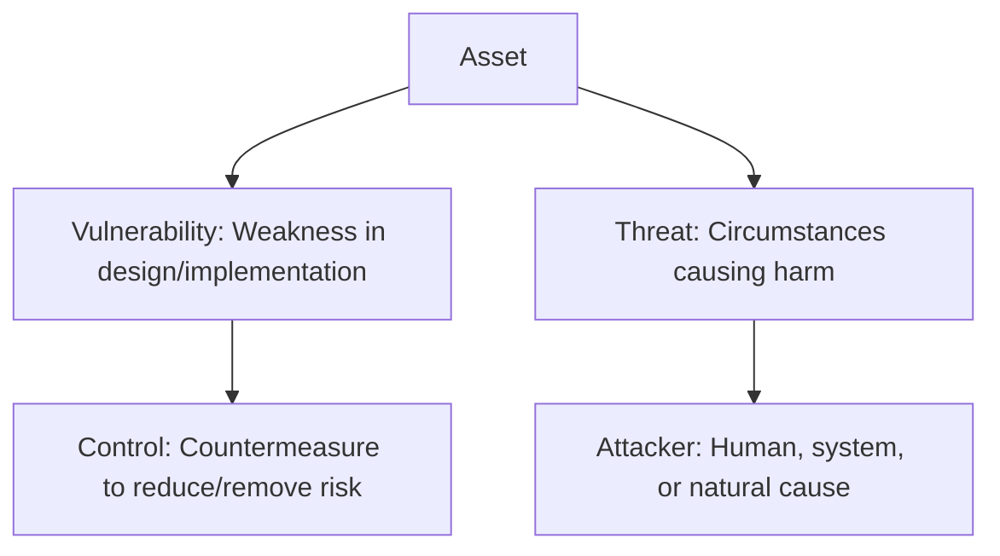

## 🛡️ Introduction

Computer security is the **protection of assets** (hardware, software, data, people, processes, or combinations) from threats and vulnerabilities.

>[!note] Value of an `Asset`
> The *value of an asset* can be actual (replacement cost, usability) or perceived (importance to the user, time/event dependency).

---

## 🔑 Core Concepts

### Assets

* **Types**: Hardware, software, data, processes, people.
	* Types of an asset has a bearing on it's **vulnerabilities**
* **Value Determinants**:
	* Monetary & replacement cost
	* Time/event dependency
	* Owner/user perspective

---

### Vulnerability–Threat–Control Paradigm

* **Vulnerability**: Weakness that can be exploited.
* **Threat**: Set of circumstances that has potential to cause harm to the system.
* **Control**: Action/device/procedure reducing risk.

---

### Threats

* **Origins**: Internal or external.
* **Perspectives**:
	  1. What can go wrong with the asset?
	  2. Who/what can cause it?

---

### CIA Triad (Classical view of security)

* **Confidentiality** → Ensure only authorized parties can read.
* **Integrity** → Ensure only authorized parties can modify.
* **Availability** → Ensure any authorized users can access services/data.

>[!tip] CIA Triad is the **foundation of security** and the lens through which attacks are classified.

---

### Extended Security Properties

* **Authentication** → Verifying identity. (The ability of a system to confirm the identity of a sender.)
* **Non-repudiation/Accountability** → Cannot deny an action. (The ability of a system to confirm that a sender cannot convincingly deny having sent something)
* **Auditability** → Trace actions to individuals. (The ability of a system to trace all actions related to a given asset)

---

### Acts Causing Security Harm

1. **Interception** → Breaks confidentiality.
2. **Interruption** → Breaks availability.
3. **Modification** → Breaks integrity.
4. **Fabrication** → Creates false data (breaks integrity).

---

## 🔐 Security Properties in Depth

### Confidentiality

* Access restricted to authorized users/systems.
* Challenges:

  * Who defines access rights?
  * Partial vs. full data access
  * Data ownership issues (e.g., web browsing history)

**Violations Examples**:

* Unauthorized access
* Privilege escalation
* Inference attacks (deriving medical conditions from purchases)
* Disclosure of existence of data (e.g., takeover rumors)

---

### Integrity

* Data must be **accurate, precise, consistent, and unmodified** unless by authorized means.

**Examples of loss**:

* Database tampering
* Unauthorized changes to financial reports
* Corruption of logs

---

### Availability

* Ensures data and services are usable when required.
* Factors:

  * Usable form
  * Capacity to meet demand
  * Bounded waiting time
  * Completion within acceptable time

**Related Aspects**: Performance, fault tolerance, usability

---

## 🛡️ Access Control Models

Security is maintained through **Access Control**, which governs how subjects interact with objects:

* **Bell-LaPadula (BLP) Model** → Focus on confidentiality (no read up, no write down).
* **Biba Model** → Focus on integrity (no write up, no read down).
* **Chinese Wall Model** → Prevents conflict of interest in shared information systems.

**No Read Up (NRU)** → A subject (like a user or process) **cannot read data at a higher security level** than its own clearance.
- Example: A user with _Secret_ clearance cannot read a file marked _Top Secret_.
- Prevents **information leakage** from high → low.

**No Write Down (NWD)** → A subject **cannot write information to a lower security level** than its own.
- Example: A _Top Secret_ analyst cannot save a report into a _Confidential_ folder.
- Prevents **leaking classified data** to lower levels.
---
 **No Write Up (NWU)** → A subject **cannot write data to a higher integrity level**.
- Example: A low-trust program cannot modify files in a _High Integrity_ system folder.
- Prevents corruption of critical data by untrusted sources.

**No Read Down (NRD)** → A subject **cannot read data from a lower integrity level**.
- Example: A _High Integrity_ medical database process cannot read from a _Low Integrity_ log file.
- Prevents contamination of high-trust processes with bad/dirty data.
## ⚠️ Types of Threats

1. **Non-Human Origin**

   * Hardware failures
   * Software bugs
   * Power/network outages

2. **Human Origin**

   * **Benign intent**: Errors, wrong inputs
   * **Malicious intent**: Viruses, phishing, impersonation

---

## 🎯 Advanced Persistent Threat (APT)

* **Advanced**: Uses intelligence-gathering techniques.
* **Persistent**: Target-specific with defined goals.
* **Threat**: Highly capable attackers, often state-sponsored.

>[!warning]
> APTs are not random — they are **targeted, organized, and well-funded**, e.g., Stuxnet attack on uranium enrichment plants.

---

## 📝 Review Questions

1. What kinds of harm could a company face from **unauthorized reading** of confidential material?
2. How does loss of **integrity** in programs/data affect business operations?
3. What are examples of **availability failures**, and how do they impact users?

---

## 📌 Key Takeaways

* Security revolves around protecting **assets** against **threats** by mitigating **vulnerabilities** with **controls**.
* The **CIA Triad** is the backbone of security, extended with **authentication, accountability, and auditability**.
* **Access control models** formalize how data should be read, modified, or used.
* **Threats** evolve from simple viruses to **state-sponsored APTs**.

---

## 📚 Further Reading

* [Security in Computing – Pfleeger et al.](https://www.pearson.com/en-us/subject-catalog/p/security-in-computing/P200000006860/9780134085043)
* [NIST Cybersecurity Framework](https://www.nist.gov/cyberframework)
* [OWASP Top 10 Security Risks](https://owasp.org/www-project-top-ten/)

