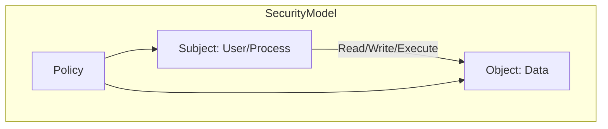
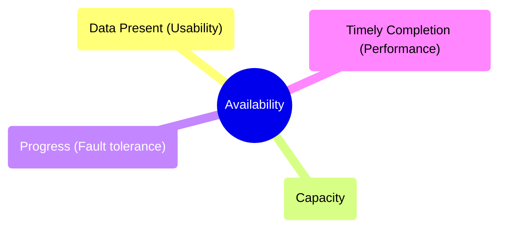

## 1. Confidentiality

**Definition:** Only **authorized people or systems** can access protected data.

> [!note]  Confidentiality = Preventing unauthorized disclosure of information.

### Why is it difficult to ensure confidentiality?

Because we need answers to **challenging questions**:

* **Authorization:** Who decides which people/systems are allowed?
* **Extent of access:** Does access mean the entire dataset or just parts of it?
* **Contextual access:** Can an authorized person take data **out of its intended context**?
* **Data sharing:** Can authorized users disclose data to **third parties**?
* **Data ownership:** Who owns the *usage data*?

  * Example: If you visit a web page, who owns the fact that you clicked a link?

    * You?
    * The website owner?
    * Your Internet Service Provider (ISP)?
    * Or all of them?

> [!example]
> **Healthcare systems:**
>
> * Doctors can view patient medical records (authorized).
> * Insurance companies may only be allowed partial access (not the full dataset).
> * A pharmacist should not infer private conditions from medicine purchases without patient consent.

---

## 2. Modeling Confidentiality

> [!NOTE]  A person, process, or program is (or is not) authorized to access a data item in a particular way.

### The Security Model consists of:

* **Subject** → Person, process, or program
* **Object** → Data item
* **Access Mode** → Read, Write, Execute
* **Policy** → Authorization rules

📌 **Example in Operating Systems:**

* File permissions:

  * Subject = User account
  * Object = File
  * Access Mode = Read/Write/Execute
  * Policy = File system rules

---

## 3. Example Instance of the Model

The **policy-based access control** mechanism is embedded in every **general-purpose operating system**.

* Windows → NTFS permissions
* Linux → `chmod`, `chown`
* Databases → Role-based access

![[Pasted image 20250928233707.png|400]]
> [!tip] Without access control policies, OS and applications would expose all files/data to any process.

---

## 4. Examples of Confidentiality Violation

Confidentiality violations are not always obvious. They may happen as a series of small actions.

* An **unauthorized person** accesses a data item.

  * Example: Hacker breaking into a hospital database.
* An **unauthorized program** accesses data.

  * Example: Malware reading local password files.
* **Privilege abuse**: Authorized person accesses unauthorized data.

  * Example: A bank clerk peeking into a celebrity’s account.
* **Inference attacks**: Data indirectly reveals private facts.

  * Example: Frequent purchase of a specific drug → reveals a medical condition.
* **Existence disclosure**: Learning about data existence without full access.

  * Example: Seeing updates in financial statements → reveals an upcoming company takeover.

> [!warning] Even **metadata** leaks (like knowing someone searched for “lawyers” or visited a cancer website) can break confidentiality.

---

## 5. Integrity

**Definition:** Only authorized entities can **modify protected data**.

### Integrity means that data is:

* **Precise & Accurate**
* **Unmodified**, or modified **only in acceptable ways**
* Modified only by **authorized people/processes**
* **Consistent** (internally and externally)
* **Meaningful & usable** in its context

> [!example]
>
> * A medical test result altered by unauthorized staff = **loss of integrity**.
> * A stock trading system must ensure no one can **inject fake trades**.

> [!fail] If integrity fails, **decisions based on corrupted data** (like wrong medical treatment or financial fraud) can have catastrophic consequences.

---

## 6. Availability

**Definition:** Ensuring **data and services are usable** when needed.

### Conditions for availability:

* Present in **usable form**
* Has **enough capacity** to serve demand
* Makes **progress** (not stuck in deadlock/infinite wait)
* Responds within **acceptable time**

### Real-World Examples:

* **E-commerce:** Amazon should not go offline during Black Friday sales.
* **Banking apps:** Customers expect 24/7 service access.
* **Hospitals:** Patient monitoring systems must always be available.

> [!attention] Availability overlaps with **performance, usability, fault-tolerance, and capacity**.

---

## 7. Access Control

Security is preserved by controlling **three actions**:

* **View (Confidentiality)**
* **Modify (Integrity)**
* **Use (Availability)**

### Classic Security Models:

**Bell-LaPadula Model (BLP):** Confidentiality (no read up, no write down).
  * Example: Classified military systems.

**Biba Model:** Integrity (no write up, no read down).
  * Example: Preventing corrupted data from contaminating higher levels.

 **Chinese Wall Model:** Prevents **conflict of interest** in consulting firms.
  * Example: A consultant working with Coca-Cola cannot also access Pepsi’s internal data.

---
**No Read Up (NRU)** → A subject (like a user or process) **cannot read data at a higher security level** than its own clearance.
- Example: A user with _Secret_ clearance cannot read a file marked _Top Secret_.
- Prevents **information leakage** from high → low.

**No Write Down (NWD)** → A subject **cannot write information to a lower security level** than its own.
- Example: A _Top Secret_ analyst cannot save a report into a _Confidential_ folder.
- Prevents **leaking classified data** to lower levels.

---
 **No Write Up (NWU)** → A subject **cannot write data to a higher integrity level**.
- Example: A low-trust program cannot modify files in a _High Integrity_ system folder.
- Prevents corruption of critical data by untrusted sources.

**No Read Down (NRD)** → A subject **cannot read data from a lower integrity level**.
- Example: A _High Integrity_ medical database process cannot read from a _Low Integrity_ log file.
- Prevents contamination of high-trust processes with bad/dirty data.

> [!info] Access control ensures **role-based, policy-driven management** of data.

---

## 8. Types of Threats

Threats can target **data, systems, and services**.

### Categories:

1. **Non-Human Origin**

   * Hardware failure, software bugs, network/power outage.
2. **Human (Benign Intent)**

   * Errors in input, wrong configuration, accidental deletion.
3. **Human (Malicious Intent)**

   * **Random attacks:** Worms, viruses, phishing, malicious web pages.
   * **Directed attacks:** Spear phishing, CEO impersonation, ransomware.

> [!example]
>
> * Random → Receiving spam with malware.
> * Directed → Hackers target a company’s CFO with a fake invoice.

---

## 9. Advanced Persistent Threat (APT)

**Definition:** APT = Long-term, well-funded, targeted cyberattack.

### Features:

* **Advanced**: Uses intelligence-gathering, social engineering, malware.
* **Persistent**: Not opportunistic; attackers have **specific goals**.
* **Threat**: Attackers are skilled, organized, well-funded.

### Example Cases:

* **Stuxnet Worm (2010):** Targeted Iran’s uranium enrichment plants.
* **SolarWinds Attack (2020):** Targeted US government & Fortune 500 firms.
* **CEO Email Hack:** High-value executive credentials stolen.

> [!quote] “APT attacks are executed by coordinated human actions, not just code. Attackers are skilled, motivated, organized, and well-funded.” – *Wikipedia*

---

## 10. Review Questions

1. **List several ways in which you define the quality of a software application.**

   * Accuracy, usability, reliability, performance, scalability, **security**.

2. **Consider a conglomerate with supermarket + pharmacy + hospital + insurance.**

   * As a customer:

     * Supermarket → Protect purchase history.
     * Pharmacy → Protect prescriptions & medical data.
     * Hospital → Protect health records.
     * Insurance → Protect policies and claims.

3. **For Uber or PickMe (ride-hailing/food delivery):**

   * Confidentiality violations: Driver/customer personal data leaks.
   * Integrity violations: Fake rides/transactions.
   * Availability violations: App downtime during peak demand.

---

# 🌐 Further Reading

* [Bell-LaPadula Model](https://en.wikipedia.org/wiki/Bell%E2%80%93LaPadula_model)
* [Biba Integrity Model](https://en.wikipedia.org/wiki/Biba_Model)
* [Chinese Wall Policy](https://en.wikipedia.org/wiki/Chinese_Wall)
* [Advanced Persistent Threat (APT)](https://en.wikipedia.org/wiki/Advanced_persistent_threat)

---

