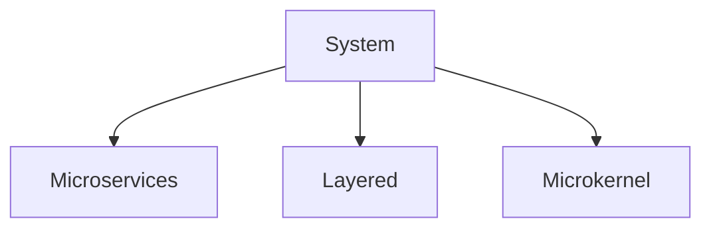
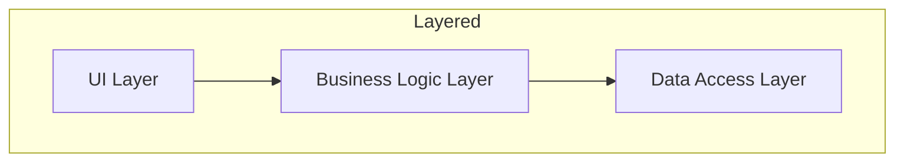
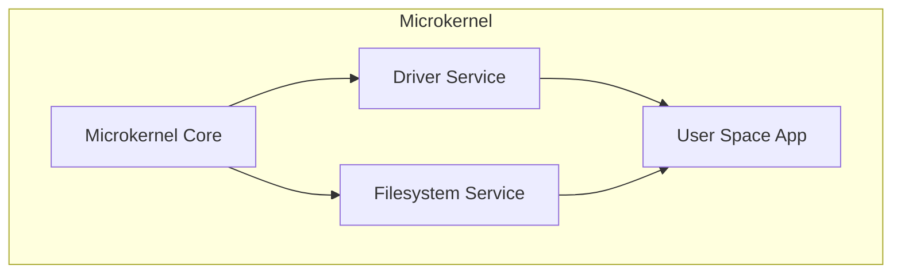
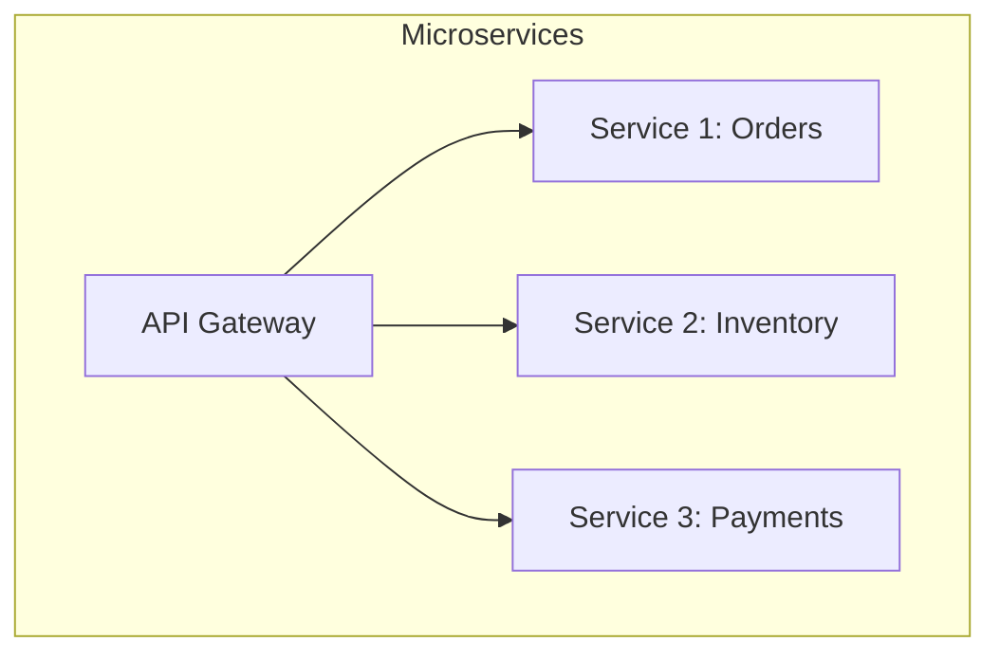

## 📝 Outline
- Defining software architecture  
- Expectations of an architect  
- Laws of software architecture  
- Evolution of software architecture (by MR)  

---

## 🔹 Defining Software Architecture

Software architecture can be seen in two ways:  
1. **As a noun:** the structure of a system.  
2. **As a verb:** the process of defining system structures.

> [!quote]
> *“Architecture is about the important stuff… whatever that is.”* — **Ralph Johnson**

> [!url] Martin Fowler’s talk: [Is Design Dead?](https://youtu.be/VjKYO6DP3fo?si=Kjsdkezv6YUKGaNd)  
> <iframe width="560" height="315" src="https://www.youtube-nocookie.com/embed/VjKYO6DP3fo?si=s--8gQuxTBtrySSv&amp;start=1" title="YouTube video player" frameborder="0" allow="accelerometer; autoplay; clipboard-write; encrypted-media; gyroscope; picture-in-picture; web-share" referrerpolicy="strict-origin-when-cross-origin" allowfullscreen></iframe>

### IEEE 1471 Definition
> [!note]
> **Architecture is the fundamental organization of a software system embodied in its components, their relationships to each other and to the environment, and the principles guiding its design and evolution.**

📌 Key points:
1. No universal definition exists.  
2. The architect’s role has expanded beyond just structure.  
3. Architecture evolves with the software ecosystem.  

---

## 🏛️ Elements of Software Architecture (Richards & Ford)

==Software architecture = **Structure + Characteristics + Decisions + Principles**==

> [!image] Software Architecture
> ![[Pasted image 20250819214628.png|560]]

### 1. Structure  
- Type of architecture style(s):  
  - **Microservices**  
  - **Layered**  
  - **Microkernel**  



#### Layered Architecture
- ASP.NET MVC or Java EE apps (UI, Business Logic, Data layers).
> [!note] **Layered architecture** promotes code separation and ease of testing.




#### Microkernel Architecture
- **Minix**, **QNX**, **L4**, **GNU Hurd**, **HelenOS**.  
> [!attention] **Microkernel architecture** excels in reliability—faulty services don’t crash the system.



#### Microservice Architecture
- **Netflix, Amazon, Uber** use microservices for scalability.  
> [!info] **Microservices** enable independent deployment, faster scaling, and organizational autonomy.




---

### 2. Architecture Characteristics (the “-ilities”)  
- Define **success criteria** of the system.  
- Orthogonal to system functionality (independent of business logic).  

> [!example] Examples:  
> - Performance  
> - Scalability  
> - Availability  
> - Security  
> - Maintainability  
> ![[Pasted image 20250819214853.png|600]]

---

### 3. Architecture Decisions  
- Rules & constraints that define how the system is built.  
- Direct development teams on what is and isn’t allowed.  

> [!example]
> In a layered architecture → only **business** and **service layers** can access the database.
> ![[Pasted image 20250819215103.png|600]]

---

### 4. Design Principles  
- Guidelines (not strict rules).  
- Complement architecture decisions.  

> [!example]
> - Use **asynchronous messaging** between microservices to improve performance.  
> - Prefer **loose coupling** and **high cohesion**.  
> 
> ![[Pasted image 20250819215304.png|600]]

---

## 👨‍💻 Expectations of a Software Architect
1. Make architecture decisions.  
2. Continually analyze and refine the architecture.  
3. Stay updated with the latest industry trends.  
4. Ensure compliance with architecture decisions.  
5. Gain diverse technical exposure.  
6. Acquire business domain knowledge.  
7. Possess strong interpersonal skills.  
8. Navigate organizational politics.  

> [!attention]
> A successful architect balances **technical expertise** with **business understanding** and **soft skills**.  

---

## ⚖️ Laws of Software Architecture (Richards & Ford)
1. **Everything in software architecture is a trade-off.**  
   - E.g., Performance vs Maintainability.  
2. **Why is more important than how.**  
   - Justifying architectural decisions is more valuable than the implementation details.  

---

## 📌 Next Lecture Preview
- Architecture vs. Design  
- Unknowns in architecture  
- Analyzing trade-offs  

Up Next : [[02 Architecture Thinking]]


---
## 📚 References
- *Fundamentals of Software Architecture – An Engineering Approach*  
  Mark Richards & Neal Ford, O’Reilly, 2020.  
- [Wikipedia: Software Architecture](https://en.wikipedia.org/wiki/Software_architecture)  

---
## 🔗 Further Reading
- [Microservices overview – Microsoft Docs](https://learn.microsoft.com/en-us/azure/architecture/guide/architecture-styles/microservices)  
- [Microkernel Architecture – GeeksforGeeks](https://www.geeksforgeeks.org/system-design/microkernel-architecture-pattern-system-design/)  
- [Choosing architecture patterns – Redpanda Blog](https://www.redpanda.com/blog/how-to-choose-right-architecture-pattern)  

```meta-bind-button
label: PDF
icon: ""
hidden: false
class: ""
tooltip: Download PDF
id: ESE01
style: default
actions:
  - type: command
    command: workspace:export-pdf

```