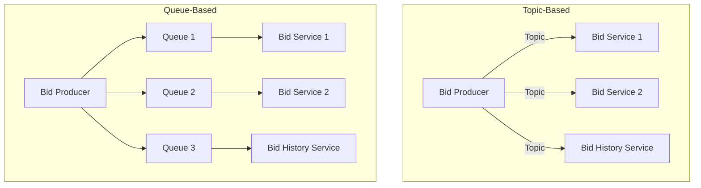

## 📝 Outline
- Architecture vs Design  
- Technical breadth  
- Analysing trade-offs  
- Understanding business drivers  
- Balancing architecture and hands-on coding  

---

## 🔹 Thinking Like an Architect

The architect’s viewpoint is **different** from a developer’s viewpoint.  
Four key aspects of thinking like an architect:

1. Understands difference between **architecture and design**, and collaborates with dev teams.  
2. Has wide **breadth of technical knowledge** while maintaining some depth.  
3. Understands, analyses, and reconciles **trade-offs**.  
4. Understands **business drivers** and translates them into architecture concerns.  

---

## 🏗️ Architecture vs Design

Traditional view: **Architecture → handed to developers** (one-way handover).  

⚠️ Problems:  
- Why decisions were made may not be conveyed.  
- Changes by dev team that affect architecture rarely reach the architect.  

> [!attention]
> Architecture works best through **collaboration** between architects and developers.  

---

## 📚 Technical Breadth

- **Developer:** needs deep expertise in a stack/tool (e.g., Java, Spring).  
- **Architect:** needs wide breadth across many technologies.  

### Examples
- Developer: “I know Java programming.”  
- Architect: “I know Java, Golang, and can identify which fits a particular problem.”  

> [!quote]
> *“If the only tool you have is a hammer, it is tempting to treat everything as if it were a nail.”* – Abraham Maslow (1966)  

📌 Architects trade deep expertise in one tool for **broad awareness of multiple solutions**.  

### Pitfalls
1. Trying to maintain expertise in too many areas → managing nothing.  
2. Stale expertise (aka *Frozen Caveman Anti-pattern*).  

---

## ⚖️ Analysing Trade-offs

- Everything in architecture is a **trade-off**.  
- The famous answer to any architecture question: **“It depends…”**  

Depends on:  
- Deployment environment  
- Business drivers  
- Company culture  
- Budgets & timeframes  
- Developer skill set  
- Many other factors  

> [!note]
> *“There are no right or wrong answers in architecture—only trade-offs.”* — Neal Ford  

---

## 🛒 Example: Item Auction System

### Communication Models

1. **Topic-based (Publish–Subscribe)**  
   - Extensibility: new service (“Bid History”) added without changes.  
   - Less coupling.  
   - Drawback: all services get same data; hard to load-balance/scale.  

2. **Queue-based**  
   - New service requires a new queue and producer changes.  
   - Better monitoring, scaling, and security (detect malicious consumers).  
   - Drawback: more tightly coupled contracts (all consumers affected by changes).  

> [!tip]
> Choosing between Topic-based and Queue-based depends on priorities:  
> - **Topic-based:** extensibility, low coupling.  
> - **Queue-based:** monitoring, scaling, security.  

---

## 💼 Understanding Business Drivers

An architect should:  
- Possess some **business domain knowledge**.  
- Build relationships with **business stakeholders**.  
- Translate business drivers → architecture characteristics (e.g., scalability, performance).  

---

## 👨‍💻 Balancing Architecture & Hands-on Coding

How can an architect keep coding while managing responsibilities?  

✅ Best practices:  
- Don’t own **critical path** code → avoid bottlenecks.  
- Pick a business function to contribute.  
- Do **proof-of-concept (POC)** implementations to validate decisions.  
- Contribute via **bug fixes**.  

---

## 📚 References
- *Fundamentals of Software Architecture – An Engineering Approach*  
  Mark Richards & Neal Ford, O’Reilly, 2020.  

---

## Summary

> [!info] **Architect vs Developer**: Developers focus on depth; Architects balance breadth and trade-offs.  

> [!warning] **Pitfall**: Don’t spread too thin across all technologies—stay updated selectively.  

> [!note] **Business Drivers**: Understanding business goals is as important as technical skill.  

> [!done] **Hands-on coding**: Architects should code strategically (POCs, bug fixes), not critical features.  

---
