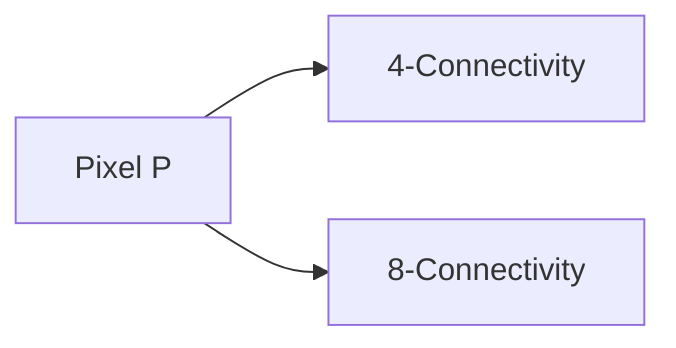
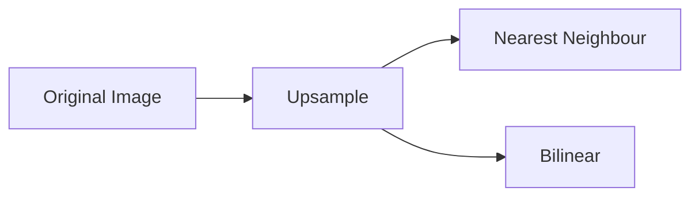

---
jupyter:
  jupytext:
    cell_metadata_filter: -all
    formats: ipynb,md
    main_language: python
    text_representation:
      extension: .md
      format_name: markdown
      format_version: "1.3"
      jupytext_version: 1.17.2
tags:
---

## 1. Physical and Logical Pixels

* Once an image is digitized, it becomes a **matrix of pixel values**.
* **Physical pixel**: Actual pixel structure on a device.
* **Logical pixel**: Representation in the image matrix.
* Pixel geometry in input (camera) and output (display) may differ, causing **geometric distortions**.
* Parameters affecting image geometry:
	- Image size
	- Resolution
	- Aspect ratio
	- Pixel aspect ratio

> [!note] **Pixel aspect ratio** ≠ **Image aspect ratio**.
> Pixel aspect ratio refers to the *shape of each pixel*, while image aspect ratio refers to the *width-to-height ratio of the whole image*.

---

## 2. Connectivity in Pixels

Connectivity helps identify boundaries, regions, and components in an image.

### Types of Connectivity



* **4-connectivity**: Pixels share an edge (N, S, E, W). $N_{4}(p)$
* **8-connectivity**: Pixels share an edge or a corner. $N_{8}(p)$

**Example:**

```
4-Connected:    8-Connected:
   0 1 0           1 1 1
   1 P 1           1 P 1
   0 1 0           1 1 1
```

---

## 3. Local Neighborhoods

Neighborhoods are used when applying operations on a group of pixels.

**3×3 Neighborhood Example:**

```
P11 P12 P13
P21  P  P23
P31 P32 P33
```

---

## 4. Distance Measures

Used to find the closeness between pixels:

> [!equation] **Euclidean distance**:
>   $D = \sqrt{(x_1 - x_2)^2 + (y_1 - y_2)^2}$

> [!equation] **City-block distance** (Manhattan):
>   $D_{4} = |x_1 - x_2| + |y_1 - y_2|$


> [!equation] **Chessboard distance**
> $D_{8} = max(\ |x_{1} - x_{2}|,\ |y_{1} - y_{2}|\ )$

---

## 5. Resolution, Size & Aspect Ratio

> [!example] Glossary
> ![[Pasted image 20250905105140.png|240]]
> **Resolution**: Dots per unit length
> **Image size**: Total number of pixels
> **Aspect ratio**: $Rows : Columns$ ratio in the pixel grid
> **Pixel aspect ratio** : Exact shape of the image

$$Visible\ image\ =\ f(resolution,\ size,\ \text{aspect ratio}) $$

**Effect of Changes:**
* Higher resolution → finer granularity.
* Change in pixel size → distortion.
* Change in pixel count → Image file size.
* Mismatched aspect ratio → stretching or cropping.

**Conversion Example:**
4:3 Letterbox → 16:9 widescreen
Options:
1. Stretch
2. Crop
3. Add borders

---

## 6. Image Resampling & Scaling

Resampling changes pixel count:

* **Upsampling** → create new pixels.
* **Downsampling** → remove pixels.

### Methods:

* **Nearest Neighbour** → picks the closest pixel value (fast, but may cause jagged edges).
* **Bilinear / Bicubic Interpolation** → smooth transitions.



> [!warning]
> **Aliasing** occurs when sampling frequency < twice the highest frequency (Nyquist limit).
> Solution: Apply low-pass filtering before downsampling.

---

## 7. Multi-Scale Image Pyramids

* Multiple versions of the image at different resolutions.
![[Pasted image 20250813112908.png|400]]
* Useful in:

  * Image indexing
  * Progressive image loading
  * Compression

---

## 8. Image Quality Assessment

Two main approaches:

### Objective:

* Uses mathematical formulas (MSE, PSNR).
* Consistent & automatable.

**Mean Squared Error (MSE)**:

$$
MSE = \frac{1}{MN} \sum_{x=1}^{M} \sum_{y=1}^{N} [I_{orig}(x,y) - I_{proc}(x,y)]^2
$$

### Subjective:

* Based on human perception.
* Requires multiple observers and normalization.

**Scales:**

* Goodness (5=Excellent → 1=Unsatisfactory)
* Impairment (1=Not noticeable → 5=Extremely objectionable)

---

## 9. Practical Python Examples

> [!code] **Nearest Neighbour Resampling**

```python
import cv2
img = cv2.imread('image.jpg')
resized = cv2.resize(img, (200, 200), interpolation=cv2.INTER_NEAREST)
cv2.imwrite('resized_nn.jpg', resized)
```

---

> [!code] **Bilinear Resampling**

```python
resized_bilinear = cv2.resize(img, (200, 200), interpolation=cv2.INTER_LINEAR)
cv2.imwrite('resized_bilinear.jpg', resized_bilinear)
```

---

**References:**

* [Nyquist Sampling Theorem](https://en.wikipedia.org/wiki/Nyquist_rate)
* [OpenCV Image Resizing Docs](https://docs.opencv.org/4.x/da/d54/group__imgproc__transform.html)

