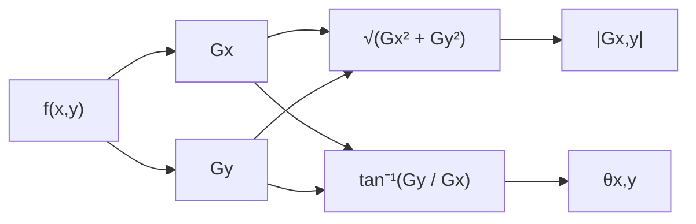

## Edges

- Changes or discontinuities in an image attribute (luminance, texture) are edges.
- In motion analysis we detect the change in edges not the motion itself.

### Edge Profiles

> [!example] Edge examples
> ![[Pasted image 20250924103846.png|250]]![[Pasted image 20250924103909.png|250]]

> [!image] Edge profile diagram
> ![[Pasted image 20250924104100.png|350]]
> - The Real edge is slanted because according to the Nyquist ratio a feature needs at least 2 samples to be captured. Hence the surrounding pixels cause the detected intensity change to be gradual rather than a step change.

## Gradient

- The gradient occur perpendicular to the edge.
![[Pasted image 20250924110722.png|300]]
![[Pasted image 20250924113037.png]]
- $X$ Direction vector $G_x = \frac{\partial I(x,y)}{\partial x}$
- $Y$ Direction Vector $\quad G_y = \frac{\partial I(x,y)}{\partial y}$

> [!math] Gradient at any point $(x,y)$:
> $G_{x,y} = \begin{bmatrix} \frac{\partial}{\partial x} I(x, y) \\ \frac{\partial}{\partial y} I(x, y) \end{bmatrix}$
> 

---

> [!math] Gradient magnitude
> 
> $|G_{x,y}| = \sqrt{ \left(\frac{\partial I(x,y)}{\partial x}\right)^2 + \left(\frac{\partial I(x,y)}{\partial y}\right)^2 }$
> 

---

> [!math] Gradient orientation (angle)
> 
> $|\theta_{x,y}| = \tan^{-1}\left( \frac{\frac{\partial I(x,y)}{\partial y}} {\frac{\partial I(x,y)}{\partial x}} \right)$
> 

### Gradient through convolution

- When pixels are equally spaced, the gradient can be approximated as:

$$\frac{\partial I(x,y)}{\partial x} = \frac{I(x+\Delta x, y) - I(x,y)}{\Delta x}, \quad \frac{\partial I(x,y)}{\partial y} = \frac{I(x, y+\Delta y) - I(x,y)}{\Delta y}$$

---
-  Simplification for $\Delta x = \Delta y = 1$

> [!math] Gradient
> $\frac{\partial I(x,y)}{\partial x} \approx I(x+1, y) - I(x, y)$ 
> $\frac{\partial I(x,y)}{\partial y} \approx I(x, y+1) - I(x, y)$

---

- The operator corresponds to a convolution of $H_x * f(x,y)$ and $H_y * f(x,y)$, where:

> [!math] Kernel
> $\quad H_x = \begin{bmatrix} 1 & -1 \end{bmatrix}$
> $\quad H_y = \begin{bmatrix} 1 \\ -1 \end{bmatrix}$

#### Better estimation using 3 points

![[Pasted image 20250924114043.png]]

$$\frac{\partial I(x,y)}{\partial x} = \frac{I(x+\Delta x, y) - I(x-\Delta x,y)}{2\Delta x}, \quad \frac{\partial I(x,y)}{\partial y} = \frac{I(x, y+\Delta y) - I(x,y-\Delta y)}{2\Delta y}$$

Simplification for $\Delta x = \Delta y = 1$

> [!math] Gradient
> $\frac{\partial I(x,y)}{\partial x} \approx \frac{I(x+1, y) - I(x-1, y)}{2}$ 
> $\frac{\partial I(x,y)}{\partial y} \approx \frac{I(x, y+1) - I(x, y-1)}{2}$

 - The operator corresponds to a convolution of $H_x * f(x,y)$ and $H_y * f(x,y)$, where:

> [!math] Kernel
> $\quad H_x = \begin{bmatrix} 1 & 0 & -1 \end{bmatrix}$
> $\quad H_y = \begin{bmatrix} 1 \\ 0 \\ -1 \end{bmatrix}$

---

### Gradient Operators

#### 1. Prewitt Operator

The Prewitt operator uses a 3-point estimate with averaging across 3 lines of pixels:

$D_{Px} = \begin{bmatrix} -1 & 0 & 1 \\ -1 & 0 & 1 \\ -1 & 0 & 1 \end{bmatrix}, \quad D_{Py} = \begin{bmatrix} 1 & 1 & 1 \\ 0 & 0 & 0 \\ -1 & -1 & -1 \end{bmatrix}$

---

#### 2. Sobel Operator

The Sobel operator uses the same concept but gives more weight to the central line:

$D_{Sx} = \begin{bmatrix} -1 & 0 & 1 \\ -2 & 0 & 2 \\ -1 & 0 & 1 \end{bmatrix}, \quad D_{Sy} = \begin{bmatrix} 1 & 2 & 1 \\ 0 & 0 & 0 \\ -1 & -2 & -1 \end{bmatrix}$

---

#### 3. Roberts Operator

The Roberts operator uses 2-point estimates on diagonal directions:

$D_{+} = \begin{bmatrix} 0 & 1 \\ -1 & 0 \end{bmatrix}, \quad D_{-} = \begin{bmatrix} 1 & 0 \\ 0 & -1 \end{bmatrix}$

---

### Gradient and Edge Thresholding
- The gradient itself is too sensitive to variations and hence seldom use as edges.
- A thresholding can result better separation of actual edges from simple gradients.
- $g(x,y) = \begin{cases} 1 & \text{if } |G(x,y)| > T \\ 0 & \text{if } |G(x,y)| \leq T \end{cases}$
![[Pasted image 20250924134852.png]]

## Noise & Thicker Edges

> [!image] Noise
> - Noise can lead to high-value local gradients that are detected erroneously as edges.
> ![[Pasted image 20250924140046.png]]

> [!image] Thick Edges
> - Leads to double edges on either side 
> ![[Pasted image 20250924140105.png]]

### Dealing with thicker edges
- Blurring (Taking pixel averages) reduces the effect due to noise but leads to thicker edges.
- These edges have high gradients on either side of the center of the edge.

#### Solution for thicker edges : $2^{nd}\ \text{Order Derivative}$

![[Pasted image 20250924142138.png|300]]
- $2^{nd}\ \text{Derivative}$ has a Zero crossing at the precise location of the edges.
- Direction of cross can tell the darker / brighter side of image.
- Can be simply approximated as the different in gradient
![[Pasted image 20250924142311.png|250]]

#### Second-Order Derivatives and Laplacian Operator

> [!math] Forward and Reverse Derivatives
> 
> - **Forward derivative** (3-point estimate):
> 
> 
> $$D_{1}(x) = \frac{f(x+\Delta x) - f(x)}{\Delta x}$$
> 
> - **Reverse derivative**:
> 
> $$D_{-1}(x) = \frac{f(x) - f(x-\Delta x)}{\Delta x}$$
> 

---

> [!math] Second-Order Derivative (1D)
> 
>- Estimated as the difference between forward and reverse gradients:
> 
> $$D^{2}_{i}(x) = \frac{1}{\Delta x} \left[ \frac{f(x+\Delta x)-f(x)}{\Delta x} - \frac{f(x)-f(x-\Delta x)}{\Delta x} \right]$$
> 
> $$D^{2}_{i}(x) = \frac{f(x+\Delta x) - 2f(x) + f(x-\Delta x)}{(\Delta x)^2}$$
> 
> - **Equivalent convolution kernel**:
> 
> $$[ \; 1 \;\; -2 \;\; 1 \; ]$$

---

### 3. Laplacian Operator (2D)

The Laplacian is defined as:

$L[f(x,y)] = \frac{\partial^2 f}{\partial x^2} + \frac{\partial^2 f}{\partial y^2}$

Approximated using second derivatives in both directions:

$L[f(x,y)] = \frac{f(x+\Delta x,y) - 2f(x,y) + f(x-\Delta x,y)}{(\Delta x)^2} + \frac{f(x,y+\Delta y) - 2f(x,y) + f(x,y-\Delta y)}{(\Delta y)^2}$

---

### 4. Simplified Laplacian (for $\Delta x = \Delta y$)

$L[f(x,y)] = \frac{1}{(\Delta x)^2} \Big[ f(x+\Delta x,y) + f(x-\Delta x,y) + f(x,y+\Delta y) + f(x,y-\Delta y) - 4f(x,y) \Big]$

- **Equivalent convolution kernel**:

$\begin{bmatrix} 0 & 1 & 0 \\ 1 & -4 & 1 \\ 0 & 1 & 0 \end{bmatrix}$

---
